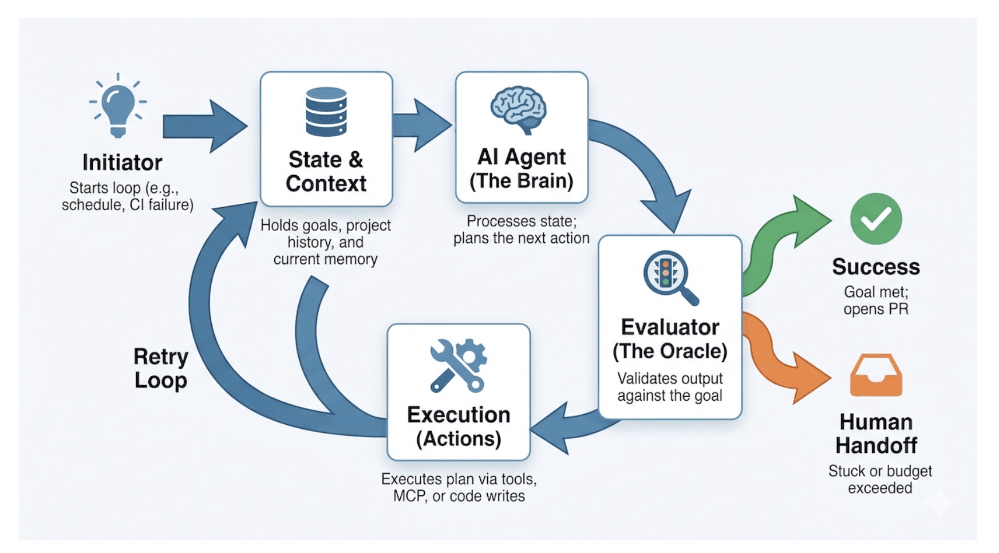
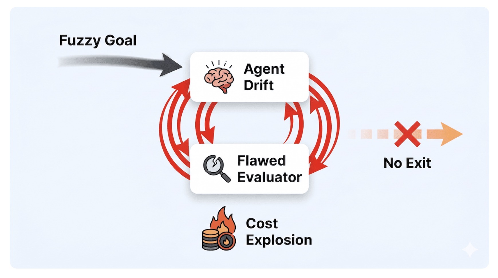

# Loop Engineering (and How to Avoid Loopmaxxing)

## Intent
Explain **loop engineering** — the practice of designing the autonomous control loops that drive coding agents, rather than hand-writing prompts for them — and give you the guardrails that keep a loop from degenerating into **"loopmaxxing,"** the anti-pattern that burns through API budgets and fills your repo with code nobody understands. Use this as a primer for teams moving past one-shot prompting into background, self-running agents in 2026.

> **One-line summary:** Loop engineering is *writing the loop that prompts the agent* instead of prompting the agent yourself. The whole skill is in the exit conditions — a loop without deterministic checks doesn't iterate toward a goal, it drifts toward your invoice.

## Why a loop, not a prompt

The biggest names in coding agents have publicly declared prompting itself a dead end. As OpenClaw creator **Peter Steinberger** put it: *"You shouldn't be prompting coding agents anymore. You should be designing loops that prompt your agents."* **Boris Cherny**, the Anthropic engineering lead behind Claude Code, said the same thing from the inside: *"I don't prompt Claude anymore. I have loops that are running. They're the ones prompting Claude and figuring out what to do. My job is to write loops."*

The highest-leverage AI engineering skill is no longer crafting one perfect prompt — it's engineering loops with LLMs at their heart. This is the same lineage covered in [From Prompt to Context to Harness Engineering](prompt-context-harness-engineering.md): loop engineering is the *execution-layer* discipline of building the harness's control loop, where prompt and context engineering operate as components inside each iteration.

## What loop engineering is

Loop engineering shifts a model from a static call-and-response tool into an **active participant in an event loop**. Instead of feeding an agent step-by-step instructions, you give the system a *verifiable goal*. The loop then runs an agent that:

1. **Observes** the current state,
2. **Chooses** an action,
3. **Executes** it,
4. **Checks** the result against the goal, and
5. **Decides** whether to continue, retry, or stop.

The decision in step 5 is the crux. A loop that can't objectively tell whether it has succeeded has no reason to ever stop.

### The primitives of an AI loop

There are competing definitions of what an AI loop needs. A practical set, adapted (and simplified) from Google engineer **Addy Osmani**:

| Primitive | What it does |
| :--- | :--- |
| **Automations** | The trigger that starts the loop — a scheduled cron job, a CI failure webhook, a `/goal` command. |
| **Worktrees** | Isolated branch environments so parallel sub-agents don't overwrite each other's code. |
| **Skills & external tools** | Markdown files of persistent project guidelines plus integrations (e.g. [MCP](../04-protocols/mcp-guide.md) servers) that reach Jira, GitHub, or internal databases. |
| **Sub-agents** | Specialized models that divide labor — one drafts the code, a *separate* evaluator grades it against a strict rubric. |
| **Memory** | External tracking (a Linear board, a progress file) because LLMs eventually clear their context windows. |

A minimal version: a loop reads yesterday's CI failures, assigns an agent to draft a fix, runs the tests, and — only if they pass — opens a pull request.

Done well, the pattern delivers. An early public example was **Andrej Karpathy's autoresearch** project — a lightweight Python loop that ran machine-learning experiments overnight, unattended, and produced real results.

## The trap: loopmaxxing is the new tokenmaxxing

AI loops come with a sharp failure mode. Just as **"tokenmaxxing"** brute-forces quality by throwing massive inference budgets or thousands of samples at a problem, **"loopmaxxing"** replaces software architecture with open-ended `while(true)` iteration. The hidden assumption is that *an agent will eventually figure it out if it runs long enough.*

It won't — not without a way to verify success (a passing test suite, a clean compile, a specific zero-exit status). Two things go wrong:

- **Agent drift.** Hand the loop a fuzzy goal — *"refactor this feature to be better,"* *"optimize the layout"* — and the agent drifts forever, optimizing for hallucinated metrics it invented.
- **The flawed evaluator.** An agent grading its own sub-agents' output spins into endless retries, reinforcing its own mistakes instead of catching them. (This is the same *unreliable self-evaluation* failure that motivates harness verification loops.)

The combination has no exit. The loop churns through retries, failed tool calls, and context reconstruction, **burning millions of tokens** — you end up billing for the memory and context a human engineer simply retains.

There's a slower-burning cost too: **comprehension debt.** As an autonomous loop ships code in the background, the gap widens between the repo's actual state and the engineer's understanding of it. When something breaks in production, debugging the loop's output is an observability nightmare — thousands of lines of unfamiliar logic, with no mental model of *why* the agent chose that path after dozens of iterations.

## The pragmatic path: control loops, not open-ended cycles

The most effective loop engineers don't write open-ended agentic cycles. They build **strict control loops**: the developer writes the *desired state* and the *observation mechanism*, while **deterministic code handles execution and API calls**. The LLM step is reserved only for the dynamic decisions ordinary code can't make. Wrapping the repetitive or risky parts of a workflow in memory and hard-coded checks limits the blast radius of a hallucinating model.

Building all those checks up front is tiresome, especially early in a project. So the path that works:

1. **Start with a minimal loop and human verification.** Run it several times by hand. You'll quickly learn what works, what to improve with [prompt](../../03-prompts-and-patterns/prompt-pattern-catalogue.md) and [context engineering](../03-context-and-memory/context-engineering.md), and what needs deterministic guardrails baked into the loop.
2. **Automate gradually, once the workflow is proven.** As you identify the steps the agent gets right *consistently*, replace those LLM prompts with standard code.
3. **Separate the doer from the checker.** Keep distinct agents for performing the task and validating it. An agent looping over its own flawed logic reinforces mistakes rather than fixing them.
4. **Instrument for control.** Production loops need trace-logging of agent reasoning, progress detection that terminates a stuck run, and strict iteration caps. Decide *explicitly* when control hands over to a human.

> **Rule of thumb:** allow a maximum of **two or three retries**, then fail gracefully and hand the error back to a human developer.

## Control-loop checklist

Before you let a loop run unattended, confirm every box:

- [ ] **Verifiable exit condition** — success is a passing test, a clean compile, or a specific exit code, *not* the agent's own opinion.
- [ ] **Hard iteration cap** — a maximum retry count (2–3) with graceful failure and human handoff.
- [ ] **Separate evaluator** — a different agent (or deterministic check) grades the output; the doer never grades itself.
- [ ] **Deterministic skeleton** — code owns execution, scheduling, and API calls; the LLM only makes the decisions code can't.
- [ ] **Trace logging** — agent reasoning and actions are recorded for post-hoc debugging.
- [ ] **Progress detection** — the loop can tell when it's stuck and stops itself.
- [ ] **Budget ceiling** — a token/cost cap that triggers human handoff before the bill explodes.
- [ ] **Isolation** — worktrees or sandboxes so parallel agents can't clobber each other or the main branch.

## Key takeaways

- **Loop engineering is the new top skill:** you design the loop that prompts the agent, not the prompt itself. It's the execution-layer craft of [harness engineering](prompt-context-harness-engineering.md).
- **The exit condition is the whole game.** A fuzzy goal with no verifiable check produces infinite drift; a verifiable goal with hard caps produces reliable work.
- **Loopmaxxing is tokenmaxxing's successor** — brute-force iteration that burns budget and accrues comprehension debt instead of solving the architecture.
- **Build control loops, not open-ended cycles:** deterministic code on the outside, LLM decisions on the inside, a separate evaluator, and a human handoff after a few retries.
- **Cognitive surrender is the real risk.** Agents run loudly and fail quietly. A system designed so you never have to think about your codebase again is a recipe for disaster — no amount of compute saves a poor architecture.

## The next layer up: fleet governance

Loop engineering makes a *single* autonomous loop reliable and persistent. The moment you run *many* loops concurrently across a team, a new problem appears that no per-loop guardrail solves: making the whole population accountable — identity, registry, permissions, audit, and a kill switch. That layer goes by **agent fleet governance** (Cobus Greyling frames it as **fleet engineering**, extending the prompt → context → harness → loop → fleet stack). See [Agent Fleet Governance (Fleet Engineering)](agent-fleet-governance.md).

## References
- Peter Steinberger (OpenClaw creator) — public post: *"You shouldn't be prompting coding agents anymore. You should be designing loops that prompt your agents."*
- Boris Cherny (Anthropic, Claude Code lead) — *"I don't prompt Claude anymore… My job is to write loops."*
- Addy Osmani (Google) — primitives of an AI loop (automations, worktrees, skills/tools, sub-agents, memory).
- Andrej Karpathy — `autoresearch`, an overnight ML-experiment loop in Python.
- Related in this repo: [From Prompt to Context to Harness Engineering](prompt-context-harness-engineering.md) · [Context Engineering](../03-context-and-memory/context-engineering.md) · [Prompt Pattern Catalogue](../../03-prompts-and-patterns/prompt-pattern-catalogue.md) · [MCP Guide](../04-protocols/mcp-guide.md)
