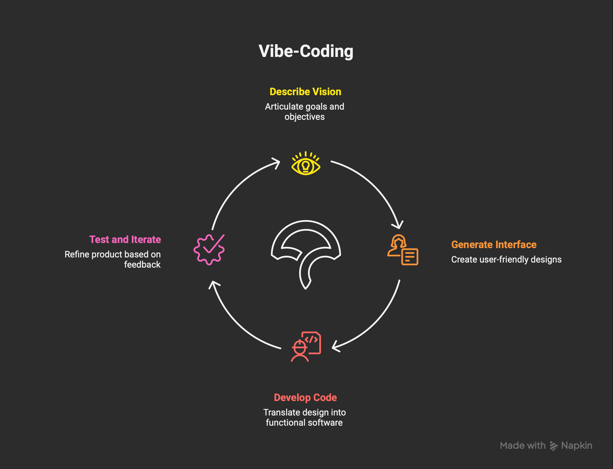
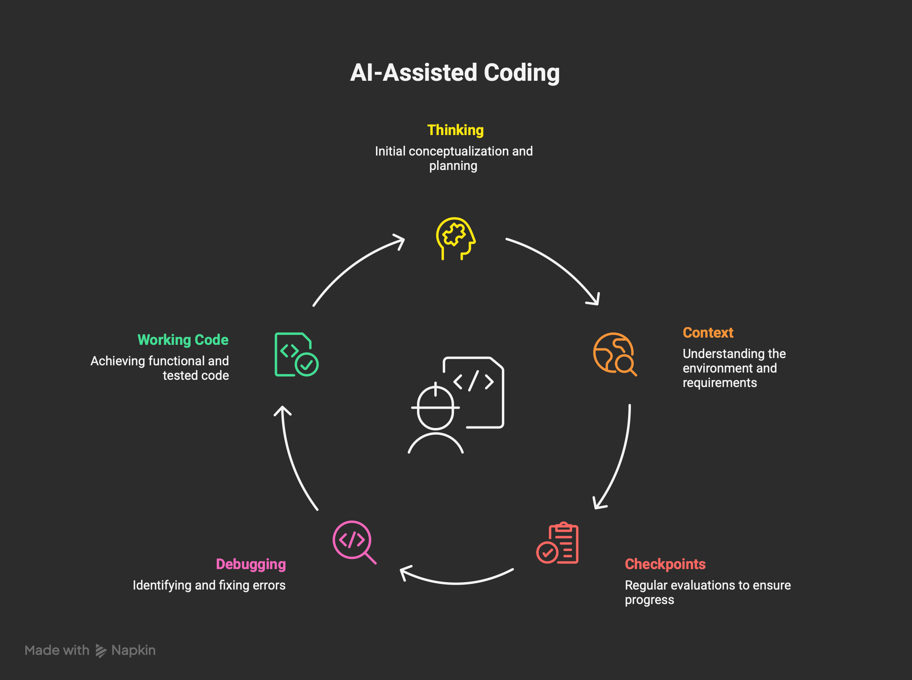
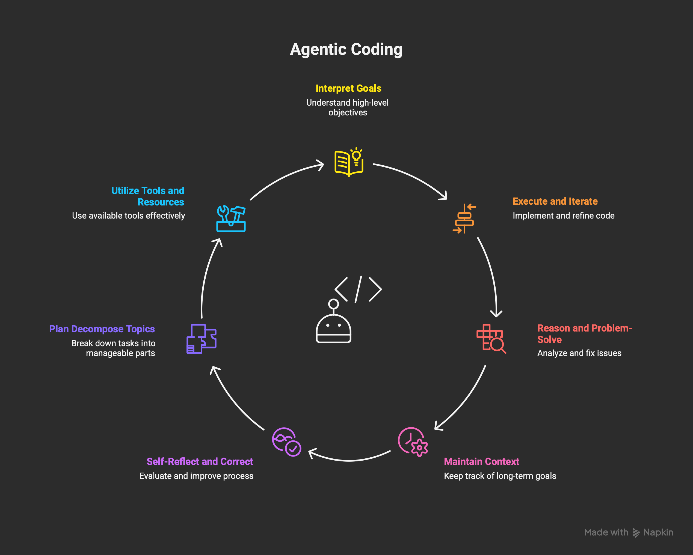

# AI Coding Spectrum

## Intent
Clarify how Vibe-Coding, AI-Assisted Coding, and Agentic Coding differ so you can match workflow depth, autonomy, and tool choices to the task at hand. Use this as a quick teaching deck or onboarding primer.

[▶️ Watch the AI Coding Spectrum overview](https://youtu.be/cU_mlreODyw) for a quick walkthrough of the three modes.

## Levels at a glance
- **Vibe-Coding (Beginner)**: Rapidly turn rough ideas into functional prototypes; speed over precision for early validation.
- **AI-Assisted Coding (Mid-Level)**: Pair-programming with real-time suggestions, completions, and guardrails; you stay in the driver’s seat.
- **Agentic Coding (Advanced)**: Delegate multi-step development to agents that plan, code, test, and refine with minimal supervision.

### Vibe-Coding (Beginner)


- **What it is**: A fast way to translate rough ideas into working prototypes without hand-writing every component.
- **How it works**: You describe the vision in plain English; the AI drafts interfaces and scaffolds code instantly.
- **When to use it**: Early-stage validation when you need speed over precision before committing major effort.
- **AI tools and products**: [bolt.new](https://bolt.new/), [Lovable](https://lovable.dev/), [Make](https://www.make.com/), [Replit](https://replit.com/), [Stagewise](https://stagewise.ai/), [V0](https://v0.dev/).

**Starter prompt**
```text
You are an interface-first AI builder. Draft a working prototype that matches this vision:
- Goal: [describe the user outcome]
- Must-have features: [list 3–5 items]
- Tech stack: [web/mobile/library preferences]
Return code blocks and a brief setup note so I can run it locally.
```

### AI-Assisted Coding (Mid-Level)


- **What it is**: Live coding support that injects intelligent completions, suggestions, and checks as you write.
- **How it works**: The model streams real-time code, comments, tests, and warnings while you control commits and merges.
- **AI product integration**: Increases developer productivity while keeping human oversight for architecture and reviews.
- **AI tools and products**: [Cursor](https://www.cursor.com/), [GitHub Copilot](https://github.com/features/copilot), [Google Antigravity](https://labs.google.com/antigravity), [Continue](https://continue.dev/), [KIRO](https://kiro.studio/).

**Starter prompt**
```text
You are a pair programmer focused on safety and speed.
Context: [link to repo or paste key files]
Task: [describe the feature or fix]
Behaviors: explain suggestions briefly, surface lint/test deltas, and stop to ask before large refactors.
```

### Agentic Coding (Advanced)


- **What it is**: AI agents that can complete end-to-end development tasks from a single objective.
- **How it works**: The agent plans, writes, tests, and refines code with minimal supervision, escalating only at defined checkpoints.
- **When to use it**: Complex builds, legacy modernization, or long-running chores where orchestrated tooling saves time.
- **AI tools and products**: [OpenAI Codex](https://openai.com/blog/openai-codex), [Claude Code](https://www.anthropic.com/news/claude-code), [Devin](https://www.cognition-labs.com/blog/introducing-devin), [Gemini CLI](https://ai.google.dev/cli).

**Starter prompt**
```text
You are an autonomous software agent with tool access.
Objective: [state the goal and acceptance criteria]
Constraints: coding standards, dependencies, time budget, review checkpoints
Required outputs: plan, code diffs, tests run, and a brief risk/rollback note.
Seek clarification if requirements are ambiguous.
```

## Picking the right mode
- **Prototype fast** with Vibe-Coding when you need UI/UX proof-of-concepts in hours, not days.
- **Ship safely** with AI-Assisted Coding when teams want consistent linting, tests, and incremental reviews.
- **Scale complex work** with Agentic Coding when orchestration and parallel tool use outweigh hands-on control.

## AI tools by category
| Vibe-Coding | AI-Assisted Coding | Agentic Coding |
| --- | --- | --- |
| [bolt.new](https://bolt.new/) · [Lovable](https://lovable.dev/) · [Make](https://www.make.com/) · [Replit](https://replit.com/) · [Stagewise](https://stagewise.ai/) · [V0](https://v0.dev/) | [Cursor](https://www.cursor.com/) · [GitHub Copilot](https://github.com/features/copilot) · [Google Antigravity](https://labs.google.com/antigravity) · [Continue](https://continue.dev/) · [KIRO](https://kiro.studio/) | [OpenAI Codex](https://openai.com/blog/openai-codex) · [Claude Code](https://www.anthropic.com/news/claude-code) · [Devin](https://www.cognition-labs.com/blog/introducing-devin) · [Gemini CLI](https://ai.google.dev/cli) |
