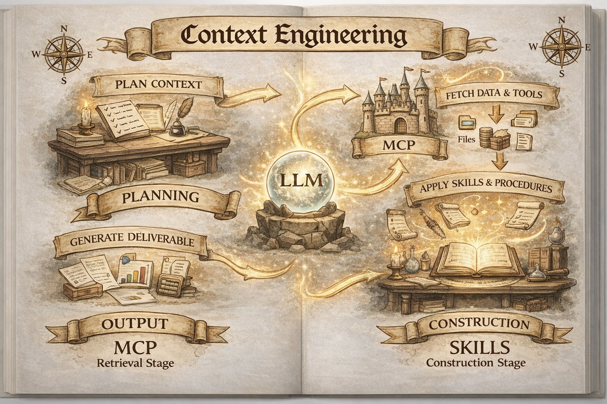

# Context Engineering

Context engineering is the discipline of dynamically managing the entirety of information an AI agent sees. It's about filling the context window with the right information for the next step.

## Key Characteristics

*   **Iterative & Dynamic:** Happens continuously as agents run in loops.
*   **Systematic Approach:** Builds a complete environment around queries (memory, tools, external data, knowledge graphs).
*   **Production-Focused:** Bridges the gap between demo-grade and production-grade AI systems.

## Why This Matters for AI Agents?

*   **Cost Reality:** AI agents use ~15x more tokens than standard chat interactions, and poor context management can cost thousands of dollars daily.
*   **The Attention Scarcity:**
    *   **Context Rot:** As token count increases, recall accuracy decreases.
    *   **Architectural Limits:** Transformers have n² pairwise attention relationships.
    *   **Training Distribution:** Models see fewer long sequences during training, making them less reliable with extended context.
*   **Multi-Agent vs Single Agent Context Crisis:**
    *   **Lost Context:** Sub-agents lack the "big picture" and optimize for wrong goals.
    *   **Resource Gaps:** Agents don't know where critical info is stored or lack access credentials.
    *   **Compounding Errors:** Failures can cascade and jeopardize the entire project.

## Context Engineering vs. Prompt Engineering

| Dimension | Prompt Engineering | Context Engineering |
| :--- | :--- | :--- |
| **Scope** | Single query optimization | Entire information environment design |
| **Analogy** | Giving someone a sticky note | Writing a full screenplay with all details |
| **Focus** | Clever wording and phrasing | Complete system (docs, examples, rules, patterns, validation) |
| **Timing** | One-time instruction | Continuous curation during execution |
| **Components** | Instructions, few-shot examples | Memory, tools, external data, schemas, project context, guardrails |
| **Failure Mode** | I didn't understand the question | I had the wrong information at the wrong time |

## 5 Parts of Effective Context Engineering

1.  **Relevance Over Volume:** Every token must earn its place.
2.  **Recency & Temporal Awareness:** Recent interactions are more relevant.
3.  **Compression Without Loss:** Preserve critical information while eliminating redundancy.
4.  **Position-Aware Architecture:** Attention mechanisms focus on the beginning and end of the context.
5.  **Dynamic Adaptation:** Context needs vary by workflow stage and task complexity.

## Strategies for Effective Context Engineering

*   **Just-in-Time Retrieval (vs. Pre-loading):** Give agents search tools to fetch specific data on-demand.
*   **Semantic Chunking & Retrieval:** Break documents into logically coherent chunks.
*   **Structured Note-Taking (Agentic Memory):** Agent maintains a NOTES.md file outside the context window.
*   **Hierarchical Context Architecture:**
    *   **Layer 1:** System Identity (Core capabilities, role)
    *   **Layer 2:** Task Instructions (Current objective)
    *   **Layer 3:** Tool Definitions (Only relevant tools)
    *   **Layer 4:** Working Memory (Recent turns, key decisions)
    *   **Layer 5:** Long-term Memory (Embedded, retrievable)

## Leaders' Tips on Context Engineering

*   **LangChain:** Write, Select, Compress, Isolate.
*   **Anthropic:** Keep context tight, use just-in-time retrieval, compact long histories, and store structured notes.
*   **ChromaDB:** Keep prompts lean, strip distractors, use retrieve-then-read, and flatten long narratives.
*   **Manus AI:** Use append-only, treat the file system as long-term context, continuously recite goals, and keep past errors in context.
