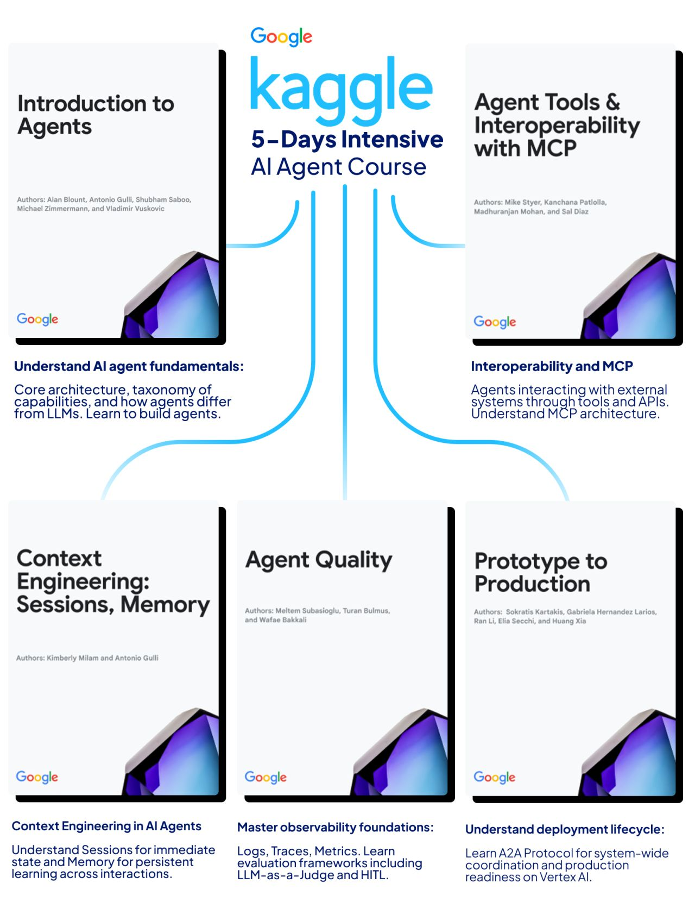

# Google 5-Day AI Agents Intensive Course

Google released massive learning resources for AI Agents, including 10+ code samples, whitepapers, hands-on projects, and much more. This 5-day intensive course gives you a bunch of resources to learn and practice building AI Agents.

---

## Day 1: Introduction to Agents

Understand AI agent fundamentals: core architecture, taxonomy of capabilities, and how agents differ from LLMs. Learn to build agents that perceive, plan, act autonomously.

> [!NOTE]
> See also our internal [AI Agents Overview](ai-agents-overview.md) for more context.

**Resources**
- [Code Resource 1: From Prompt to Action](https://www.kaggle.com/code/kaggle5daysofai/day-1a-from-prompt-to-action) | [Code Resource 2: Agent Architectures](https://www.kaggle.com/code/kaggle5daysofai/day-1b-agent-architectures)

---

## Day 2: Agent Tools & Interoperability with MCP

Learn how agents interact with external systems through tools and APIs. Understand MCP architecture, tool design best practices, and human-in-loop approval workflows.

[.png)](../assets/guides/google-2026/02%20Agent%20Tools%20&%20Interoperability%20with%20Model%20Context%20Protocol%20(MCP).pdf)

> [!NOTE]
> See also our internal [MCP Guide](mcp-guide.md) for more tactics and context.

**Resources**
- [Code Resource 1: Agent Tools](https://www.kaggle.com/code/kaggle5daysofai/day-2a-agent-tools) | [Code Resource 2: Agent Tools Best Practices](https://www.kaggle.com/code/kaggle5daysofai/day-2b-agent-tools-best-practices)

---

## Day 3: Context Engineering: Sessions & Memory

Discover how agents maintain context across conversations. Understand Sessions for immediate state and Memory for persistent learning across interactions.

> [!TIP]
> Compare these approaches with our repository's guide on [Context Engineering](context-engineering.md).

**Resources**
- [Code Resource 1: Agent Sessions](https://www.kaggle.com/code/kaggle5daysofai/day-3a-agent-sessions) | [Code Resource 2: Agent Memory](https://www.kaggle.com/code/kaggle5daysofai/day-3b-agent-memory)

---

## Day 4: Agent Quality

Master observability foundations: Logs, Traces, Metrics. Learn evaluation frameworks including LLM-as-a-Judge and Human-in-the-Loop for production reliability.

**Resources**
- [Code Resource 1: Agent Observability](https://www.kaggle.com/code/kaggle5daysofai/day-4a-agent-observability) | [Code Resource 2: Agent Evaluation](https://www.kaggle.com/code/kaggle5daysofai/day-4b-agent-evaluation)

---

## Day 5: Prototype to Production

Understand deployment lifecycle and scaling strategies. Learn Agent2Agent Protocol for system-wide coordination and production readiness on Vertex AI.

> [!NOTE]
> To understand coordination deeper, read our local [Agent-to-Agent (A2A) Protocol Guide](a2a-protocol-guide.md).

**Resources**
- [Code Resource 1: Agent2Agent Communication](https://www.kaggle.com/code/kaggle5daysofai/day-5a-agent2agent-communication) | [Code Resource 2: Agent Deployment](https://www.kaggle.com/code/kaggle5daysofai/day-5b-agent-deployment)

> **Important Setup Instructions**
> Learn the prerequisites before running these solutions, as they require a few unique configs and API keys.

---

## References

- [Kaggle 5-Day AI Agents Course Guide](https://www.kaggle.com/learn-guide/5-day-agents)
