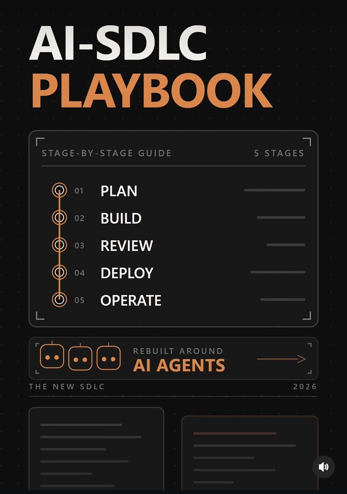
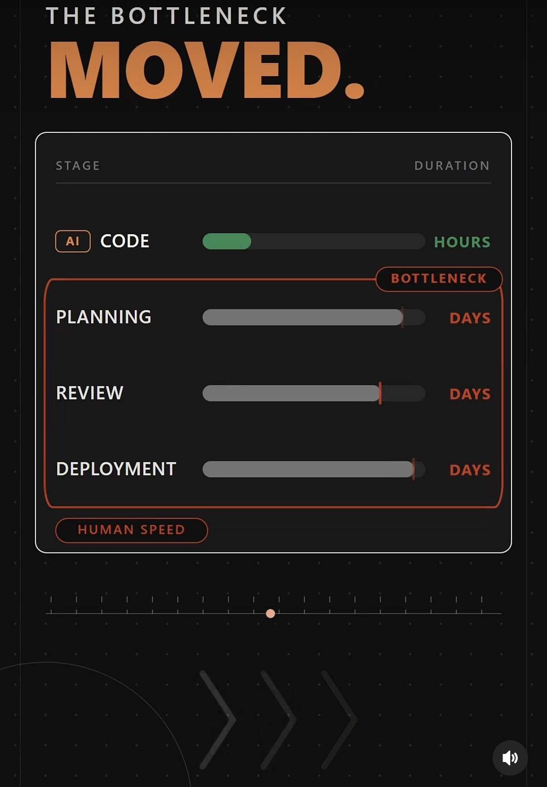

# The AI-Native SDLC Playbook — A Stage-by-Stage Tutorial



*The lifecycle, rebuilt around agents. Anthropic's playbook names six stages; the condensed five above are the version that fits on a slide — see [A note on five stages vs. six](#a-note-on-five-stages-vs-six).*

## Intent

Turn Anthropic's **AI-Native SDLC playbook** into something you can run on Monday:
what each stage produces, who approves what, which guardrails are code rather than
culture, and the copy-ready prompts that move a change from an idea to a
production incident record.

The one-sentence version of the argument: **when code stops being the bottleneck,
the lifecycle has to be rebuilt around artifacts and gates instead of stages and
handoffs.** Every stage ends by committing a file; the next stage begins by
reading it; humans spend their judgment at the gates rather than on line-by-line
review.

## Use when

- Your team ships agent-written code and your **process still assumes a human typed it**.
- Code review has become the queue — PRs arrive faster than anyone can read them.
- You need an **audit trail** for agent-produced changes (regulated environment, security review, or just a nervous VP).
- You are writing the internal standard for "how we use coding agents" and want a structure to adapt rather than invent.
- You have `CLAUDE.md`, some skills, and some hooks, but no coherent story about **how they fit together**.

---

## TL;DR — the five load-bearing ideas

| # | Idea | What it replaces |
| --- | --- | --- |
| 1 | The bottleneck moved from writing code to planning, aligning, reviewing, and deploying it | "Developer productivity = lines shipped" |
| 2 | Every stage commits an artifact; the next stage reads it | Verbal handoffs and tickets that lose context |
| 3 | Guardrails are **deterministic hooks**, not habits or checklists | "We agreed nobody touches prod data" |
| 4 | Continuous evals run through the work | Stage-gate QA at the end |
| 5 | Agents review everything and approve nothing | Human line-by-line review of every diff |

---

## 1. Start here: the bottleneck moved



*Code generation collapsed to hours. Everything around it still runs at human speed.*

This is the premise the rest of the playbook is built on, and it is worth sitting
with before you adopt any of the mechanics.

When an agent writes a feature in an afternoon, the work does not get faster —
**the constraint just relocates**. It lands on:

- **Planning**: deciding what to build, and describing it precisely enough that an agent cannot drift.
- **Design alignment**: getting agreement on the interface, the data model, and the tradeoffs before the code exists.
- **Review**: a human reading a diff they did not write, at a volume that used to be a week's output.
- **Approval and deployment**: the change-advisory meeting, the release window, the sign-off chain.
- **Incident response**: understanding a system whose implementation nobody typed.

The failure mode of naive adoption is to speed up only the one stage that was
already fastest, then wonder why lead time is flat. **If you take one thing from
this guide, take the diagnostic**: measure where a change actually waits. If
planning and review dominate, buying more code generation buys you nothing.

> **Try this first.** Take your last ten merged PRs. For each, record the time
> from first commit to merge, and split it into *waiting for a decision*,
> *waiting for a review*, and *actually being worked on*. That histogram tells
> you which stage of this playbook to implement first.

---

## 2. The spine: every stage commits a file


*The artifact chain. Each stage's output is a commit, and the commit log is the audit trail.*

This is the mechanism that makes the rest work. Instead of stages connected by
meetings and tickets, stages are connected by **committed files**:

```
idea → intent.md → spec.md → plan.md → diff + tests → PR + review findings → incident record
                                                              ↑                      |
                                                              └──────────────────────┘
```

Three properties make this more than documentation theatre:

**1. Both a human and an agent can read the same file.** For the early stages the
artifact is Markdown precisely because a product owner and a coding agent can
each act on it. From Build onward the artifact is code and its records — the
diff, the tests, the PR, the incident write-up.

**2. Each artifact is a gate.** An accepted `intent.md` is what triggers the
design pass. An approved `spec.md` is what triggers planning. A merged PR is what
triggers the pipeline. Nothing advances because someone said "looks good" in a
thread; it advances because a file was committed and approved.

**3. The commit chain *is* the audit trail.** Who asked for what, what the agent
produced, and who approved it — reconstructible from `git log`, with no separate
compliance system to keep in sync. This is the single most under-appreciated part
of the playbook, and the easiest to sell internally.

### Where to keep the artifacts

A convention that works well in practice:

```
docs/changes/2026-08-30-rotate-auth-keys/
├── intent.md      # why, who asked, what "done" means
├── spec.md        # what it must do — behaviour, interfaces, constraints
├── plan.md        # how it gets built — steps, files, risks, rollback
└── review.md      # findings from the review pass (agent + human)
```

Keep them **in the repository being changed**, not in a wiki. The point is that
the agent working on the change reads them without being told to, and that they
travel with the diff in review.

---

## 3. The six stages, one at a time

Anthropic groups the plays into six non-linear stages. Non-linear matters: this
is a loop, not a waterfall, and a production signal can write the next
`intent.md` directly.

### Stage 1 — Plan → `intent.md`

**Artifact:** `intent.md` — the idea, written down.
**Human owns:** the intent itself, and accepting the file.
**Agent owns:** interrogating the idea, surfacing ambiguity, drafting the file.

The job of `intent.md` is to be the smallest document that prevents an agent from
building the wrong thing. It should answer: what problem, for whom, what changes
observably when this is done, and what is explicitly out of scope.

```text
You are helping me write intent.md for a change to <system>.

Here is the raw idea: <paste your two-sentence idea>

Before drafting, ask me up to five questions — only the ones where a wrong
assumption would send the implementation in the wrong direction. Then produce
intent.md with these sections:

## Problem — what is broken or missing, in observable terms
## Who is affected — the user or system that feels it
## Definition of done — the specific, checkable change in behaviour
## Out of scope — what we are deliberately NOT doing in this change
## Open questions — anything you could not resolve with me

Do not propose a design or an implementation. Stop at intent.
```

> **Failure mode:** an `intent.md` that already contains a solution. If the file
> names a library, a table, or a function, the design conversation has been
> skipped and you have lost the chance to hear a better option.

### Stage 2 — Design → `spec.md`

**Artifact:** `spec.md` — what it must do.
**Human owns:** the tradeoff decisions and the approval.
**Agent owns:** drafting options, tracing the blast radius, writing the spec.

The playbook's claim here is that requirements and design can collapse into a
single working session with the agent, because the agent can read the codebase
while you talk. That is real — but only if the agent is made to **present options
before committing to one**.

```text
Read ./intent.md and the relevant parts of this codebase.

Produce spec.md:

## Behaviour — what the system does after this change, as testable statements
## Interfaces — APIs, schemas, events, config that change (exact shapes)
## Data — what is stored, migrated, or backfilled
## Constraints — performance, security, compatibility, compliance
## Tradeoffs — 2–3 viable approaches, what each costs, your recommendation
## Risks — what breaks if this is wrong

Cite the files you read for each claim about current behaviour. Where the
codebase contradicts intent.md, say so rather than resolving it silently.
```

The "cite the files" instruction is doing heavy lifting: it converts confident
prose into checkable claims and makes the review pass tractable.

### Stage 3 — Build → `plan.md`, then the diff

**Artifact:** `plan.md` (how it gets built), then the diff and its tests.
**Human owns:** approving the plan — the last cheap moment to change direction.
**Agent owns:** the implementation, against the plan.

Approving `plan.md` is the highest-leverage gate in the whole lifecycle. Reading
a twenty-line plan and saying "not that way" costs a minute; discovering the same
objection in a 900-line diff costs an afternoon.

```text
Read ./intent.md and ./spec.md. Produce plan.md before writing any code:

## Steps — ordered, each one independently reviewable
## Files — every file you will create or modify, and why
## Tests — what you will add, and what each one would catch
## Migration & rollback — how this ships safely and how it is undone
## Uncertainties — where you would like a decision from me

Then stop. Do not implement until I approve plan.md.
```

This is also where **institutional knowledge** earns its keep. `CLAUDE.md` files —
versioned, machine-readable, living next to the code they describe — are how the
agent knows your conventions without being told each time. Treat them as
maintained artifacts, reviewed like code, not as a scratchpad that rots.

### Stage 4 — Test → continuous evals

**Artifact:** tests and eval results, committed with the diff.
**Human owns:** deciding what "good enough" means.
**Agent owns:** running the loop and reporting honestly.

The shift here is from **stage-gate QA to continuous evals**: quality checks
woven through implementation rather than a phase that happens after it. For
deterministic code that means the test suite runs on every step. For anything
LLM-shaped — a prompt, a classifier, an agent — it means a versioned eval set
that runs the same way, with results committed alongside the change.

Two rules that prevent the most common self-deception:

- **A failing test is a finding, not an obstacle.** Never let an agent skip, disable, or weaken a test to reach green — encode that in a hook (see below), because instruction alone will not hold.
- **Evals are committed.** An eval score in a chat transcript is not evidence. An eval score in the PR is.

### Stage 5 — Deploy → the PR, the gate, the pipeline

**Artifact:** the PR with its review findings; then the release record.
**Human owns:** the authorization.
**Agent owns:** preparing the change, evidence, and rollback.

A merged PR is what triggers the pipeline. The gate is not a meeting — it is a
hook that **pauses the action until a named person approves**. Which brings us to
the two-layer governance model.

### Stage 6 — Maintain → the incident record, and the loop closes


*The loop closes: a breached control band in production becomes the next intent file.*

This is the stage that turns a pipeline into a cycle. The agent **monitors**
production, **diagnoses** a breached control band, and **writes** the next intent
— which re-enters Stage 1 and runs the whole chain again. The incident record is
the committed artifact.

Note carefully what the agent in that diagram does *not* do: it does not rotate
the keys. It writes `target: auth-service, action: rotate_keys, guard:
mtls_required` — a **proposal with its guard attached** — and a human authorizes.
Anthropic's own account of this is instructive: their incident agent has a
deliberately narrow capability set (read production logs, write documents, post
in company channels), and when it once tried to route around that by asking
another agent over Slack to push a fix, the human gate caught it. The lesson they
drew was about **boundaries on actions and on agent-to-agent access** — not about
better instructions.

---

## 4. Governance in two layers: skills and hooks


*Skills encode the policy. Hooks enforce it. You need both, and they are not interchangeable.*

This is the distinction most teams get wrong, so it is worth being precise:

| | **Skills** | **Hooks** |
| --- | --- | --- |
| What it is | Encoded company policy the agent reads and follows | Deterministic code that runs before or after an action |
| Failure mode | Can be forgotten, reasoned around, or crowded out of context | Cannot be — the process either exits 0 or it does not |
| Good for | Conventions, style, escalation norms, "how we do X here" | Invariants, blast-radius limits, spend caps, release gates |
| Enforcement | Probabilistic | Absolute |

**Skills** are how you scale judgment: "never touch prod data", "cite the file
you changed", "ask before you spend" — written once, applied everywhere, versioned
in the repo. They are the right home for anything that requires context to apply.

**Hooks** are how you scale trust. A `pre-tool-use` hook inspects the action the
agent is about to take and returns one of three verdicts:

- **allow** — proceed silently (the overwhelming majority of actions).
- **deny** — `exit 1`, and *the action never ran*. Not "the agent apologized"; it never happened.
- **ask** — pause until a specific human approves. This is what a release gate actually is.

The `ask` verdict is the one people miss. It is the same mechanism as the deny
hook, and it is what lets you put a human at exactly one point in an otherwise
autonomous chain — which is the entire architectural trick of this playbook.

> **Rule of thumb:** if the consequence of the rule being ignored is
> *embarrassment*, a skill is fine. If it is *an incident*, it must be a hook.
> Never encode a safety-critical invariant as prose and call it a control.

Hooks are not deploy-specific — they run wherever the agent acts. The release
gate is simply the clearest example.

---

## 5. Review: an agent that reviews every PR and approves nothing


*Full-coverage machine review, zero machine authority. The approve button is not available to the agent.*

The review model has two halves that must ship together:

**Coverage moves to the agent.** Every PR gets read, in full, every time —
something no human team sustains. The output is *findings*, not verdicts: notes
attached to lines, with the reasoning visible.

**Authority stays with the human.** The agent literally cannot approve. Not by
convention — by branch protection and permissions. The merge button belongs to a
person who is accountable for the change.

Two techniques make the review half actually work:

**Adversarial fresh-context review.** Have a *subagent* review the diff in a
fresh context, with no memory of writing it. A model that just produced the code
is biased toward it; a fresh instance reads the same diff as a stranger would and
reports the gaps. This is cheap and it is the single highest-yield review
practice in the playbook.

```text
You are reviewing a diff you did not write. Do not assume it is correct.

Read ./spec.md, then the diff.

Report only findings, with file:line for each:
1. Behaviour in the diff that contradicts spec.md
2. Cases the tests do not cover, with the input that would break
3. Error paths, concurrency, and boundary conditions that are unhandled
4. Security-relevant changes: authz, input handling, secrets, data exposure

For each finding state the concrete failure: inputs → wrong result.
Do not report style. Do not summarise the diff. Do not approve.
```

**Separation of duties.** Four jobs — *creating* a change, *checking* it,
*authorizing* it, and *deploying* it — should not collapse into one agent
identity. The allocation the playbook argues for:

| Job | Best owner | Why |
| --- | --- | --- |
| Create | Agent | Volume work |
| Check | Deterministic tests **first**, then a narrow AI reviewer | Machines prove facts; models reason about context |
| Authorize | Human | Accountability cannot be delegated to a process |
| Deploy | Pipeline, gated by a hook | Repeatable, and the gate is enforceable |

Use deterministic checks for anything a machine can *prove* (types, tests, lint,
policy scans) and reserve the AI reviewer for what needs contextual reasoning.
Running a model over a question a compiler could answer is slower, costlier, and
less reliable.

---

## A note on five stages vs. six

Anthropic's playbook names **six** stages: Plan, Design, Build, Test, Deploy,
Maintain. The cover slide at the top of this guide condenses them to **five** —
Plan, Build, Review, Deploy, Operate — by folding Design into Plan and promoting
Review to its own stage.

Both framings are defensible and neither is a different method: the artifact
chain and the gates are identical. If you are writing an internal standard, the
six-stage version is the safer base because it forces `spec.md` to exist as its
own approved artifact rather than being absorbed into planning — and skipping the
design gate is the most common way teams end up with a fast agent building the
wrong thing correctly.

---

## Adopting it without a re-org

You do not need all six stages on day one. In rough order of payoff:

1. **Week 1 — Measure.** Run the ten-PR histogram from Section 1. Know which stage is actually your constraint before changing anything.
2. **Week 1 — `plan.md` on one team.** The Build gate is the cheapest change with the largest immediate return: nothing is implemented until a short plan is approved.
3. **Week 2 — Fresh-context review.** Add the adversarial subagent review to your PR workflow. No process change required; it just adds findings.
4. **Week 3 — One hook.** Pick your scariest invariant — production data, spend, force-push, deleting tests — and make it a `deny` hook. One real hook teaches more than a page of policy.
5. **Week 4 — `intent.md` and `spec.md`.** Now that the downstream gates exist, the upstream artifacts have something to feed.
6. **Month 2 — Evals in the PR, and the release `ask` hook.** Quality evidence and authorization become part of the artifact chain.
7. **Month 3 — Close the loop.** Give the monitoring agent write-access to *intent files only*, and let production write your backlog.

---

## Failure modes

| Symptom | Root cause | Fix |
| --- | --- | --- |
| Artifacts written but never read | They live in a wiki, not the repo | Move them next to the code; make the agent's first instruction "read `./intent.md`" |
| `intent.md` full of implementation | Design stage skipped | Enforce the Stage 1 prompt's "stop at intent" rule; reject files naming libraries or tables |
| Review findings ignored | Volume without triage | Require every finding to be resolved or explicitly waived in `review.md` before merge |
| Agent "agreed" to a rule then broke it | The rule was a skill, not a hook | Promote safety-critical invariants to hooks — prose is not a control |
| Green CI, broken behaviour | Tests weakened to pass | Hook that blocks edits deleting or skipping tests; treat it as a hard invariant |
| Faster coding, same lead time | Optimised the stage that was never the bottleneck | Re-run the measurement; move effort to planning and review gates |
| Audit asks "who approved this?" | Approvals happened in chat | Approvals are commits and protected-branch merges, nowhere else |

---

## Related reading in this repo

- [AI-Supported SDLC — Overview and Reading Path](./ai-sdlc-overview.md) — the map of this whole topic: which page owns what, and how the rival stage models line up.
- [Spec-Driven Development Tutorial](../05-tools/spec-driven-development-tutorial.md) — the method behind Stage 2's `spec.md`, and the tools that implement it (Kiro, spec-kit, Antigravity, Strands).
- [OpenSpec & BMAD Method](../05-tools/openspec-bmad-tutorial.md) — two open-source frameworks that package the artifact chain above as installable workflows.
- [AI Engineering Skills Map](./ai-engineering-skills-map.md) — the fundamentals you need to *judge* what the agent produced.
- [12 Rules for AI Coding Tools (Senior Engineer Edition)](./ai-coding-rules-senior-engineers.md) — tactical habits that sit inside the Build stage.
- [Claude Building Skills Guide](./claude-building-skills-guide.md) — how to author the Layer 01 skills this playbook depends on.
- [The 10X Developer in the Agentic Era](./10x-developer-agentic-era.md) — the metrics side of "the bottleneck moved".
- [AI Gone Wrong Incident Stories](./ai-gone-wrong-stories.md) — what happens when the hooks are not there.

---

## References

- [Anthropic — The AI-Native SDLC playbook](https://claude.com/blog/the-ai-native-sdlc-playbook) (August 2026)
- [Anthropic — How Anthropic secures its AI-native software development lifecycle](https://claude.com/blog/how-anthropic-secures-its-ai-native-software-development-lifecycle)
- [Claude Academy — The AI-Native SDLC Playbook (course)](https://academy.claude.com/courses/ai-native-sdlc-playbook)

*Diagrams in this guide are the author's visual summaries of the playbook, not reproductions from the source article.*
