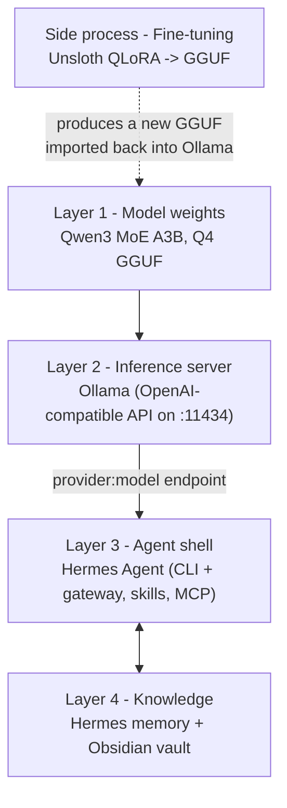

# Build a Local Hermes Daily Assistant (Qwen3 + Ollama + Unsloth + Obsidian)

## Intent
Stand up a **private, local-first daily assistant** — including coding help — built on [Hermes Agent](./hermes-agent-tutorial.md). You serve a Qwen3 MoE model locally with Ollama, give the agent a persistent knowledge layer (Hermes built-in memory **plus** an Obsidian vault), and optionally fine-tune the model on your own data with Unsloth.

## Use when
- You want a personal assistant that runs **on your own hardware** — no cloud round-trips for everyday tasks.
- You need one agent that handles **chat, coding, scheduling, and recall** across sessions.
- You want to **adapt the model to your voice and workflow** with your own data.

## The mental model: four layers, not one tool

The most common setup mistake is thinking "Hermes" or "Qwen" is the whole thing. It isn't. A working daily assistant is **four independent layers**, and the piece people forget is the **inference server** that sits between the model weights and the agent.



| Layer | Choice in this tutorial | Why it's needed |
| :--- | :--- | :--- |
| **Model** | Qwen3 MoE (~30B, **A3B** = ~3B active), Q4 quant | Strong reasoning + coding, but only ~3B params active per token → fast on modest hardware |
| **Inference server** | **Ollama** | Hermes does **not** run weights itself — it calls an OpenAI-compatible endpoint. Ollama provides exactly that. **This is the layer most setups miss.** |
| **Agent shell** | **Hermes Agent** | The assistant: CLI + messaging gateway, self-writing skills, scheduling, MCP tools |
| **Knowledge** | Hermes memory **+ Obsidian** | Hermes remembers across sessions; Obsidian gives you a human-readable, version-controlled vault the agent reads and writes |

> **About Obsidian:** you don't strictly *need* it — Hermes already has persistent memory and a user model. Add Obsidian when you want your knowledge to be a **portable, inspectable, Git-versioned set of Markdown files** rather than living only inside the agent's database. This tutorial wires up both.

## Prerequisites

- A machine with an NVIDIA GPU (for fine-tuning) **or** any modern machine for inference-only (Apple Silicon, or CPU+GPU via Ollama).
- [Ollama](https://ollama.com) installed.
- Hermes Agent prerequisites (Python 3.11+, uv, Node.js — the installer handles these). See the [Hermes Agent Tutorial](./hermes-agent-tutorial.md).
- [Obsidian](https://obsidian.md) (free) for the knowledge vault.
- For fine-tuning: a Google account (Colab) or a local NVIDIA GPU and `pip`.

> **Hardware reality check (read this).** This tutorial assumes a **~16 GB GPU** as the baseline and stays runtime-agnostic, but be honest about the limits:
> - A Q4 quant of a 30B-A3B MoE needs roughly **18–22 GB** just for weights. On 16 GB it will **partially offload to CPU/RAM** (Ollama does this automatically) — it runs, but slower, and a small context window.
> - If 16 GB feels tight, drop to a **smaller Qwen3 variant** (e.g. an 8B or 14B dense model, or a 4B) — the entire pipeline below is identical, only the model tag changes.
> - **Fine-tuning** the full 30B locally on 16 GB is not realistic. Either fine-tune a **smaller** Qwen3 on 16 GB, or use a **cloud/Colab GPU** for the training step (Step 4) and bring the result back down to your machine.

---

## Step 1 — Serve Qwen3 locally with Ollama

Install Ollama, then pull and run your model. Confirm the exact tag on [ollama.com/library](https://ollama.com/library) — substitute the variant that fits your hardware.

```bash
# Inference-capable model (use the exact tag for the Qwen3 MoE you want)
ollama pull qwen3:30b-a3b          # MoE, ~3B active — the model you described
# Lighter fallbacks if 16 GB is tight:
# ollama pull qwen3:14b
# ollama pull qwen3:8b

# Smoke test
ollama run qwen3:30b-a3b "Write a Python function that reverses a linked list."
```

Ollama automatically exposes an **OpenAI-compatible API** at `http://localhost:11434/v1`. That endpoint is what Hermes will talk to. Verify it:

```bash
curl http://localhost:11434/v1/chat/completions \
  -H "Content-Type: application/json" \
  -d '{"model":"qwen3:30b-a3b","messages":[{"role":"user","content":"ping"}]}'
```

If that returns JSON, Layer 2 is done.

---

## Step 2 — Install Hermes and point it at Ollama

Install Hermes and run the setup wizard (full command reference in the [Hermes Agent Tutorial](./hermes-agent-tutorial.md)):

```bash
# Linux / macOS / WSL2
curl -fsSL https://raw.githubusercontent.com/NousResearch/hermes-agent/main/scripts/install.sh | bash
source ~/.bashrc        # or ~/.zshrc
hermes setup
```

Now connect Hermes to your **local** model instead of a cloud provider. Hermes is model-agnostic and supports custom OpenAI-compatible endpoints, so you register Ollama as a custom provider. Configure it via `hermes config set` (or the `.env` it generates in `~/.hermes/`):

```bash
# Point Hermes at the local Ollama endpoint
hermes config set                 # set the OpenAI-compatible base URL to:
                                  #   http://localhost:11434/v1
                                  # and an api key (any non-empty string, e.g. "ollama")

# Select the local model (provider:model form)
hermes model openai:qwen3:30b-a3b

# Verify the whole environment
hermes doctor
```

> If `hermes doctor` reports the model is reachable and you get a reply from `hermes`, Layers 1–3 are wired together. Keep `ollama` running (it runs as a background service) whenever you use Hermes.

Start chatting:

```bash
hermes
```

---

## Step 3 — Wire up the knowledge layer (Hermes memory + Obsidian)

You get persistence from **two complementary sources**:

**3a. Hermes built-in memory (automatic).** Hermes already keeps cross-session memory, a user model, and self-written skills. After your first multi-step task, check what it captured:

```bash
hermes
/skills        # browse procedural memory the agent wrote for itself
```

**3b. Obsidian vault as a human-readable knowledge base.** Use the **LLM Wiki pattern** ([AI Knowledge Base for Agents](../02-ai-agents/03-context-and-memory/ai-knowledge-base-tutorial.md)): a folder of Markdown files the agent reads and writes, governed by a schema. The cleanest way to give Hermes access is to add a **filesystem MCP server** scoped to your vault folder.

```bash
# 1. Create (or open) an Obsidian vault — it's just a folder of .md files
mkdir -p ~/knowledge-vault

# 2. Add a schema file so the agent files notes consistently
#    (copy the minimal schema from the AI Knowledge Base tutorial into WIKI.md)

# 3. Register a filesystem MCP server scoped to the vault, then enable it
hermes config set        # add an MCP server pointing at ~/knowledge-vault
hermes tools             # confirm the filesystem/MCP tools are enabled
```

Now the agent can answer from your notes and append new ones. A good operating rule, drawn from the wiki pattern:

- **Facts and knowledge → Obsidian vault** (recall, retrieval, "what did I decide about X?").
- **Procedures and habits → Hermes skills** (repeatable multi-step tasks).

> Tip: keep the vault in Git. Because it's plain Markdown, every change the agent makes is a reviewable diff.

---

## Step 4 — (Optional) Fine-tune on your data with Unsloth

You said your data is **personal notes and docs**. Read this before training, because it determines whether you should fine-tune at all:

> **Don't fine-tune to memorize facts.** Fine-tuning teaches a model *behaviour* (tone, format, defaults, how you like answers), not a reliable *fact store*. Raw notes belong in the **Obsidian knowledge base** (Step 3), where they're retrievable and updatable. Fine-tune only to make the assistant **sound like you and follow your conventions**.

So split your notes:

1. **Knowledge → vault** (Step 3). Ingest the notes as wiki pages.
2. **Style/voice → fine-tune.** Derive **instruction → response pairs** that demonstrate *how* you want the assistant to write and decide. You can have a capable model draft these pairs *from* your notes, then you curate them.

### 4a. Build a small instruction dataset (JSONL)

```json
{"messages":[{"role":"user","content":"Summarize my meeting notes into 3 action items."},{"role":"assistant","content":"1. ... 2. ... 3. ... (in your preferred terse, bulleted voice)"}]}
{"messages":[{"role":"user","content":"Draft a reply declining this request politely."},{"role":"assistant","content":"<a reply written in your tone>"}]}
```

Keep it small and consistent (even 100–500 high-quality pairs move the needle). Hold out ~5% for a sanity-check split.

### 4b. Train a QLoRA adapter with Unsloth

Use the official Unsloth Qwen3 notebook (Colab if your local GPU is small). The recipe mirrors the repo's existing Unsloth walkthrough in [FunctionGemma Fine-Tuning](../04-guides/finetune-functiongemma.md) and the [Claude fine-tuning guide](../04-guides/claude-fine-tune-llm.md):

```python
from unsloth import FastLanguageModel
from trl import SFTTrainer, SFTConfig

# Pick a base that fits your training hardware.
# 30B-A3B needs a big/cloud GPU; on 16 GB use a smaller Qwen3.
model, tokenizer = FastLanguageModel.from_pretrained(
    model_name="unsloth/Qwen3-8B",      # swap for your chosen variant
    max_seq_length=4096,
    load_in_4bit=True,                   # QLoRA — fits modest VRAM
)
model = FastLanguageModel.get_peft_model(
    model, r=16, lora_alpha=16, lora_dropout=0,
    target_modules=["q_proj","k_proj","v_proj","o_proj",
                    "gate_proj","up_proj","down_proj"],
)

trainer = SFTTrainer(
    model=model, tokenizer=tokenizer,
    train_dataset=train_ds,              # your JSONL, formatted to chat template
    args=SFTConfig(max_seq_length=4096, per_device_train_batch_size=2,
                   gradient_accumulation_steps=4, learning_rate=2e-4,
                   num_train_epochs=2, logging_steps=10),
)
trainer.train()
```

### 4c. Export to GGUF and import back into Ollama

This closes the loop — your fine-tuned model becomes the model Hermes serves.

```python
# In the notebook: export a quantized GGUF (Unsloth has a one-call helper)
model.save_pretrained_gguf("my-assistant", tokenizer, quantization_method="q4_k_m")
```

```bash
# On your machine, create an Ollama model from the GGUF
cat > Modelfile <<'EOF'
FROM ./my-assistant/unsloth.Q4_K_M.gguf
SYSTEM "You are my personal daily assistant. Be concise and match my writing style."
EOF

ollama create my-assistant -f Modelfile

# Point Hermes at the fine-tuned model
hermes model openai:my-assistant
```

> **On 16 GB:** do Step 4b on Colab/cloud, download the GGUF, and run 4c locally. The fine-tuned smaller model is often a better daily driver on constrained hardware than a heavily-offloaded 30B.

---

## Step 5 — Coding tasks

Hermes ships 40+ tools (filesystem, shell, search) and MCP integration, so coding works out of the box once the model is connected:

- Run `hermes` inside a project directory; ask it to read files, propose diffs, and run commands.
- Enable/trim tools with `hermes tools` (keep shell + filesystem on for coding).
- Add project-specific MCP servers (e.g. a Git or test-runner server) via `hermes config set`.
- For repo conventions, keep an `AGENTS.md`/`CLAUDE.md` in the project — see [CLAUDE.md design](./claude-md-design-tutorial.md). A local Qwen3 follows a short, explicit instructions file far better than a long one.

> Local models have smaller effective context than frontier cloud models. Keep prompts and instruction files tight, and lean on the Obsidian vault + skills for recall instead of stuffing everything into context. See [agent context window performance](../02-ai-agents/03-context-and-memory/agent-context-window-performance.md).

---

## Step 6 — Make it a daily driver

```bash
# One process that also answers from Telegram/Discord/Slack/WhatsApp/Signal/Email
hermes gateway

# Schedule recurring tasks (e.g. a morning briefing from your vault)
# configure cron-based jobs via hermes setup / hermes config set
```

Let Hermes write skills after multi-step tasks, review them with `/skills`, and keep your vault in Git.

## Verification checklist
- [ ] `ollama run <model> "..."` returns a sensible answer (Layer 1–2).
- [ ] `curl http://localhost:11434/v1/chat/completions ...` returns JSON.
- [ ] `hermes doctor` passes and `hermes` replies using the local model (Layer 3).
- [ ] Filesystem/MCP tools point at your Obsidian vault; the agent can read and append notes (Layer 4).
- [ ] Notes split correctly: **facts in the vault**, not in the fine-tune set.
- [ ] (Optional) Fine-tuned GGUF imported via `ollama create`, selected with `hermes model`.
- [ ] (Optional) `hermes gateway` running and reachable from at least one messaging app.

## Common pitfalls
- **"Hermes can't find my model."** It's not pointed at Ollama. Set the base URL to `http://localhost:11434/v1` and re-run `hermes doctor`.
- **Slow / out-of-memory inference on 16 GB.** The Q4 30B is offloading to CPU. Use a smaller Qwen3 variant or a smaller quant; close other GPU apps.
- **Fine-tune "forgot" my facts.** Expected — that's the vault's job, not the adapter's. Move facts to Obsidian and keep the fine-tune for style.
- **Ollama not running.** It runs as a background service; start it (`ollama serve`) before launching Hermes.

## Related resources
- [Hermes Agent Tutorial](./hermes-agent-tutorial.md) — full command reference for the agent shell.
- [AI Knowledge Base for Agents (LLM Wiki Pattern)](../02-ai-agents/03-context-and-memory/ai-knowledge-base-tutorial.md) — the Obsidian vault pattern and schema.
- [FunctionGemma Fine-Tuning + Local Serving](../04-guides/finetune-functiongemma.md) — the Unsloth → GGUF workflow in detail.
- [Fine-Tune an Open Source LLM with Claude](../04-guides/claude-fine-tune-llm.md) — LoRA config and eval guidance.
- [Open Models for Agentic AI](../02-ai-agents/01-foundations/open-models.md) — why local/open models fit agent stacks.

## References
- Hermes Agent — [hermes-agent.nousresearch.com](https://hermes-agent.nousresearch.com)
- Nous Research — [nousresearch.com](https://nousresearch.com)
- Ollama — [ollama.com](https://ollama.com)
- Qwen (Qwen3 models) — [qwenlm.github.io](https://qwenlm.github.io)
- Unsloth documentation — [docs.unsloth.ai](https://docs.unsloth.ai)
- Obsidian — [obsidian.md](https://obsidian.md)
- claude-obsidian (Daniel Agrici) — [github.com/AgriciDaniel/claude-obsidian](https://github.com/AgriciDaniel/claude-obsidian)
