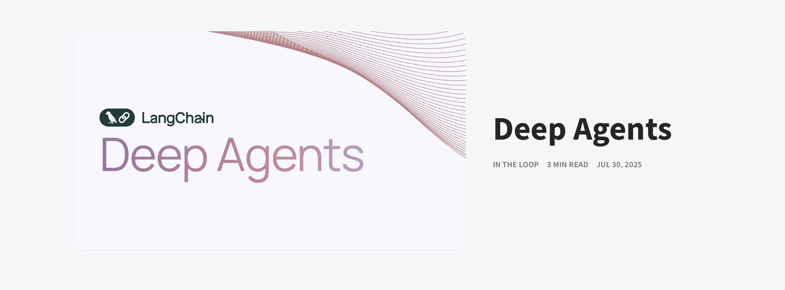
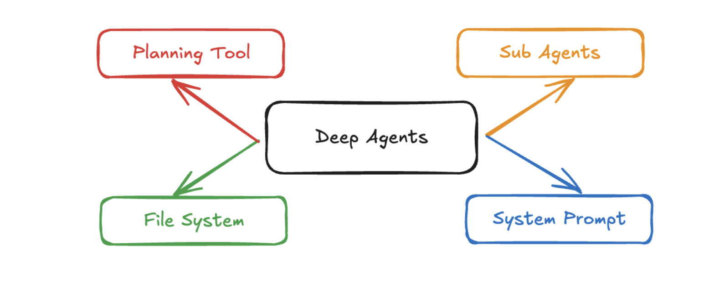

# LangChain Deep Agents Playbook

> Based on LangChain’s “Deep Agents” post, this guide shows how to recreate Claude Code–style research agents that plan, use sub-workers, and leave durable artifacts.

## Intent
- Capture the four characteristics LangChain identified in production-grade “deep” agents.
- Provide a repeatable recipe for building similar workflows with the open-source [`deepagents`](https://github.com/langchain-ai/deepagents) package.
- Highlight where Deep Research, Manus, and Claude Code lean on these mechanics so practitioners can mirror the same guardrails.

## Use when
- You need an agent to pursue multi-step research or coding tasks that last several tool calls.
- You want to move beyond a “single-loop” LangChain agent but keep things explainable and fully prompt-driven.
- You must leave artifacts (notes, drafts, todo lists) that downstream analysts can audit.

## Applications already shipping
- **Deep Research (OpenAI)** — delegates multi-hour investigations by combining structured prompts with workspace files ([Introducing Deep Research](https://openai.com/index/introducing-deep-research/)).
- **Manus** — leans on a persistent file system as shared memory for multi-day research loops ([manus.im](https://manus.im/)).
- **Claude Code** — Anthropic’s async coding surface that mixes long-form system prompts, a todo list tool, on-demand sub agents, and workspace storage ([Claude Code](https://www.anthropic.com/claude-code)).

These products proved that deeper planning + memory lets agents outgrow “question → answer” chats, especially for research and asynchronous coding.

## Core building blocks (from LangChain’s Deep Agents article)

### Detailed system prompt
- Claude Code’s recreated base prompts are lengthy, with instructions for every tool call and multiple examples.
- They preload allowed behaviors (“write findings to `final_report.md`”, “spawn critique sub agent when done”).
- Treat the prompt as policy plus playbook: include decision trees, failure protocols, and expected file outputs so the agent behaves consistently when it loops for hours.

### Planning tool
- LangChain calls out Claude Code’s todo list tool—a deliberate no-op whose only job is to force the LLM to plan in-context.
- Implement a similar planning hook that records goals and checkpoints (even if it just appends to a text file). The habit of pausing to plan keeps the agent from thrashing on complex briefs.

### Sub agents
- Claude Code spawns child agents for debugging, refactors, or documentation. Manus does the same for research branches.
- In `deepagents`, each sub agent can have its own name, description, system prompt, and toolset. Use them to parallelize tasks like fact gathering vs. critique.
- Keep sub agent prompts short but focused (“research-agent”, “critique-agent”) so you can call many of them without bloating the main context.

### File system
- Both Claude Code and Manus log intermediate artifacts to disk—notes, drafts, structured outputs—that other agents (or the human) can read later.
- LangChain’s package mocks this with a virtual file system so every tool call can read/write `question.txt`, `todo.md`, `final_report.md`, etc.
- Files double as scratchpads, accountability logs, and “shared memory” across the main agent and sub agents.

## Build with `langchain-ai/deepagents`

1. `pip install deepagents` (Python 3.11+ recommended).
2. Import `create_deep_agent`, define your real tools (search APIs, repo operations), and craft a base `system_prompt`.
3. Register helper components mirroring the four core traits:
   - **Prompt**: start from the Claude-inspired template shipped in the repo and inject domain-specific instructions.
   - **Planning tool**: wire a todo or checklist tool that simply echoes the plan back into context.
   - **Sub agents**: pass a list of `{name, description, system_prompt, tools}` dicts so heavy tasks run in parallel sandboxes.
   - **File hooks**: rely on the virtual file system (exposed via LangGraph state) to persist `*.md` or `*.txt` files each step can revisit.

The package exposes sane defaults (system prompt, todo tool, file workspace) so you can focus on your custom instructions, tools, and evaluation harnesses.

### Research agent template from the repo
- See [`examples/research/research_agent.py`](https://github.com/langchain-ai/deepagents/blob/master/examples/research/research_agent.py) for a full pattern.
- **Tools**: wraps a Tavily search helper (`internet_search`) and reuses it across the parent agent plus child researchers.
- **Sub agents**: defines `research-agent` (fact gathering) and `critique-agent` (editor) with targeted prompts, letting the supervisor break one brief into multiple investigations.
- **File workflow**:
  1. First action writes the original user question to `question.txt`.
  2. Research findings are merged into `final_report.md`, ensuring there is a durable artifact even if the session is interrupted.
  3. The critique agent reads from `final_report.md` and annotates gaps without overwriting the draft itself.
- **Instructional spine**: the master prompt embeds report templates, citation rules, and language constraints, guaranteeing consistent Markdown outputs regardless of the topic.

Adapt this blueprint by swapping in your own search tools, expanding the todo planner, or adding domain-specific sub agents (compliance reviewer, data analyst, etc.).

## Implementation checklist
- [ ] Draft or adapt a Claude-style system prompt covering role, tools, file conventions, and language rules.
- [ ] Stand up a planning tool (todo list file, scratchpad, or tracker) that the agent must call before risky operations.
- [ ] Enumerate sub agents with clear scopes and minimal tool access.
- [ ] Decide which artifacts live in the shared file system (inputs, drafts, critiques) and document the filenames inside the prompts.
- [ ] Run `mkdocs build` and any relevant `promptfoo` suites before publishing new tooling docs.

## References
- LangChain Blog — [Deep Agents](https://blog.langchain.com/deep-agents/)
- OpenAI — [Introducing Deep Research](https://openai.com/index/introducing-deep-research/)
- Manus — [manus.im](https://manus.im/)
- Anthropic — [Claude Code](https://www.anthropic.com/claude-code)
- GitHub — [`langchain-ai/deepagents`](https://github.com/langchain-ai/deepagents)
