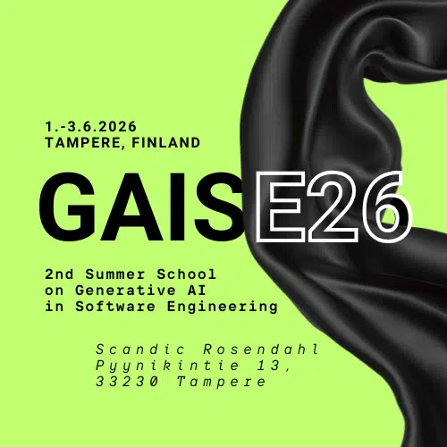
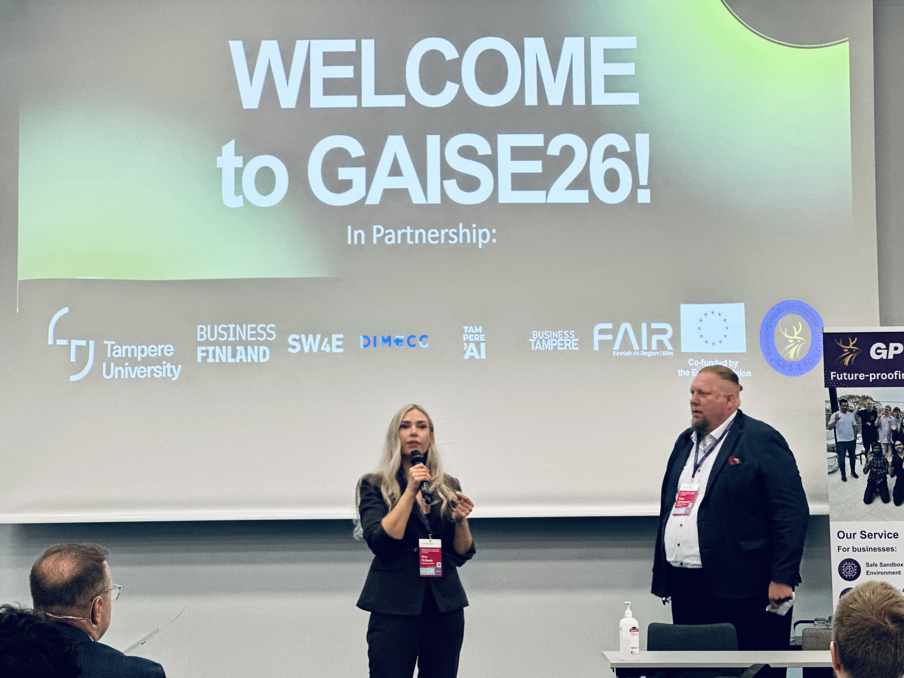
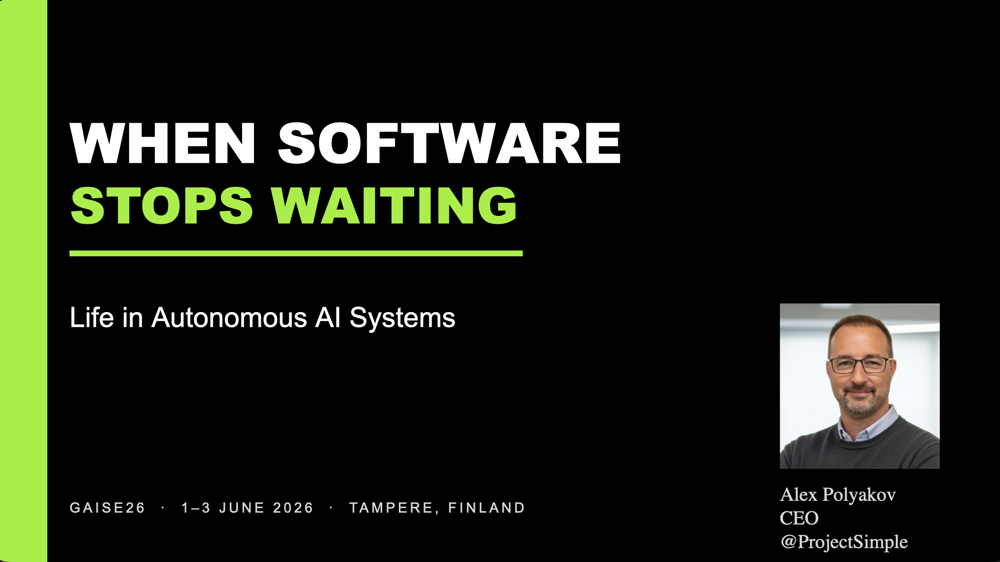
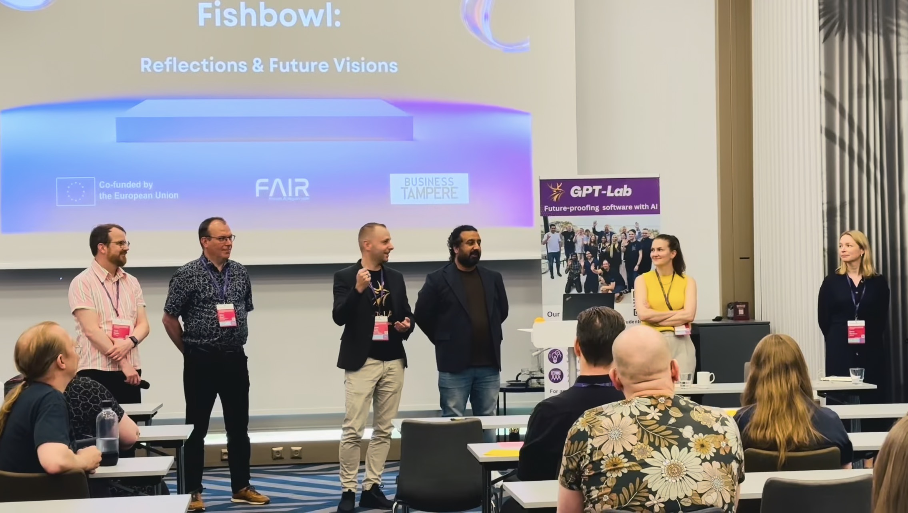

# GAISE 2026 — Tampere, Finland

## Event Introduction

**GAISE 2026 (GAISE Summer School)** took place on **1–3 June 2026** at **Tampere University, Hervanta Campus** (Korkeakoulunkatu 1, 33720 Tampere, Finland), hosted by [GPT-Lab](https://gpt-lab.eu/about-us/our-team/) — a generative-AI research lab founded by Professor Pekka Abrahamsson at Tampere University.

Across three days, the program explored how artificial intelligence is reshaping software engineering and organizations, structured around three thematic areas:

- **Monday, 1 June — Autonomous AI Systems** (Academic & Industry Tracks)
- **Tuesday, 2 June — AI-Native World** (Academic, Industry & Executive Tracks)
- **Wednesday, 3 June — Responsible AI Era** (Academic & Industry Tracks)

These are my personal notes from the sessions I attended.

**Links:** [Full program](https://gpt-lab.eu/gaise26-program/) · [Speakers](https://gpt-lab.eu/gaise26-speakers/) · [Organizer: GPT-Lab](https://gpt-lab.eu/about-us/our-team/)



---

## Day 1 — Monday, 1 June 2026

### Theme: Autonomous AI Systems · Academic & Industry Tracks

### 🎤 Conference Opening



GAISE 2026 kicked off with a warm welcome from Prof. Pekka Abrahamsson and Virve Yli-Savola of GPT-Lab at Tampere University. They opened the summer school, set the stage for three days exploring how AI is reshaping software engineering, and introduced the program ahead.

### 🎤 Keynote — When Software Stops Waiting: Life in Autonomous AI Systems by Alex Polyakov, CEO @ ProjectSimple



AI is changing far more than how code is written — software systems are starting to observe, decide, and act with ever less human involvement. Tracing the thread back to *"The first AI-Assisted Agile Software Engineering workshop"* he ran with Prof. Pekka Abrahamsson at XP Amsterdam on 13 June 2023, Alex Polyakov walked through what is already **dead**, what is rapidly **dying**, and what stays **very much alive** in the age of autonomous AI systems. His core message: agents make the coding fast, but the value — and the bottleneck — now lives in human judgment, ownership, and the checkpoints that keep autonomy honest.


**Interesting slides and observations**

- **Autonomous agents cut both ways.** Done right they deliver real gains — ~50% faster cycle time, ~35% fewer open bugs, ~40% more test coverage, ~60% faster incident recovery, and ~80% fresher docs. Done wrong, the failure modes are severe: deleted production databases, secrets logged in plain text, read-only modes overridden, and safety/approval loops bypassed.
- **Human-in-the-Loop is what closes those gaps.** Practices like work decomposition, iterative delivery, code review, a shared definition of done, requirement clarification, acceptance testing, architectural decision records, pair programming, and reversible rollbacks are exactly where agents fall short.
- **Where autonomous agents struggle (mostly high-severity):** scope drift, front-loaded execution, self-review blind spots, completion uncertainty, silent assumption propagation, teaching to the test, no rationale memory, asymmetric dialogue (they can't push back), and irreversibility blindness.
- **The Agile lesson still holds:** the more work is in progress, the slower it gets done. AI accelerates output, but human bottlenecks create the wait — Alex framed it via Kent Beck's Theory of Constraints ("see where the bags are piling up") and a baggage-claim metaphor: AI coding is *fast*, while human-in-the-loop and review/approve are the *waiting* states where work piles up.
- **Backlog thought experiment:** he contrasted how the backlog of **1 person + a 24/7 autonomous AI** looks versus **5 devs using human-in-the-loop** — output isn't the constraint, the human review states are.
- **Dead, Dying, Very Much Alive game** — Dead: PR-less merge, manual test generation, Scrum, the "10x developer." Dying: hand-coding, code ownership, line-by-line PR review. Very much alive: architectural design, Agile, product managers, and software engineers.
- **Five takeaways:** (1) autonomous agents aren't new — hallucination without judgment has always changed outcomes, and model size doesn't fix it; (2) human-in-the-loop beats full autonomy for now; (3) complex work needs more than intelligence — architecture, prioritization, naming, and incident calls stay human; (4) the biggest value is **Intelligent Automation (IA)**, reached through contextual awareness rather than bigger models; (5) **tokens are the new currency**, but AI commoditization is inevitable — ask what's optimizing whom.
- **Some memorable lines and data points:** *"Early bird gets the worm, but the second mouse gets the cheese."* On average **65% of a team's work is unplanned**, **token usage is the new KPI**, and — most pointedly — *"You cannot delegate ownership: let the people decide what we work on, describe the problem, and let the team solve the issue."*

### Academic Track

<!-- Add sessions below using the Session block from "Session Structure" at the bottom of this page. -->

### Industry Track

<!-- Add sessions below. -->

---

## Day 2 — Tuesday, 2 June 2026

### Theme: AI-Native World · Academic, Industry & Executive Tracks

### Academic Track

<!-- Add sessions below. -->

### Industry Track

<!-- Add sessions below. -->

### Executive Track

<!-- Add sessions below. -->

---

## Day 3 — Wednesday, 3 June 2026

### Theme: Responsible AI Era · Academic & Industry Tracks

### Academic Track

<!-- Add sessions below. -->

### Industry Track

<!-- Add sessions below. -->

### 🎤 Conference Closing

<!-- CLOSING PHOTO PLACEHOLDER -->


A heartfelt thank you to everyone who made GAISE 2026 possible. The **GPT-Lab team** at Tampere University created an outstanding program that brought together researchers, practitioners, and executives from across the AI and software-engineering community.

Special recognition goes to the main organizers — **Vaishnavi Bankhele** and **Virve Yli-Savola** — whose meticulous planning and tireless effort ensured the event ran smoothly from the first keynote to the final session. Equal thanks to all the **volunteers** who handled registration, logistics, and the countless behind-the-scenes tasks that keep a multi-track conference on track.

Your work gave everyone in the room the space to focus on learning and connecting. Thank you.

---

## Session Structure (copy this block for each session)

Copy and paste the block below under the relevant day/track, then fill in the details.

```markdown
#### [Session Title]


- **Speaker:** [Name, affiliation/role] — [speaker profile link]
- **Session Type:** [Keynote / Academic talk / Industry talk / Executive panel / Workshop / Lightning talk]
- **Title:** [Full session title]

**Description**

[2–4 sentences summarizing the session.]

**Interesting slides and observations**


[Note what made these slides worth capturing.]

**Related Blueprints**

- [Title](../path/to/blueprint.md)
```

---

*Notes by Tomas Herda. Connect on [LinkedIn](https://www.linkedin.com/in/herdatom).*
