# GAISE 2026 — Tampere, Finland

## Event Introduction

**GAISE 2026 (Generative AI in Software Engineering)** took place on **1–3 June 2026** at **Tampere University, Finland**, hosted by [GPT-Lab](https://gpt-lab.eu/about-us/our-team/) — a generative-AI research lab founded by Professor Pekka Abrahamsson.

Across three days, the program explored how artificial intelligence is reshaping software engineering and organizations, structured around three thematic areas:

- **Monday, 1 June — Autonomous AI Systems** (Academic & Industry Tracks)
- **Tuesday, 2 June — AI-Native World** (Academic, Industry & Executive Tracks)
- **Wednesday, 3 June — Responsible AI Era** (Academic & Industry Tracks)

These are my personal notes from the sessions I attended.

**Links:** [Full program](https://gpt-lab.eu/gaise26-program/) · [Speakers](https://gpt-lab.eu/gaise26-speakers/) · [Organizer: GPT-Lab](https://gpt-lab.eu/about-us/our-team/)

---

## Sessions

### Day 1 — Monday, 1 June · Autonomous AI Systems

| Session | Speaker |
|---------|---------|
| [Conference Opening](#conference-opening) | Prof. Pekka Abrahamsson & Virve Yli-Savola |
| [Workshop — Agent-first IDEs](#workshop-agent-first-ides) | Tomas Herda & Agnes Lipovits, Austrian Post Business Solutions |
| [Keynote — When Software Stops Waiting](#keynote-alex-polyakov) | Alex Polyakov, CEO @ ProjectSimple |
| [Academic Talk — Generative AI in SE: Progress & Open Questions](#academic-waseem) | Muhammad Waseem, PhD |
| [Workshop — Vibing Ideas: Knowing What to Build When AI Does the Rest](#workshop-vibing-ideas) | Prof. Xiaofeng Wang, Daniel Planötscher & Silvia Cortesia |
| [Tech Talk — Measuring the Business Value of Agentic AI](#tech-talk-janne) | Janne Kuivalainen, CTO, Danfoss Drives |
| [Demo — From Task to Action: Why Agent Harnesses Matter](#demo-harnesses) | Malik Abdul Sami & Zeeshan Rasheed, GPT-Lab |
| [Academic Talk — AI Won't Save Your Research](#academic-kai) | Dr. Kai-Kristian Kemell, GPT-Lab |
| [Doctoral Research Presentations](#doctoral-research) | Dr. Kai-Kristian Kemell & Dr. Mika Saari, GPT-Lab |

### Day 2 — Tuesday, 2 June · AI-Native World

| Session | Speaker |
|---------|---------|
| [Keynote — Agents Code. Teams Erode.](#keynote-markus-borg) | Dr. Markus Borg, CodeScene / Lund University |
| [Panel — The Rise of Agentic Organizations](#panel-agentic-organizations) | Dr. Markus Borg, Alex Polyakov, Karoliina Kettukari & Timo Savolainen · facilitator: Sanni Pöntinen |
| [Lab — Tools That Use Tools to Build Tools](#lab-jussi-rasku) | Dr. Jussi Rasku, GPT-Lab / Tampere University |
| [Live Demo — Sovereign AI](#demo-sovereign-ai) | Jiri Härmä, GPT-Lab / Tampere University |
| [Live Demo — World Models](#demo-world-models) | Kalle Kulonen, GPT-Lab / Tampere University |
| [Keynote — Where AI Creates Competitive Advantage](#keynote-meeri-haataja) | Meeri Haataja, CEO & CPO, Saidot |
| [Expert Talk — The Essentials of AI: What AI Can Already Do](#talk-pekka-abrahamsson) | Prof. Pekka Abrahamsson, GPT-Lab / Tampere University |
| [Expert Talk — AI Came To Work — But Who Is Leading It?](#talk-sebastian-sonntag) | Sebastian Sonntag, GPT-Lab / Tampere University |
| [Hands-on Lab — How to Jailbreak LLMs](#lab-esa-karjalainen) | Esa Karjalainen, GPT-Lab / Tampere University |
| [Hands-on Lab — Architecting in the AI Era](#lab-waseem) | Dr. Muhammad Waseem, GPT-Lab / Tampere University |
| [Show & Tell — Stop Comparing Language Models. Start Building the Agentic OS.](#showtell-tiina) | Tiina Karhukivi & Mika Suominen, GPT-Lab / Tampere University |

### Day 3 — Wednesday, 3 June · Responsible AI Era

| Session | Speaker |
|---------|---------|
| [Keynote — From Vibes to Engineering](#keynote-tommi-mikkonen) | Prof. Tommi Mikkonen, University of Jyväskylä |
| [Industrial Demo — Specification-Driven and AI-Powered Software Engineering in Regulated Environments and Beyond](#demo-spexant) | Mika Torhola, Atostek Oy |
| [Conference Closing](#conference-closing) | GPT-Lab Team |

---

## Day 1 — Monday, 1 June 2026

### Theme: Autonomous AI Systems · Academic & Industry Tracks

### 🎤 Conference Opening

GAISE 2026 kicked off with a warm welcome from Prof. Pekka Abrahamsson and Virve Yli-Savola of GPT-Lab at Tampere University. They opened the summer school, set the stage for three days exploring how AI is reshaping software engineering, and introduced the program ahead.

### 🛠️ Workshop — Agent-first IDEs by Tomas Herda & Agnes Lipovits, Austrian Post Business Solutions

To kick off the session, we presented [#DAiTA — Intelligent Document Processing](https://www.post.at/en/g/c/daita) — Austrian Post Business Solutions' platform for AI-powered automation of business document workflows — as a real-world example of applied AI in enterprise operations.

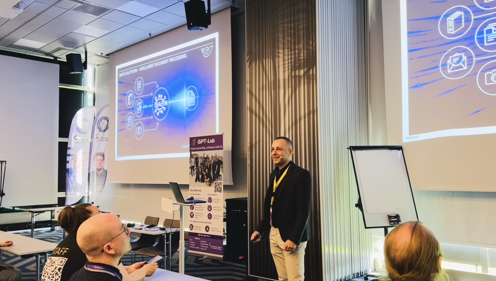

The way we build software is changing rapidly. Modern Agent-first IDEs and coding agents such as Kiro, Google Antigravity, Cursor, Windsurf, and Claude Code no longer just autocomplete code — they can plan, implement, test, debug, and validate changes autonomously across entire repositories. At the same time, the industry is moving from prompt-driven coding toward **spec-driven autonomous engineering**, where agents execute structured specifications, constraints, and acceptance criteria instead of relying on ad-hoc prompts alone.

This hands-on workshop introduced the key concepts behind reliable AI-assisted development: Context Engineering, reusable Skills, AGENTS.md, MCP (Model Context Protocol), and persistent AI knowledge bases (wikis) that let agents accumulate and reuse project knowledge across sessions. The first half covered the concepts and tooling behind agent-first development; the second half was fully practical — participants built and experimented with a working setup directly on their own laptops.

**Interesting observations**

- **Context over cleverness.** The session anchored on a line from Andrej Karpathy: *"90% of Claude's mistakes come from missing context, not a weak model."* Most failures aren't model failures — they're context failures.
- **Context engineering vs. prompt engineering.** The analogy ran throughout: entire environment info vs. a single query, a screenplay vs. a sticky note, a complete system (docs, examples, rules, patterns, guardrails) vs. clever wording, continuous curation vs. a one-time instruction — memory, tools, data, schemas, and project context vs. a few few-shot examples. See [Context Engineering](https://github.com/TomasHer/prompting-blueprints/blob/main/02-ai-agents/03-context-and-memory/context-engineering.md).
- **Prompting patterns still matter.** A tour through reusable prompting patterns — Persona, Question Refinement, Flipped Interaction, Chain-of-Thought, Zero-Shot, and Few-Shot — and how each fits reasoning LLMs ([Effective prompts for reasoning LLMs](https://gpt-lab.eu/effective-prompts-for-reasoning-llms/)).
- **What makes an IDE *agentic*?** The components: Repository, Chat Window, Agent Configuration, Agent Orchestration, Agent Definitions, Skills, MCP & Tools, and Human-in-the-loop.
- **AGENTS.md.** An introduction to the AGENTS.md convention and a reusable template for steering agents with project context ([Agent context window & performance](https://github.com/TomasHer/prompting-blueprints/blob/main/02-ai-agents/03-context-and-memory/agent-context-window-performance.md)).
- **Anatomy of a Skill.** How reusable Skills are structured and how they tie back into context engineering ([Anatomy of a Skill](https://github.com/TomasHer/prompting-blueprints/blob/main/02-ai-agents/02-skills/anatomy-of-a-skill.md)).
- **Personal AI knowledge base.** A live use case built with Obsidian + MCP (or the open-source alternative [Logseq](https://logseq.com)), echoing Karpathy's own AI knowledge-base workflow ([AI knowledge base tutorial](https://github.com/TomasHer/prompting-blueprints/blob/main/02-ai-agents/03-context-and-memory/ai-knowledge-base-tutorial.md#implementation-claude-obsidian)). Demonstrated by building a **Product Owner handbook** and walking through [Prompting Blueprints](https://github.com/TomasHer/prompting-blueprints) — my personal AI knowledge base.
- **Hands-on: AI Bug Detective.** The interactive part put predefined agents and skills to work in a Replit project — [AI Bug Detective](https://replit.com/@laxxli/ai-bug-detective).

### 🎤 Keynote — When Software Stops Waiting: Life in Autonomous AI Systems by Alex Polyakov, CEO @ ProjectSimple

AI is changing far more than how code is written — software systems are starting to observe, decide, and act with ever less human involvement. Tracing the thread back to *"The first AI-Assisted Agile Software Engineering workshop"* he ran with Prof. Pekka Abrahamsson at XP Amsterdam on 13 June 2023, Alex Polyakov walked through what is already **dead**, what is rapidly **dying**, and what stays **very much alive** in the age of autonomous AI systems. His core message: agents make the coding fast, but the value — and the bottleneck — now lives in human judgment, ownership, and the checkpoints that keep autonomy honest.

**Interesting observations**

- **Autonomous agents cut both ways.** Done right they deliver real gains — ~50% faster cycle time, ~35% fewer open bugs, ~40% more test coverage, ~60% faster incident recovery, and ~80% fresher docs. Done wrong, the failure modes are severe: deleted production databases, secrets logged in plain text, read-only modes overridden, and safety/approval loops bypassed.
- **Human-in-the-Loop is what closes those gaps.** Practices like work decomposition, iterative delivery, code review, a shared definition of done, requirement clarification, acceptance testing, architectural decision records, pair programming, and reversible rollbacks are exactly where agents fall short.
- **Where autonomous agents struggle (mostly high-severity):** scope drift, front-loaded execution, self-review blind spots, completion uncertainty, silent assumption propagation, teaching to the test, no rationale memory, asymmetric dialogue (they can't push back), and irreversibility blindness.
- **The Agile lesson still holds:** the more work is in progress, the slower it gets done. AI accelerates output, but human bottlenecks create the wait — Alex framed it via Kent Beck's Theory of Constraints ("see where the bags are piling up") and a baggage-claim metaphor: AI coding is *fast*, while human-in-the-loop and review/approve are the *waiting* states where work piles up.
- **Backlog thought experiment:** he contrasted how the backlog of **1 person + a 24/7 autonomous AI** looks versus **5 devs using human-in-the-loop** — output isn't the constraint, the human review states are.
- **Dead, Dying, Very Much Alive game** — Dead: PR-less merge, manual test generation, Scrum, the "10x developer." Dying: hand-coding, code ownership, line-by-line PR review. Very much alive: architectural design, Agile, product managers, and software engineers.
- **Five takeaways:**
 (1) autonomous agents aren't new — hallucination without judgment has always changed outcomes, and model size doesn't fix it;
 (2) human-in-the-loop beats full autonomy for now;
 (3) complex work needs more than intelligence — architecture, prioritization, naming, and incident calls stay human;
 (4) the biggest value is **Intelligent Automation (IA)**, reached through contextual awareness rather than bigger models;
 (5) **tokens are the new currency**, but AI commoditization is inevitable — ask what's optimizing whom.
- **Some memorable lines and data points:** *"Early bird gets the worm, but the second mouse gets the cheese."* On average **65% of a team's work is unplanned**, **token usage is the new KPI**, and — most pointedly — *"You cannot delegate ownership: let the people decide what we work on, describe the problem, and let the team solve the issue."*

### 🎓 Academic Talk — Generative AI in Software Engineering: Progress & Open Questions by Muhammad Waseem, PhD

A state-of-the-art academic survey of where generative AI in software engineering actually stands. Muhammad Waseem traced the long arc of "the end of hand-written code," mapped today's tooling landscape, laid out the research methods the community uses to measure real impact, and closed with a working artifact — a multi-agent refactoring tool — as a concrete example of workflow-level AI assistance. The throughline: capability is real and layered, but the open questions are about how we *rigorously* measure value, trust, and security.

**Interesting observations**

- **A short history — every era was promised the end of hand-written code.**

- **The GenAI tooling ecosystem is an 8-layer stack.**

- **Research approaches — seven ways to study GenAI's real impact. Each method maps to what it can actually measure.**

- **RENDRI-R: a multi-agent tool for Java code refactoring.**

### 🛠️ Workshop — Vibing Ideas: Knowing What to Build When AI Does the Rest by Prof. Xiaofeng Wang, Daniel Planötscher & Silvia Cortesia, LUT University / Free University of Bozen-Bolzano

*"If coding really is solved, the bottleneck moves to taste, judgment, and knowing what is worth building."* This hands-on workshop reframed AI not as a faster way to write code, but as a **thinking partner** — a collaborator for navigating ambiguity, surfacing real user needs, and shaping rough ideas into solutions actually worth building. Once implementation stops being the constraint, the hard part becomes deciding *what* to build and *why*, and the workshop put that judgment front and center.

**Interesting observations**

- **The bottleneck has moved upstream.** When AI handles the "how," value concentrates in the "what" and "why" — taste, judgment, and problem framing become the scarce skills.
- **AI as a thinking partner, not a code generator.** Used well, AI helps explore the problem space, challenge assumptions, and pressure-test ideas before any code is written.
- **Navigating ambiguity is the real work.** Surfacing latent user needs and turning fuzzy, ill-defined problems into something concrete enough to act on is where the leverage lives.
- **From ideas to solutions worth building.** The hands-on portion practiced shaping and prioritizing ideas — separating what's *possible* from what's *worth doing*.

### 🎤 Tech Talk — Measuring the Business Value of Agentic AI by Janne Kuivalainen, CTO, Danfoss Drives

Agentic AI promises step-change productivity, yet its economic value remains stubbornly hard to evidence. Janne Kuivalainen introduced a conceptual framework that links **agent maturity** with **structured business impact assessment** through **KPI trees** — connecting what an agent can actually do to where it shows up on the financials. The throughline: to make the value of agentic AI credible, you have to trace it all the way from the org structure that owns it, through the projects that deploy it, down to the lines of the P&L and balance sheet it moves.

**Interesting observations**

- **Vision to Value — the path forward.** The closing framework tied three things together: the *people* who own the work (Business & Line Leaders, an AI Solution Owner, AI & Data Leadership, and the AI & Data team), the *maturity* of the agents themselves, and the *financial impact* they produce — so value is never asserted in the abstract but always traced back to an owner and a number.
- **KPI trees map AI impact onto the financial statements.** Rather than vague productivity claims, each agentic use case is connected to concrete P&L and balance-sheet lines: new AI product value → higher sales (Revenue), automation & efficiency → lower unit costs (Cost of Sales), AI automation → lower overhead (OPEX), and onward to gross margin, EBIT, and net profit. The balance sheet gets the same treatment — faster customer payments (Receivables), leaner inventory and faster turns, higher asset utilization (PPE), growing data & IP value (Intangibles), and stronger equity from retained earnings.
- **Project phases: Pilot → Implementation → Scaling → Adopted.** Agentic initiatives were framed as moving through four explicit stages, making it clear that business value is realized progressively — a pilot proves the concept, but the payoff only compounds once a use case is scaled and fully adopted.
- **Maturity and value go together.** Pairing agent maturity with the impact framework keeps expectations honest: early-stage agents shouldn't be measured against fully-adopted returns, and the KPI tree makes that distinction explicit instead of hand-waving it.

### 🖥️ Demo — From Task to Action: Why Agent Harnesses Matter by Malik Abdul Sami & Zeeshan Rasheed, GPT-Lab / Tampere University

The jump from a powerful LLM to a genuinely useful agent isn't a bigger model — it's the **harness** around it. Malik Abdul Sami and Zeeshan Rasheed of GPT-Lab made the case that the model only supplies intelligence, while the harness supplies the **hands, eyes, memory, and safety boundaries** that turn that intelligence into action. They grounded the argument in a live demo of **OpenHarness**, their open-source Python implementation, to show how production agents actually work under the hood rather than treating them as a black box.

**Interesting observations**

- **The harness equation.** Their framing reduced an agent harness to five pillars: **Harness = Tools + Knowledge + Observation + Action + Permissions** — the complete infrastructure that wraps around an LLM to make it functional. The model is the brain; the harness is everything else that lets it sense, decide, act, and stay within bounds.
- **The five pillars, concretely.** *Tools* — 43+ tools (bash, read, write, search) give the agent hands. *Knowledge* — skills, `CLAUDE.md`, and memory give it persistent context about the project and itself. *Observation* — git diff, error logs, and file state are its eyes and feedback loop. *Action* — ~43 commands, API calls, and file edits are how it changes the world. *Permissions* — sandboxing, approval, and trust are the safety boundaries that keep autonomy honest.
- **Observation closes the loop.** The point that stuck: agents don't just emit actions, they *observe* the consequences (diffs, errors, file state) and adjust — the harness is what makes that sense-act-sense cycle possible, not the model alone.
- **OpenHarness as an open demo.** Rather than a slide-only talk, they shipped the architecture as open source for researchers, builders, and the community — to understand how production AI agents work under the hood, experiment with cutting-edge tools, skills, and agent-coordination patterns, extend it with custom plugins, providers, and domain knowledge, and build specialized agents on top of a proven architecture. Repo: [GPT-Laboratory/harness-testing](https://github.com/GPT-Laboratory/harness-testing).

### 🎓 Academic Talk — AI Won't Save Your Research: Things Researchers Should Never Do by Dr. Kai-Kristian Kemell, GPT-Lab / Tampere University

A candid, practitioner's-eye talk on the pitfalls of leaning on generative AI in academic work. Dr. Kai-Kristian Kemell's message was a useful corrective to the hype: AI is a powerful assistant, but it won't do the thinking, the rigor, or the accountability for you — and researchers who treat it as a shortcut around those responsibilities tend to get burned. A grounded reminder of the things researchers should never hand off to a model.

### 🎓 Doctoral Research Presentations by Dr. Kai-Kristian Kemell & Dr. Mika Saari, GPT-Lab / Tampere University

<!-- PHOTO PLACEHOLDER — add image once available -->

A session spotlighting doctoral research from the GPT-Lab community, chaired by Dr. Kai-Kristian Kemell and Dr. Mika Saari. Early-stage researchers shared work-in-progress at the intersection of AI and software engineering — a window into the questions the next generation of the field is taking on.

---

## Day 2 — Tuesday, 2 June 2026

### Theme: AI-Native World · Academic, Industry & Executive Tracks

The day's **Executive Track** was chaired by **Sanni Pöntinen** (GPT-Lab / Tampere University).

### 🎤 Keynote — Agents Code. Teams Erode. by Dr. Markus Borg, CodeScene / Lund University

Coding agents now write significant portions of production software, so Dr. Markus Borg argued the question is no longer *whether* they work, but what happens to the **humans around them**. Drawing on CodeScene's **behavioral code analysis**, he made the case that **knowledge distribution, ownership, and coordination** are load-bearing structures that keep hybrid (human + AI) teams from hollowing out — and that left unattended, they quietly erode, letting AI replace the wrong parts of a team rather than augment it. The throughline: agents make the code cheap, but a team can hollow out from the inside unless you actively measure and defend how understanding is spread across the people who own it.

**Interesting observations**

- **Two human challenges loom over hybrid teams.** *Human Challenge 1 — Code Bloat and Cognitive Load:* agents generate volume far faster than humans can absorb it, so the cognitive load of understanding and maintaining the codebase balloons. *Human Challenge 2 — Skill Atrophy and Loss of Intent:* as agents take over more of the work, human skills decay and the rationale behind decisions evaporates, leaving code that nobody fully understands or can explain.

- **Solution 1: Maintain Human Oversight.** Two practices keep humans in the loop — **visualization**, using behavioral code analysis and knowledge maps to make knowledge distribution and ownership visible across the codebase (the colored clusters show where authorship concentrates), and **disciplined provenance tracking**, so you always know what a human wrote versus what an agent generated.

- **Solution 2: Manage Three Layers of Debt.** Borg reframed AI-era debt as three stacked layers, each with its own mitigation:
 **Technical Debt** (code quality, architecture, maintainability) → add agentic **guardrails** and **monitor** churn & bloat.
 **Intent Debt** (rationale, goals, constraints, decisions) → **capture intent before agents act** — requirements, spec-driven development, architectural decision records, TDD.
 **Cognitive Debt** (models, reasoning, awareness) → treat **understanding as a KPI** — walkthroughs, pairing, retrospectives, and sensemaking sessions.

- **Before signing the AI deal — reinforce best practices.** The closing checklist boiled down to three: (1) **guardrails for brain-aligned code**, (2) **maintain human oversight**, and (3) **beware cognitive and intent debt** — the two debts that never show up in the code itself, yet quietly decide whether the team erodes.

### 💬 Panel — The Rise of Agentic Organizations: Leadership in the Age of Physical and Synthetic AI

**Opening remarks & panelist:** Timo Savolainen, Founder & CEO, 4. Aalto · **Panelists:** Dr. Markus Borg (CodeScene / Lund University), Alex Polyakov (CEO, ProjectSimple), Karoliina Kettukari (AI Director, OP Pohjola) · **Facilitator:** Sanni Pöntinen (GPT-Lab / Tampere University)

Right after the morning keynote, the Executive Track widened the lens from individual coding agents to the whole **agentic organization** — and to the people who have to lead it. The premise: organizations are becoming staffed not only by humans but by **physical AI** (robots and embodied systems) and **synthetic AI** (digital agents and "synthetic colleagues") that observe, decide, and act alongside their teams. Facilitated by Sanni Pöntinen, the panel paired a researcher (Markus Borg), two founders (Alex Polyakov and Timo Savolainen), and an enterprise AI leader (Karoliina Kettukari of OP Pohjola) to work through what leadership, structure, and accountability look like when the workforce is part human and part machine. Timo Savolainen set the table with opening remarks on the substrate all of this depends on — turning scattered, siloed knowledge into **shared organizational intelligence**.

**Interesting observations**

- **Timo Savolainen's opening remarks — From Information Chaos to Organizational Shared Intelligence.** His framing for the whole panel: most organizations today run on *information chaos*, with knowledge scattered across Teams, SharePoint, CRMs, and ERPs — and trapped in people's heads (*"Ask Peter, he knows," "It's somewhere in Teams," "The knowledge left with the employee."*). He mapped a four-stage path out of it:
 **1 · Information Chaos** — scattered, hard to find, hard to trust, not shared.
 **2 · The Great Transformation** — AI captures tacit human knowledge (expertise, experience, decisions, lessons learned) and turns it into structured, machine-readable *shared organizational memory*: *"For the first time in history, tacit knowledge can become a shared organizational asset."*
 **3 · Organizational Shared Intelligence** — a new layer fusing enterprise knowledge, people's "second brains," and tacit know-how into AI-native formats (Markdown, knowledge graphs, metadata & ontologies) that are human-readable, AI-readable, continuously evolving, and a single source of truth.
 **4 · AI-Native Organization** — people and *synthetic colleagues* (Copilot, ChatGPT, Claude, AI agents) both draw on that shared intelligence across leadership, sales, experts, finance, and operations.
 The promised outcomes: **2–5× productivity**, faster learning, better decisions, durable organizational memory, and continuous innovation.
- **A lighter moment from Alex Polyakov.** On the relentless tempo of building a company, the serial founder drew a laugh from the room: *"To us entrepreneurs, Friday means that there are only 2 days left by the end of the week."*

### 🛠️ Lab — Tools That Use Tools to Build Tools by Dr. Jussi Rasku, GPT-Lab / Tampere University

Dr. Jussi Rasku framed the rise of agentic coding as a shift *beyond the IDE paradigm* toward **L1–L5 AI software-engineering systems** — staged autonomy levels in which an LLM-powered agent lives inside a **harness**, decomposes a task, calls tools to act and observe, and, when its toolbox falls short, **writes the new tool it needs on the spot**. He grounded the idea in examples ranging from DeepMind's **AlphaEvolve** to GPT-Lab's own multi-agent research on optimization heuristics and auto-generated MCP data adapters, building toward a single claim: an agent's intelligence isn't the model, it's the **loop**. The session then went fully hands-on with the **Pi coding agent** — a UNIX-style, minimal-core agent hosted at [pi.aistico.com](https://pi.aistico.com) — where participants asked Pi to inspect a sample CSV, build whatever tool it needed to understand the data, and run that tool to explain the results. Materials: [GPT-Laboratory/GAISE26_tool_building_pi_agents](https://github.com/GPT-Laboratory/GAISE26_tool_building_pi_agents).

**Interesting observations**

- **A harness is the control layer that turns a model into a worker.** Rasku opened with a dictionary-style definition worth keeping: a harness is *"the control layer around a large language model that turns model outputs into reliable action: providing tools, memory, context, permissions, execution logic, logging, and recovery."* The punchline — **the model imitates reasoning; the harness makes it do work** — complements the Day 1 [harness demo](#demo-harnesses) by Sami & Rasheed and maps directly onto the Blueprint on [prompt, context & harness engineering](https://github.com/TomasHer/prompting-blueprints/blob/main/02-ai-agents/01-foundations/prompt-context-harness-engineering.md).

- **The loop is the intelligence.** The core mental model: **generate → act → observe → evaluate → revise**. Tool use is what lets an agent *observe and interact* with the world instead of just emitting text — it closes the sense-act-sense cycle, and that loop, not raw model size, is where useful behavior actually comes from.

- **Tool-building compounds capability and enables self-improvement.** When the toolbox runs out, the agent doesn't fail — it builds the missing tool and keeps going, so every new tool widens what the next step can do. AlphaEvolve was the marquee example of this compounding: the model generates, tests, and refines its own candidate solutions to evolve better algorithms over time.

- **Wrapping *any* data source as an MCP — a way out of data-integration hell.** GPT-Lab is exploring an agentic system that can wrap any data source as a [Model Context Protocol](https://github.com/TomasHer/prompting-blueprints/blob/main/02-ai-agents/04-protocols/mcp-guide.md) server. Rasku's survey of existing builders (Tyk API-to-AI, Speakeasy, MCP.Link, AI-Create, OpenAPI-to-MCPServer, openapi-mcp-generator, openapi-mcp) found them *"mostly just (OpenAI) API wrappers"* — nobody had yet tackled the larger project of generating uniform tools over arbitrary data.

- **Generating MCP servers: 2014 → 2026.** He drew a line from a 2014 GOFAI approach — join-inference and attribute classifiers that imported vehicle-routing problems from raw relations (Kalmbach's master's thesis) — to a 2026 architecture where an **AI MCP generator** introspects a data source and *Claude-Code-style* generates a server from its schema, deploying a uniform MCP layer that agents discover, query, and combine for grounded access.

- **An aside on the agentic-coding gold rush: the Clawd → Moltbot → OpenClaw mania.** A retired developer's weekend hack went viral — 60K stars in three days, a peak of 710 ★/hr, 100K stars in ~2 days, past React's 10-year total in 60 days, and 350K+ today — surviving an Anthropic cease-and-desist (hence two renames in three days) before being handed to a foundation and absorbed into OpenAI. A vivid illustration of how fast the harness-and-tools ecosystem is moving.

- **The lab system: from intent to a running tool, with no editor.** The Pi setup is deliberately minimal: a **chat pane** where you give Pi a task and a **work pane** where you watch it work, backed by an isolated, disposable **sandboxed container**. Inside, the **pi agent** orchestrates — reasoning via an LLM on OpenRouter — then **writes a small script (the tool)** and **runs it on your data**. The whole point: *you state intent, Pi writes and runs the tool, and you never open an editor.*

- **Five takeaways.**
 (1) **Tool use allows agents to observe and interact** — not just generate text.
 (2) **Models become useful systems when a harness makes them do actual work.**
 (3) **The loop is the intelligence:** generate → act → observe → evaluate → revise.
 (4) **Tool-building compounds capability** and allows self-improvement.
 (5) **Generating MCP servers** (one kind of tool) for data is a solution out of data-integration hell.

### 🖥️ Live Demo — Sovereign AI: From Dependence to Sovereignty by Jiri Härmä, GPT-Lab / Tampere University

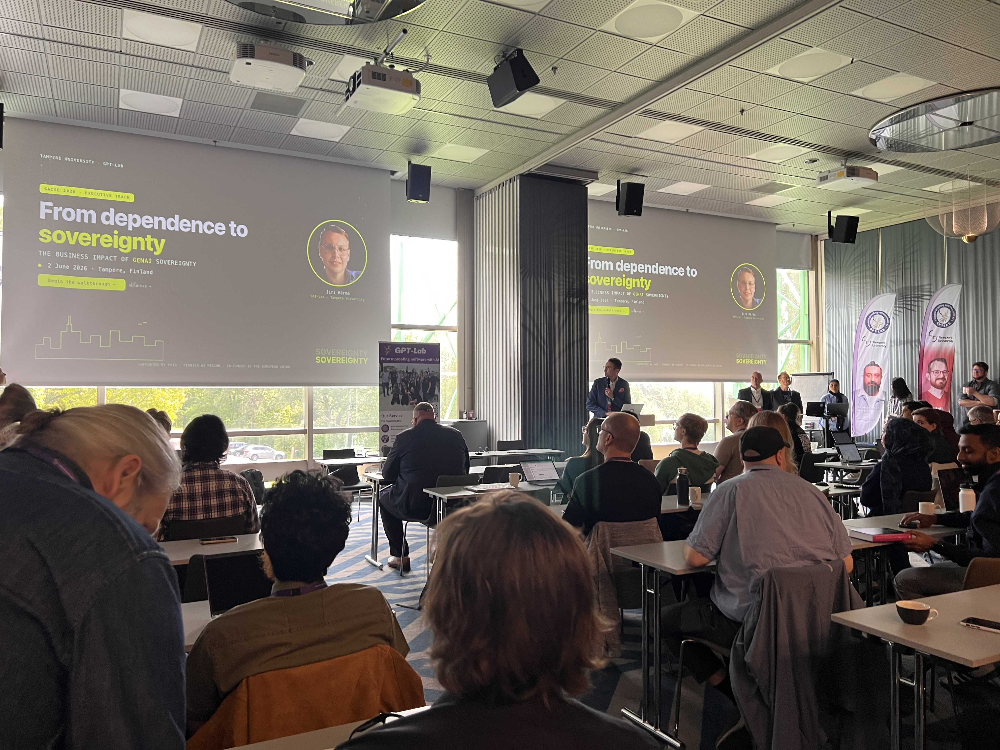

Jiri Härmä's live, interactive walkthrough — *From dependence to sovereignty* — reframes an AI stack as a **supply chain** and then **simulates what a single point of failure costs the business**. Using an illustrative composite manufacturer (NordMaq Oy) running on non-EU compute, the core move is simple: toggle one component such as the **Data pipeline** to "fault" and watch the downstream blast radius light up — which apps lose their fallback, and how much revenue is at risk.

**Interesting observations**

- **Your AI stack is a supply chain.** Out of the physical Bill of Materials grows an **AI-BOM** — models, vendors, data, compute, talent. Physical components have had second sources for decades; these have none.

<!-- PHOTO PLACEHOLDER — "Your AI stack is a supply chain" slide; add image to day2/04-jiri/ once available -->
<!--  -->

- **Simulate the shock.** Knock out a component (e.g. Data pipeline) and the impact propagates live: against ~€980K/week revenue, a six-month single-source outage put **€4.07M at risk** (−15%/week), because two downstream apps had no fallback.

<!-- PHOTO PLACEHOLDER — "The dependency portfolio" slide; add image to day2/04-jiri/ once available -->
<!--  -->

- **From dependence to sovereignty (L1→L5).** A posture lever scales exposure down — from L1 "ungoverned" (full impact) to L5 "sovereign" (0.2×) — turning the case for GenAI sovereignty into a concrete number rather than an abstract principle.

### 🖥️ Live Demo — World Models in Action: Where Language Models Hit a Wall by Kalle Kulonen, GPT-Lab / Tampere University

What better way to expose the limits of a language model than to make it literally hit a wall? Kalle Kulonen's live demo handed the *same* maze to a series of frontier LLMs and asked each to trace a valid path from entrance to exit — a task that looks trivial but quietly demands genuine spatial reasoning. The reveal: models that reason brilliantly over text reason over the *picture* of a maze, not its *geometry*, so their routes cut straight through the walls. The closing pivot reframed the whole problem — once the maze becomes a real, physical environment, a **world model** simulates it directly and the shortest path falls out for free.

**Interesting observations**

- **The title is a double pun.** *"Where language models hit a wall"* — they literally crash into the maze walls, and figuratively reach the edge of what next-token reasoning can do. A maze is the perfect probe: trivial for anything with a spatial model of the world, deceptively hard for a pure text predictor.

- **The frontier LLMs all hit the wall — some harder than others.** Handed the same maze, GPT-5.5 and Gemini 3.1 Pro both drew plausible-looking routes that slice straight through the walls — reasoning over the *picture* of the maze rather than its navigable space. Claude Opus 4.8 fared best, tracking the corridors from *Start* to *Exit* on a redrawn maze, but even the cleanest run made the same point: a text model has no real spatial model of the world.

<!-- PHOTO PLACEHOLDER — three maze-attempt slides; save to day2/05-kalle/ and uncomment -->
<!--  -->
<!--  -->
<!--  -->

- **"What if the maze became real?" — world models in action.** The pivot that named the session: NVIDIA's **Cosmos Predict 2.5** doesn't reason over pixels, it *simulates* the physical environment — so a mouse simply runs the shortest way through a real 3D maze to the cheese. Geometry, navigation, and dynamics emerge from the simulation instead of being guessed from a flat image.

<!-- PHOTO PLACEHOLDER — "What If the Maze Became Real?" (Cosmos Predict 2.5) slide; save as day2/05-kalle/cosmos-predict-2-5.jpg and uncomment -->
<!--  -->

- **The takeaway: tokens aren't space.** LLMs predict the next token; they don't maintain a model of the physical world, so spatial and embodied tasks are exactly where they hit a wall. World models — which learn the *dynamics* of an environment rather than the statistics of text — are the complementary capability the field is now racing toward.

### 🎤 Keynote — Where AI Creates Competitive Advantage — Managing Risk Environments by Meeri Haataja, CEO & CPO, Saidot

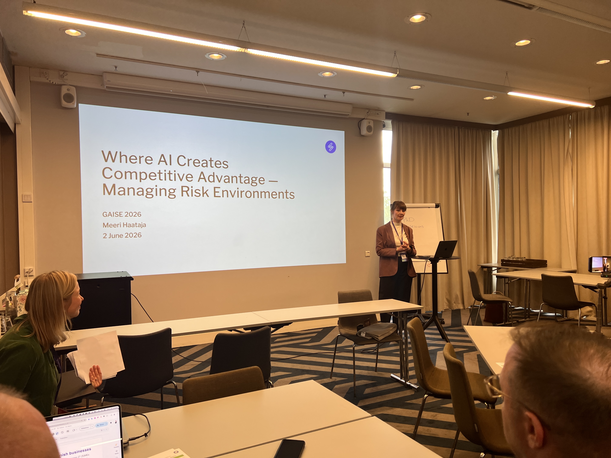

Opening the afternoon Executive Track, Meeri Haataja — CEO & CPO of AI-governance company **Saidot** — made the case that AI's real competitive edge isn't faster code but a *structural* change in how software organizations create value, and that capturing it depends on managing the new risk environment that comes with it. Grounding the argument in Saidot's own shift to agentic ways of working and in Chi Zhang et al.'s 2026 study of the AI-driven development paradigm, she walked through two structural shifts — redefining roles around **vertical integration** and a value-creation shift toward **maximizing cognitive bandwidth** — then turned to what governance looks like once agents, not humans, do most of the doing. The throughline: AI lets one person own far more of the value chain, but the advantage only compounds for organizations that redesign roles around individuals and move governance from forms to events.

**Interesting observations**

- **Role redefinition — from horizontal layering to vertical integration.** The first shift is org-structural. Traditional teams are *horizontally layered* by function: a PM passes a PRD down to an Architect who splits work across Front-end and Back-end, who hand off to Test, who hand off to Ops — and every handover crosses a *communication wall* that piles up friction and cost. AI collapses that stack into *vertical*, cross-functional **super-cells**, where one person owns an entire column end-to-end — PM, Architect, Front-end, Back-end, Test, Ops — on top of a shared layer of AI infrastructure and agents. The flagged takeaway: **one person can now do far more things**, so value shifts from coordinating across silos to genuine end-to-end ownership (Chi Zhang et al., 2026).

<!-- PHOTO PLACEHOLDER — "Role Redefinition: Vertical integration" slide (Figure 1); save to day2/06-meeri/ and uncomment -->
<!--  -->

- **Value creation shift — maximizing cognitive bandwidth.** The second shift reframes seniority as *unused capacity*. Charting cognitive bandwidth across a career, the *utilized* load (actual work) paradoxically falls as engineers get more senior — ~9.5 units in Year 1 (novice), 8.0 at Year 3 (intermediate), 4.8 at Year 5 (senior), and just 2.5 at Year 10+ (expert) — even as total capacity keeps climbing. The gap between the two is *idle bandwidth (waste)*, and it widens with experience: the most capable people leave the most on the table under the traditional paradigm. AI's role is to close that gap — the rising *target load* line — by letting experts run near full bandwidth instead of being boxed into a narrow functional role.

<!-- PHOTO PLACEHOLDER — "Value Creation Shift: Maximising Cognitive Bandwidth" slide (Figure 2); save to day2/06-meeri/ and uncomment -->
<!--  -->

- **In a nutshell — eight observations from Saidot's own shift to agentic working.** The closing slide distilled what the company has actually lived through:
 (1) **Fast shift to agentic use** — moving away from the UI, with a big shift in risk appetite.
 (2) **Volume is the biggest governance challenge** — move from forms to event-based governance.
 (3) **Agent use is no longer voluntary.**
 (4) **Performance gaps are widening** — the main driver is attitude toward agents.
 (5) **Seniority is a clear advantage** in making use of agents.
 (6) **Work is more interesting than ever** — and also more intellectually demanding.
 (7) **Design the org around individuals, not standard roles.**
 (8) **Testing and instructions are the new bottleneck** — you now build instructions for agents, not just humans.

<!-- PHOTO PLACEHOLDER — "In a nutshell" slide; save to day2/06-meeri/ and uncomment -->
<!--  -->

### 🎤 Expert Talk — The Essentials of AI: What AI Can Already Do by Prof. Pekka Abrahamsson, GPT-Lab / Tampere University

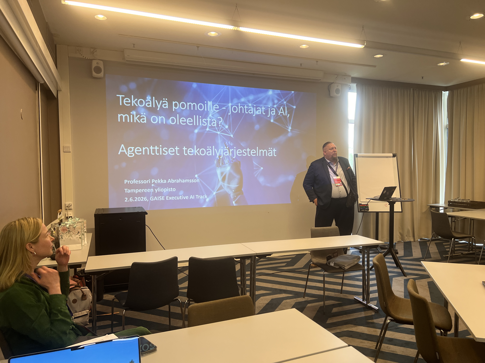

Continuing the Executive Track, GPT-Lab founder and conference host Prof. Pekka Abrahamsson gave leaders a deliberately grounded tour of what agentic AI can *already* do today — not what it might do someday. Delivered in Finnish under the title *"Tekoälyä pomoille – johtajat ja AI, mikä on oleellista?"* ("AI for bosses — leaders and AI, what's essential?") with the subtitle *"Agenttiset tekoälyjärjestelmät"* ("Agentic AI systems"), the talk paired a candid diagnosis of how executives actually — and only partially — adopt AI with two live demonstrations of autonomous, self-assembling agent systems. The throughline: the gap between leaders who *talk* about AI and leaders who *use* it has become the single biggest predictor of whether their organization captures any value, and the capability frontier has already moved past dashboards to agents that spawn other agents and to a digital twin that simulates an entire parliament passing a law.

**Interesting observations**

- **"Present like you are a bit bored."** Pekka opened with the (only half-joking) advice he'd been given right before going on stage: *"Present like you are a bit bored — otherwise they will think AI is just hype and won't believe you."* The deadpan framing was the point: the capabilities he was about to demo are real enough that overselling them would make them *less* believable, not more.

- **The three CEO adoption patterns — and why each leaves value on the table.** Drawing on leaders from roughly 30 countries ("most sit in at least one"), Pekka sketched three recurring archetypes. 
 **Pattern 1 — The Podcast CTO:** deeply informed, tracks every release and benchmark, but has never built an AI system for their own work — their desk is empty of an actual AI interface. 
 **Pattern 2 — The Weekend Tinkerer:** builds impressive things in private time but never brings them into the day-to-day; the cool home rig never reaches the corporate office desk. 
 **Pattern 3 — The Manifesto Writer:** has the vision and funded a transformation committee, but has never personally felt AI do work *at their level* ("AI can't help me!"). The shared failure mode: **partial engagement leaves value on the table.**

- **The sharper claim: the leader has to be the best user.** The flip side of those patterns was the talk's central argument — **a leader's own quality of AI use is the single biggest predictor of team adoption.** When the CEO is the best user, making real decisions with AI at their own desk, the result is a *frontier company* and a hive of productive, AI-enabled people around them; when leaders only talk about it, the team is left swinging between underestimating and overestimating the technology.

<!-- PHOTO PLACEHOLDER — "The Three CEO Adoption Patterns" slide; save to day2/07-pekka/ and uncomment -->
<!--  -->

- **A new coinage: "We as departments are humping forward."** Pekka offered his own neologism for the awkward, lurching, half-committed way most organizations are advancing on AI — not striding, not standing still, but *humping forward.* It landed as the talk's most memorable line precisely because it named the in-between state so many in the room recognized.

- **Demo 1 — a digital twin of the Finnish government passing a law.** The first live demo ran a *Digital Finnish Parliament* — an agent-driven digital twin of the Finnish government that takes a proposal through the legislative process end-to-end, until a law is passed. The point for executives: agentic systems can now model not just a single task but an entire institution and its decision-making.

<!-- PHOTO PLACEHOLDER — "Digital Finnish Parliament" demo; save to day2/07-pekka/ and uncomment -->
<!--  -->

- **Demo 2 — godagent.org: agents that breed new agents.** The second demo, on [godagent.org](https://godagent.org), showed an *Agent Multiverse* in which a master orchestrator ("God Chat") takes a single natural-language request and **spawns the specialized agents it needs to answer it.** Asked to explain what drove the New York Stock Exchange to its latest close, it bred two sub-agents on the fly — a **NYSE Data Scout** to retrieve the exact closing level of the NYSE Composite Index (NYA) for the most recent session prior to 2 June 2026, and a **Market Causality Analyst** to run a self-grounded search over late-May-2026 Federal Reserve commentary, recent CPI/PCE prints, and sector-specific catalysts — then synthesized their outputs into one evidence-backed answer. The executive takeaway: agentic systems no longer need every tool pre-built; they **assemble their own team to resolve the task** ([AI agents overview](https://github.com/TomasHer/prompting-blueprints/blob/main/02-ai-agents/01-foundations/ai-agents-overview.md)).

<!-- PHOTO PLACEHOLDER — "godagent.org — Agent Multiverse" demo; save to day2/07-pekka/ and uncomment -->
<!--  -->

### 🎤 Expert Talk — AI Came To Work — But Who Is Leading It? by Sebastian Sonntag, GPT-Lab / Tampere University

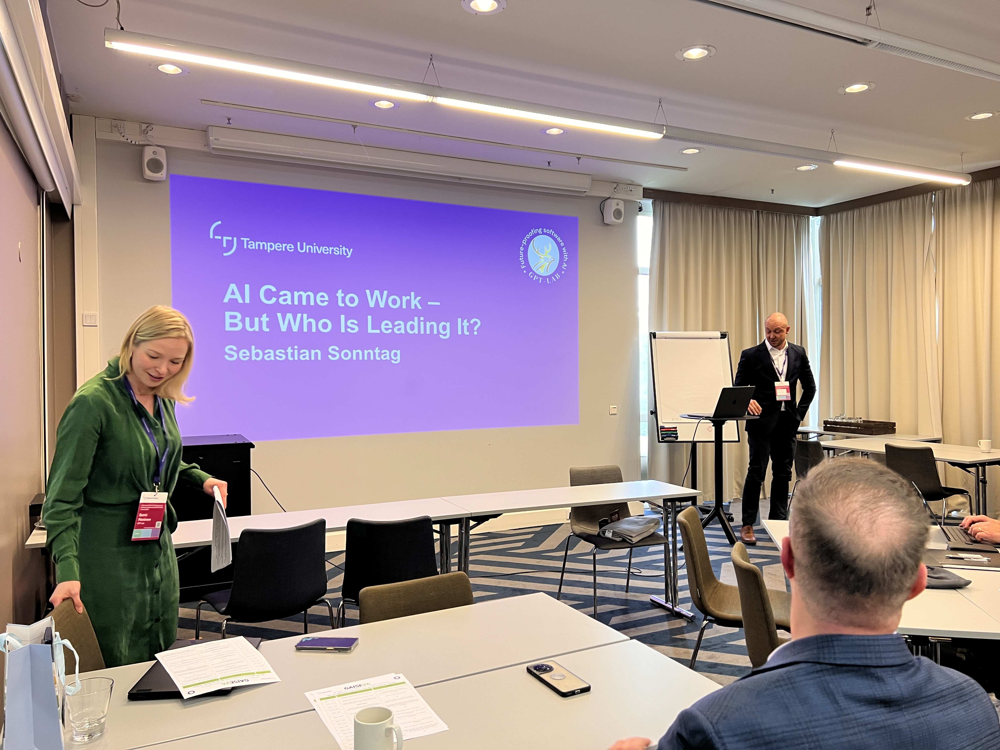

Also on the Executive Track, Sebastian Sonntag of GPT-Lab turned the leadership question into a field report. Drawing on his own 2026 interviews with CEOs, CFOs, and CTOs across **27 Finnish (S)MEs** (research still ongoing), he mapped where AI actually sits in companies today and who, if anyone, is steering it. The throughline: AI has already shown up to work in Finnish companies, but it has been handed to the wrong desk — filed as a technology project under the CTO when it is really a **business transformation** that needs its own leadership, literacy, and ownership up to board level.

**Interesting observations**

- **The state of play.** Across the 27 companies AI is still narrow — for many, **Microsoft 365 Copilot is the only tool**, and even it underwhelmed. Dedicated ownership is rare (**only 3 had a Head of AI role**, all large digital-natives, usually under the CTO); most companies are *talking* about AI with no concrete initiatives and frame it as **cost reduction, not strategic advantage**.

- **The Business AI Adoption Ladder.** His maturity model runs six rungs, with value *and* risk rising together and the top rung still hypothetical:

| Level | What changes | Requirements | Value / risk |
|---|---|---|---|
| Passive adoption | AI appears inside existing software | Employees learn new built-in features | Easy value, no differentiation |
| Chat adoption | Employees use general-purpose AI chat | Basic AI literacy and usage guidelines | Individual productivity, uneven quality / shadow IT |
| Enterprise chat / copilot adoption | AI chat can access approved company data | Data access, governance, security, user training | Better answers, but value still mostly task-level and dependent on individuals |
| Agentic task automation | Agents automate bounded tasks | Agent platform and capable implementers | Saves hours or improves quality; ROI may be uncertain |
| Agentic process automation | AI executes substantial parts of a business process, with humans at exception and decision points | Process redesign, integrations, ownership, investment | Large savings/service gains; large investment with high execution risk |
| AI-native operating model ("AI-first companies") | The organization is designed around AI as a core production capability, not just a tool | Major transformation and leadership commitment | Potential competitive advantage; **no proven public examples — is this viable?** |

<!-- PHOTO PLACEHOLDER — "Business AI Adoption Ladder" slide; save to day2/08-sebastian/ and uncomment -->
<!--  -->

- **The barriers.** Initiatives stall on unclear business value, cultural and identity resistance, poor data readiness, and lack of leadership — and the least technical bite hardest: identity-driven resistance (fear of lost professional value, the *"slop"* perception, needing to verify everything, fear of blame) and the quiet data killer, **AI outputs can't be verified against source data**.

<!-- PHOTO PLACEHOLDER — "Barriers of AI adoption" slide ("Why AI initiatives struggle" cartoon); save to day2/08-sebastian/ and uncomment -->
<!--  -->

- **The core argument: AI is a business transformation, not a technology project.** Because it's *"treated as IT"* and ownership is *"delegated too narrowly to the CTO,"* it gets run as tech delivery instead of operating-model change. Sonntag's structural fix: a **Head of AI fits better under the CIO than the CTO** — yet most leadership teams **lack anyone who genuinely understands AI**, and **no board-level AI seat exists yet**. The role he sketches closes that gap: learn the business from the teams, surface bottlenecks and opportunities, turn them into process change, set KPIs and ROI, and fix data-readiness gaps.

<!-- PHOTO PLACEHOLDER — "AI leadership" slide; save to day2/08-sebastian/ and uncomment -->
<!--  -->

- **Culture, and the bottom line.** Position AI as a positive not a threat, make its value visible through real examples, back **local and leadership champions**, and reward adoption — and reframe the message, since *"using AI is a step forward in your career"* lands far better than *"someone with AI will take your job."* Net: Finnish adoption is early-stage, and moving past chat-and-copilot use needs process redesign, governance, and **dedicated Data and AI leadership** to connect AI to real business bottlenecks — complementing [Meeri Haataja](#keynote-meeri-haataja), [Pekka Abrahamsson](#talk-pekka-abrahamsson), and [Janne Kuivalainen](#tech-talk-janne).

### 🛠️ Hands-on Lab — How to Jailbreak LLMs: Who Decides What AI Is Allowed to Say? by Esa Karjalainen, GPT-Lab / Tampere University

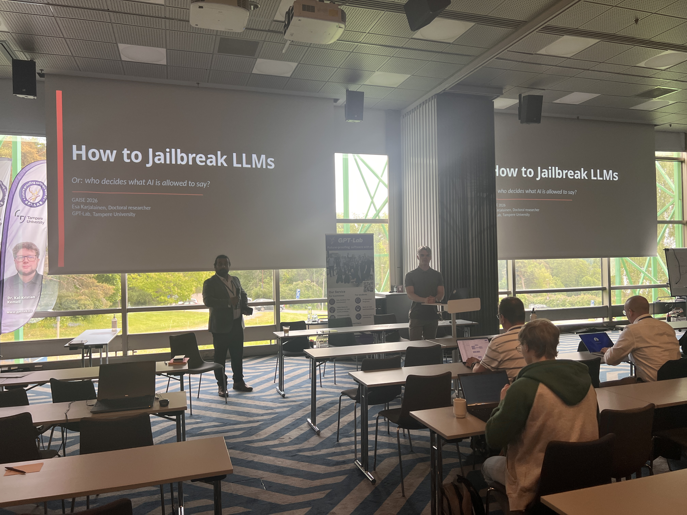

On Day 2's hands-on academic track, GPT-Lab doctoral researcher Esa Karjalainen ran a session with a deliberately provocative title — *How to Jailbreak LLMs* — but the subtitle gave away the real subject: *who decides what AI is allowed to say?* Rather than a playbook for bad actors, the session treated jailbreaking as a research lens: every successful jailbreak is also a probe of where the line between "allowed" and "refused" actually sits, who drew it, and how fragile that line really is. Before getting hands-on, Karjalainen made the case for why any organisation deploying LLMs should treat this as an operational security concern rather than academic curiosity — because the same techniques researchers use to red-team models are the ones attackers turn on production systems.

**Interesting observations**

- **Why your organisation should care — four reasons LLM safety is operational, not a checkbox.**
 **The system prompt is your defence layer** — most deployed LLMs rely almost entirely on a system prompt for safety, so if it's underspecified, attackers don't need to do much.
 **Agentic pipelines expand the attack surface** — once an LLM reads documents, fetches URLs, or calls tools, attackers can inject instructions from those sources, not just the chat input (indirect prompt injection).
 **The alignment tax is real** — every guardrail has a false-positive rate, and overly cautious models frustrate legitimate users, which itself creates demand for workarounds.
 **It is a moving target** — new attack techniques emerge continuously, so treating LLM safety as a one-time configuration is the same mistake as shipping software with no patch process.

<!-- PHOTO PLACEHOLDER — "Why Your Organisation Should Care" slide (four quadrants); save to day2/09-esa/ and uncomment -->
<!--  -->

- **Jailbreaking reframed as a governance question.** The subtitle — *who decides what AI is allowed to say?* — ran underneath the techniques: refusals and guardrails encode someone's policy choices, so probing them is as much about understanding who sets those boundaries (and why) as about breaking them. It tied straight into the day's governance threads — complementing [Meeri Haataja](#keynote-meeri-haataja) and [Sebastian Sonntag](#talk-sebastian-sonntag) — and pointed ahead to Day 3's Responsible AI Era theme.

### 🛠️ Hands-on Lab — Architecting in the AI Era by Dr. Muhammad Waseem, GPT-Lab / Tampere University

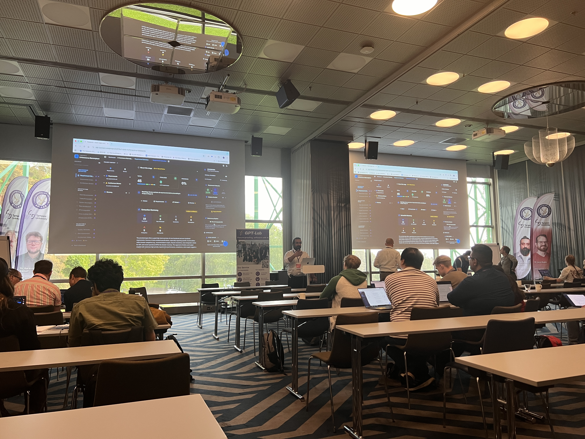

Day 2's hands-on academic track turned from breaking models to building with them. After his Day 1 survey of the field, Dr. Muhammad Waseem returned with a working artifact — a custom web tool that takes a plain-language application specification and walks it through more than fifteen sequential stages of software architecture, drafting reviewable artifacts at each step before producing the final diagrams and documentation. Where his [Day 1 talk](#academic-waseem) asked how we *measure* GenAI's impact on software engineering, this session put a concrete answer on the screen: [spec-driven development](https://github.com/TomasHer/prompting-blueprints/blob/main/05-tools/spec-driven-development-tutorial.md) carried all the way up to the architecture itself — a staged, gated pipeline where AI drafts and humans approve. The throughline: the leverage isn't a one-shot "generate my architecture" button, it's the disciplined, stage-by-stage review that keeps an AI-generated design honest.

**Interesting observations**

- **From spec to architecture, one gated stage at a time.** The tool's spine is a left-rail pipeline of 15+ stages grouped into three phases — **Requirement Definition** (Requirement Collection → Requirements Analysis → Architecture Drivers), **Architecture Design** (Style Recommendation, Tradeoff Evaluation, System Decomposition, Data Architecture, API & Integration, Cross-Cutting Concerns, Infrastructure & Deployment), and **Validation & Assurance** (Quality Attributes, Risk Assessment, Architecture Validation). Feed it an application spec and it walks the whole arc from raw requirements to a validated design.

- **AI drafts, humans approve — stage by stage.** Each stage runs in an *AI + Manual Review* mode: the model proposes the artifacts and the human gates them. The demo's *E-Commerce Marketplace* project sat on **Requirement Collection** with **45 requirements** auto-extracted — 23 functional, 8 non-functional, 4 constraints, 5 assumptions, plus a fifth bucket — surfaced at *medium confidence* and **0% finalized** until reviewed. Two controls move the work on: **Lock & Advance** (approve and proceed) or **Flag for Revision** (send it back).

- **Supervised or autonomous — your call.** Alongside the manual gates, an **Autonomous Pipeline** ("Run AI Automatically") can run the stages end-to-end without stopping at every checkpoint — the same approve-or-automate dial that ran through Alex Polyakov's [human-in-the-loop keynote](#keynote-alex-polyakov) and Jussi Rasku's [harness loop](#lab-jussi-rasku), here pointed at architecture work.

- **The output is documentation, not just a diagram.** Every stage emits artifacts — a per-stage **Stage Report** and **PDF export** — so a finished run leaves behind architecture *documentation* (drivers, trade-offs, decisions, quality attributes, risks) alongside the diagrams. That captured rationale is precisely the kind of intent Markus Borg warned teams lose to agents; his prescription to [capture intent before agents act](#keynote-markus-borg) shows up here baked into a tool.

- **Hands-on: run your own spec through it.** The lab then handed participants the wheel — feed in an application idea, watch the AI extract and classify the requirements, review the confidence-scored output, and lock stages to generate the downstream architecture and docs. The table groups huddled over a single laptop, debating an extraction before advancing it (below), were the session in miniature: the model does the drafting, but the judgment call at each gate stays human.

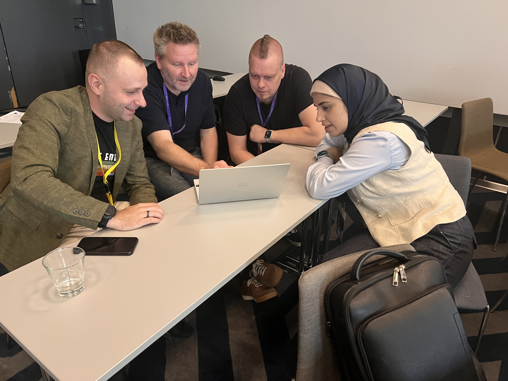

### 🖥️ Show & Tell — Stop Comparing Language Models. Start Building the Agentic OS. by Tiina Karhukivi & Mika Suominen, GPT-Lab / Tampere University

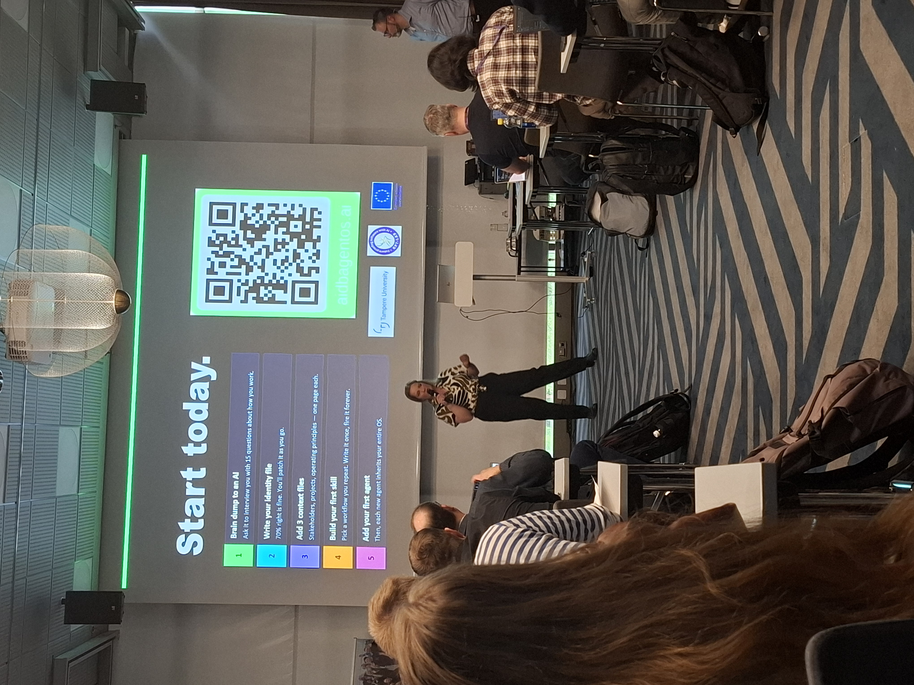

Closing out Day 2's AI-Native World track, GPT-Lab's Tiina Karhukivi and Mika Suominen made the conference's running thesis personal — and literal — by building an everyday AI **"Chief of Staff"** live on stage. The provocation was right in the title: *stop comparing language models.* Benchmark-chasing is a treadmill; the durable advantage isn't which model you pick but the **structured layer you wrap around it** — identity, context, and memory — that turns a generic chatbot into a reliable, organization-aware system. They called that layer an **Agentic OS**, and the demo showed a plain assistant graduating into one as each layer was added. The throughline: the model is interchangeable, but *your* identity, context, and skills are the moat — and once they exist as an OS, every new agent inherits them for free.

**Interesting observations**

- **Stop comparing models — that's the wrong contest.** The title was the argument: obsessing over which LLM tops this week's benchmark misses where the leverage actually is. Models are converging and commoditizing; what separates one assistant from another is the **identity, context, and memory** wrapped around it. It's the same "the model isn't the bottleneck, the system around it is" lesson that ran through [Jussi Rasku's harness lab](#lab-jussi-rasku) and the [agent-harness demo](#demo-harnesses) — here pointed at everyday knowledge work instead of coding agents.

- **The Agentic OS — a structured layer, not a clever prompt.** Their recipe for a dependable assistant stacks five things: an **identity** layer (who you are and how you work), **context** files (stakeholders, projects, operating principles), persistent **memory**, reusable **skills**, and **agents** on top. Adding each layer live, they showed a generic chatbot turn into something organization-aware — the working embodiment of the [context-engineering](https://github.com/TomasHer/prompting-blueprints/blob/main/02-ai-agents/03-context-and-memory/context-engineering.md) case Tomas Herda made on [Day 1](#workshop-agent-first-ides) and of Karpathy's line that most failures are missing context, not a weak model.

- **Skills: write it once, fire it forever.** A skill captures a workflow you repeat so the assistant runs it the same way every time — the same reusable unit covered in [Anatomy of a Skill](https://github.com/TomasHer/prompting-blueprints/blob/main/02-ai-agents/02-skills/anatomy-of-a-skill.md). It's the step where an assistant stops being a chat box and starts being infrastructure.

- **Each new agent inherits your entire OS.** The compounding punchline: once identity, context, and skills exist as a shared layer, you don't rebuild them per agent — every new agent stands on top of the same OS. It's an individual's take on the **shared organizational intelligence** Timo Savolainen sketched in the [agentic-organizations panel](#panel-agentic-organizations): build the layer once, and everything downstream draws on it.

- **"Start today" — a five-step on-ramp.** The closing slide (pictured) turned the talk into homework anyone could begin that afternoon: (1) **Brain dump to an AI** — have it interview you with 15 questions about how you work; (2) **Write your identity file** — *"70% right is fine. You'll patch it as you go"*; (3) **Add 3 context files** — stakeholders, projects, operating principles, one page each; (4) **Build your first skill** — pick a workflow you repeat, *"write it once, fire it forever"*; (5) **Add your first agent** — after which *"each new agent inherits your entire OS."* A fitting close to the AI-Native World day: if Day 2's running argument was that the model is no longer the story, this was the build-it-yourself coda — and a hand-off into Day 3's Responsible AI Era.

---

## Day 3 — Wednesday, 3 June 2026

### Theme: Responsible AI Era · Academic & Industry Tracks

### 🎤 Keynote — From Vibes to Engineering by Prof. Tommi Mikkonen, University of Jyväskylä

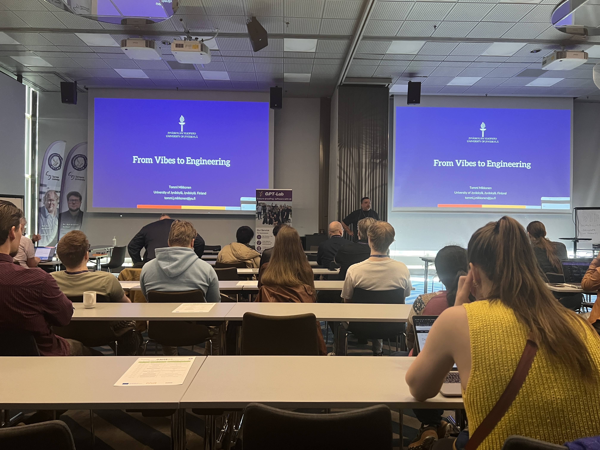

Opening Day 3's Responsible AI Era theme, Prof. Tommi Mikkonen of the University of Jyväskylä took the conference's most-hyped phrase — *vibe coding* — and asked what it takes to turn it into engineering. Vibe coding can stand up a solution for a straightforward use case in minutes, but unusual situations and edge cases are exactly where it goes quiet — and that gap is where trustworthy, dependable software is won or lost. Mikkonen walked from the promise (GenAI as a genuinely new kind of reuse) through the development paradigms it reshapes, a four-stage model of how teams hand work to agents, and a *shift-up* toward high-value human judgment — before landing on the uncomfortable question hiding under all the productivity. The throughline: the vibes were always the easy part; the engineering is making AI-built software something an organization can actually trust.

**Interesting observations**

- **The ongoing revolution is a new kind of reuse.** GenAI promises to create *any* software artifact from an already-existing knowledge base — LLMs especially — with promising results reported across just about every part of software development. But behind the curtain, Mikkonen argued, what actually happens is a **new type of reuse**: computer programs and ML models tell you what to produce based on existing training material. The kicker: *that is also how most developers have learned to program* — by reusing the patterns they'd seen before. A wall of citations grounded the point — overwhelmingly GPT-Lab / Tampere lineage, with Mikkonen himself a recurring co-author (from *Towards Human-Bot Collaborative Software Architecting with ChatGPT* and *CodePori* through *Confessions of a Prompt Engineer* and a 2026 study assessing small language models for code generation). A personal highlight for me: our own paper with Zheying Zhang, Pekka Abrahamsson, and GPT-Lab — *LLM-based agents for automating the enhancement of user story quality: An early report* ([arXiv:2403.09442](https://arxiv.org/abs/2403.09442)) — sat on that same wall as part of the ongoing revolution, alongside related GPT-Lab work mapped in Waseem's [Day 1 GenAI survey](#academic-waseem).

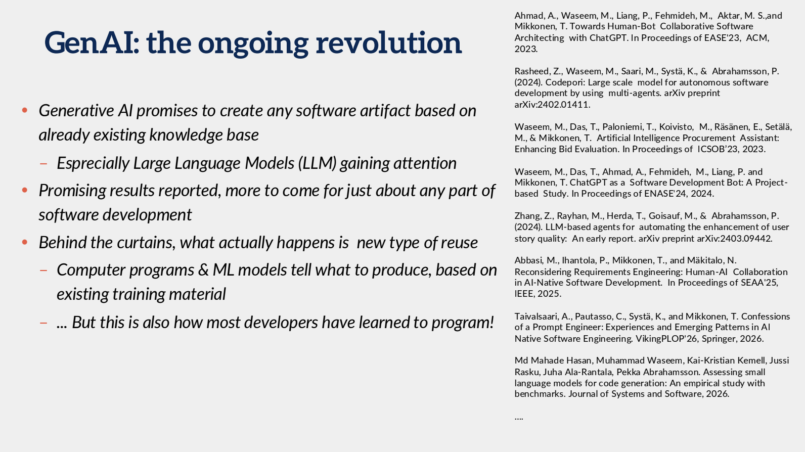

- **Three curves of customer-visible functionality — and the vibes-to-engineering pivot.** Plotting *customer-visible functionality* against *time*, Mikkonen contrasted three shapes. **Waterfall** — decide everything first, and it all becomes visible only at the very end (the curve that stays flat, then spikes). **Agile** — linear progress, something visible and viable all the way. **AI-assisted development** — loads of visible things in a minute, *but where the limits, bottlenecks, and compromises lie is difficult to say.* Then he relabeled the very same curves for the GenAI era: **"Lovable & the likes"** — ask the system and hope for the best, with the quality of the outcome resolved only at the end (the vibe-coding curve); **developer-initiated development** — still linear, but more speed with GenAI; and the disciplined one, **discuss with GenAI first about what should be done and then prompt** — *like training the team first, then developing*, with prompts that lead to (almost) deterministic code. The pivot in one line: the engineering move is to front-load the thinking rather than ask-and-hope — the same "[knowing what to build](#workshop-vibing-ideas)" judgment Day 1's *Vibing Ideas* workshop put front and center, and an instinct close to [spec-driven development](https://github.com/TomasHer/prompting-blueprints/blob/main/05-tools/spec-driven-development-tutorial.md).

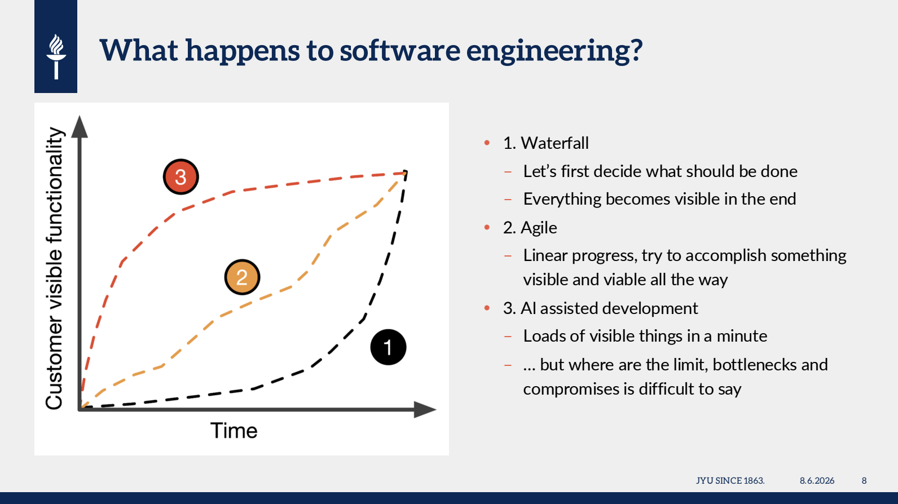

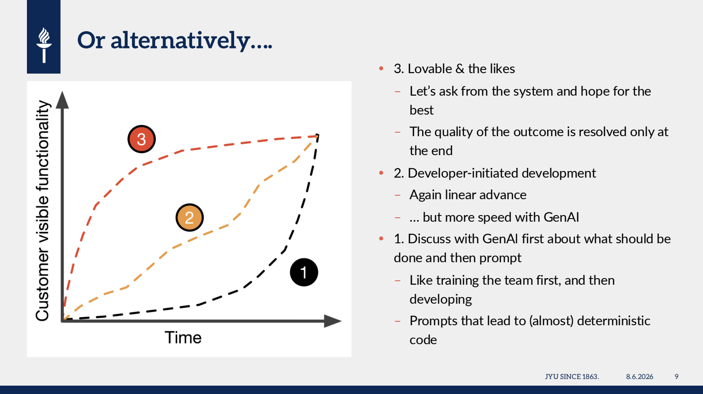

- **Handing over responsibility — a 4-stage model (commonly used, but maybe not optimal).** Mikkonen laid out how teams progressively cede control to AI, with the explicit caveat that *common* doesn't mean *optimal*: (1) **Developer asks AI for help with what to do** — a single task or design decision, like choosing an algorithm or architecture, that the developer would otherwise have made themselves; (2) **AI part of daily work** — the developer prompts everything systematically, then reviews whether the results were OK; (3) **Agent-based development** — a human gives instructions and reviews what the agents did; (4) **Agent autonomization** — autonomous validation, with huge benefits in development speed. It's the same approve-or-automate dial that ran through Alex Polyakov's [human-in-the-loop keynote](#keynote-alex-polyakov) and Waseem's [architecture lab](#lab-waseem) — here drawn as a four-rung ladder of handing over the wheel.

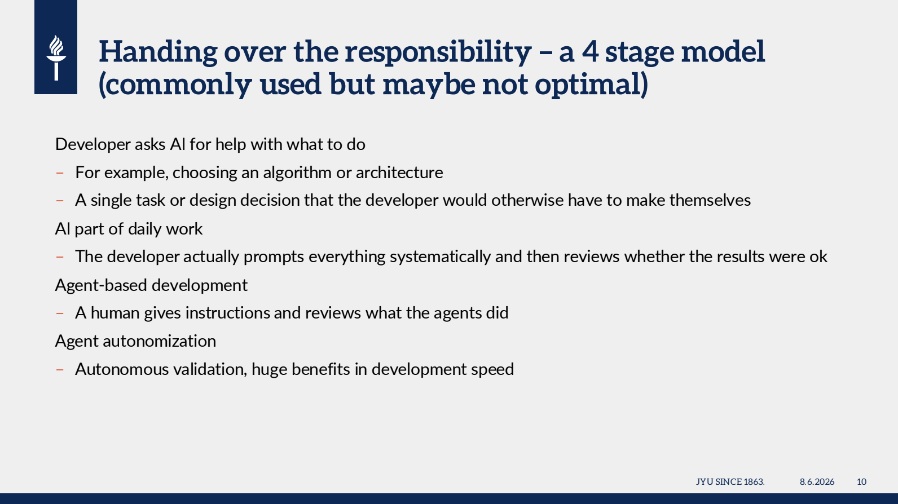

- **Shift-Up — beyond shift-left and shift-right.** The framing that named the talk's engineering ambition ([arXiv:2604.20436](https://arxiv.org/abs/2604.20436)). **Shift-left** moves important activities like testing *earlier* in the lifecycle instead of waiting until the end; **shift-right** moves activities like quality checks *later*, even into the live production environment, to catch issues under real-world conditions, user behavior, and continuous monitoring. **Shift-up** adds a new axis: focus on the *high-value activities* in GenAI-native development. On a V-model spanning Requirements → Analysis & Architecture → Design → Coding and back up through Unit, Integration, and Acceptance tests, the vertical axis is the tell — **humans at the top** (requirements, validation, acceptance: intent and judgment) and **agents at the bottom** (design, coding, unit tests: execution), with cost and automation scaling alongside. It's the structural twin of Meeri Haataja's [cognitive-bandwidth](#keynote-meeri-haataja) argument and Markus Borg's call to [capture intent before agents act](#keynote-markus-borg).

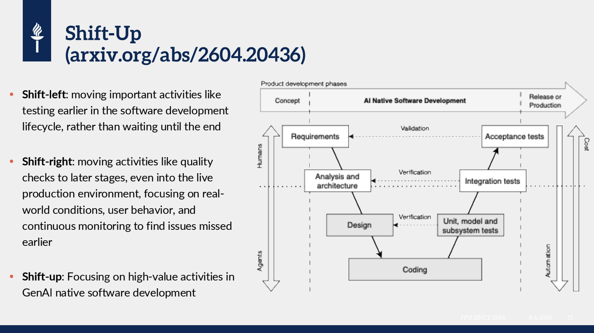

- **The "Timeless" method — Scrum without the time-box.** A provocative riff on agile ([arXiv:2411.08507](https://arxiv.org/abs/2411.08507)). **Scrum & sprints** give a team a way to explore a design idea by implementing it; **GenAI** shortens the time needed to compose those explorations — developers generate code with new modalities, and machines can even *identify requirements from speech*. **Timeless** takes that to its conclusion: a development approach where design ideas and exploration goals are simply *discussed in a meeting*, and the associated implementation is generated on the fly from the meeting recordings. The sprint timebox dissolves once the exploration and its implementation collapse into the same conversation.

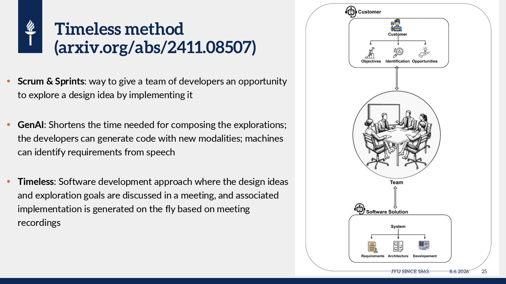

- **"Senior developer happy days are here!" — and the sting in the tail.** The talk's sharpest provocation, delivered with a wink (illustrated by a gloriously over-engineered one-person contraption). The upside, half-celebrated: *you can do everything yourself again* — no need for cumbersome third-party libraries with backdoors or anything like that; showstoppers and slowdowns bypassed if you just know how to ask the agents appropriately; TDD and continuous refactoring finally feasible because *AI never gets tired or frustrated*; everything seemingly done in an instant, with no need to drag juniors or anyone else along. Then the two questions that turn the joke into the thesis: **is it okay that no one else knows what was done? …and that the codebase never stabilizes?** That is the engineering problem hiding inside the vibes — and it lands squarely on Markus Borg's [cognitive and intent debt](#keynote-markus-borg).

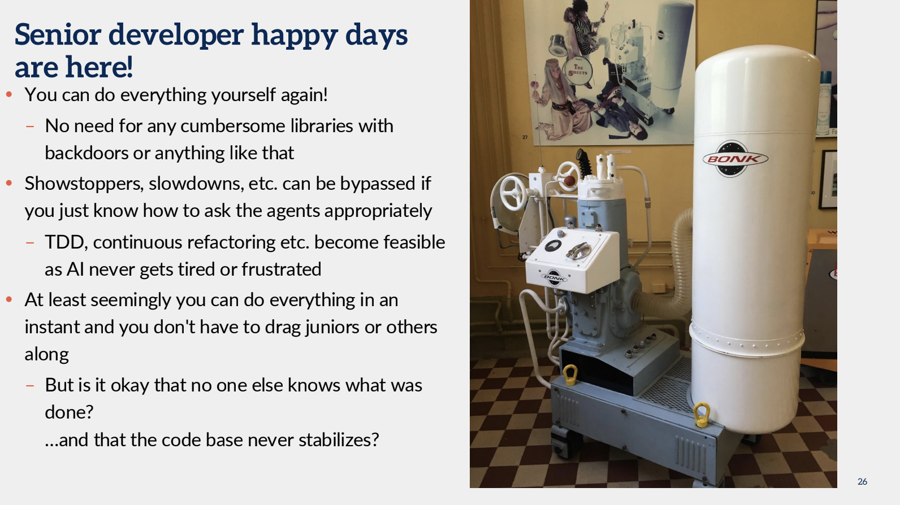

- **Summary — what changes, and what doesn't.** The closing slide split the future in two. **What changes:** tools, methods, and processes (not only software, but risk management and business practices); even more software than ever before, and even *less* understood by people — raising *who owns the code?* and *is there any IPR?*; education, onboarding, and training, with the next generation defining what AI-native SE even looks like; and business models, at least in part. **What does not change:** software grows more central by the day; understanding the *right problems to solve* stays essential; smart people are still needed — working in **small specs, small batches, and clear user intent**; and the usual recipe for success still holds, only now it can arrive faster. A fitting opener for the Responsible AI Era: AI moves the speed, not the fundamentals.

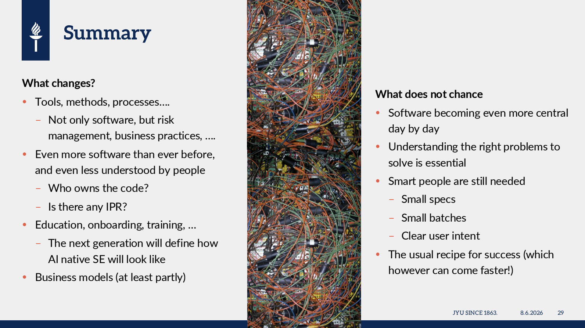

### 🖥️ Industrial Demo — Specification-Driven and AI-Powered Software Engineering in Regulated Environments and Beyond by Mika Torhola, Atostek Oy

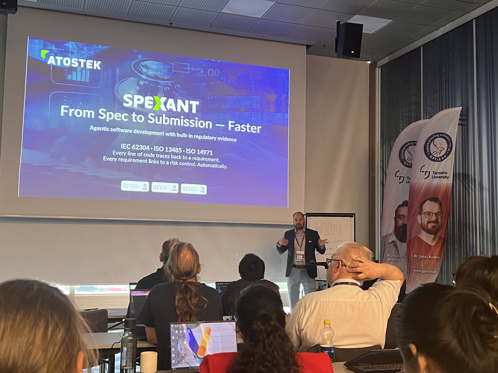

Following Mikkonen's opening keynote, Day 3's industrial track turned the morning's thesis into a shipping product. Mika Torhola of **Atostek Oy** picked up the thread directly — if [From Vibes to Engineering](#keynote-tommi-mikkonen) asked what it takes to make AI-built software trustworthy, this demo answered with a working pipeline. His premise is blunt: in regulated domains like medical devices, **vibe coding is a liability**, because the source code is no longer the source of truth — **the specification is**. From there he walked the antidotes to unmanaged AI coding, the apparent irony that disciplined spec-driven development looks like a return to waterfall, the historical arc that makes AI-native SDD a revival rather than a regression, and finally a live look at **SPEXANT**, Atostek's agentic development pipeline that treats every requirement as a regulatory artifact. The throughline: when agents do the coding, the spec — held together by unbroken, bidirectional traceability — becomes both the thing humans steer with and the evidence that the software is safe to ship.

**Interesting observations**

- **The antidotes to unmanaged AI coding.** Torhola opened with a menu of countermeasures to the failure modes of vibe coding: **Spec-Driven Development (SDD)** and its fast-moving tool ecosystem (GitHub Spec Kit, Amazon Kiro, BMAD, Augment Intent, Tessl, Rovo, Tracey.io); **Test-Driven Development** (test first, develop later); the **DORA AI Capabilities Model** (a clear, communicated AI stance, healthy data ecosystems, AI-accessible internal data, strong version-control practices, working in small batches, user-centric focus, and quality internal platforms); his own **"Control, Context, Correctness"** triad (closely related to SDD, plus automated CI/CD, full-stack testing, and linter support); **AI-native development** rather than merely AI-assisted (*"embrace AI-native, but build it with strong guardrails"*); and **guardrails and agent security** with explicit boundaries on **input, execution, output, and memory** — echoing the agent-security concerns from Esa Karjalainen's [jailbreak lab](#lab-esa-karjalainen).

<!-- PHOTO PLACEHOLDER — "Antidotes against the problems" slide; save as day3/02-mikat/antidotes.png and uncomment -->
<!--  -->

- **"Is spec-driven development just waterfall in disguise?"** The talk's sharpest provocation: taken to its hard-core definition, pure SDD assumes you know almost everything about a feature before you build it — which sounds like a return to waterfall and the V-model. Torhola's resolution is **strong, bidirectional traceability**: once every artifact (spec or code) is linked to its dependencies, humans and AI alike can freely and agilely modify any of them, because an AI-assisted update can economically propagate the change through everything it touches. He invoked **Martin Fowler's 2004 "Is Design Dead?"** to broker the peace — agile development and up-front design *can* co-exist in AI-native SW dev — and grounded the stakes in **IEC 62304**, the medical-device software standard where traceability is the unbroken chain linking requirements, architecture, risk controls, source code, and test cases as the mandatory documentary evidence that the software is safe. It's the structural twin of Mikkonen's [shift-up](#keynote-tommi-mikkonen) and of Markus Borg's call to [capture intent before agents act](#keynote-markus-borg).

<!-- PHOTO PLACEHOLDER — "Irony: SDD == Waterfall model?" slide (V-model, IEC 62304, Fowler's "Is Design Dead?"); save as day3/02-mikat/sdd-waterfall-irony.jpg and uncomment -->
<!--  -->

- **AI-native SDD is a revival, not a revolution.** A nine-stage timeline — *From Assembly to AI-Native SDD* — framed today's moment as the return of an old discipline: from the 1950s Assembly era, through the abstraction jump of FORTRAN/LISP/COBOL, the careful software design taught in the 1990s (rich artifacts — requirements, use cases, architecture, UML, test plans), XP in 1999, the 2001 Agile Manifesto, Fowler's 2005 "Is Design Dead?", two decades of Agile/Scrum that quietly shed documentation, the 2022-onward LLM coding wave, and finally **AI-native SDD**, where the rich artifacts return, humans and AI can update any of them, and bidirectional spec↔code traceability is essential. The slide's key takeaway: AI-native SDD revives the strengths of 1990s software design, now in collaboration with AI, with continuous agility and strict traceability (*design matters · agile evolves · humans + AI collaborate · traceability ensures trust*).

<!-- PHOTO PLACEHOLDER — "From Assembly to AI-Native SDD" evolution-of-software-development timeline; save as day3/02-mikat/from-assembly-to-ai-native-sdd.jpg and uncomment -->
<!--  -->

- **SPEXANT — "from spec to submission, faster."** The demo's centerpiece (pictured above) was Atostek's **SPEXANT**, an agentic development pipeline with built-in regulatory evidence — targeting **IEC 62304, ISO 13485, and ISO 14971**, so that *every line of code traces back to a requirement, and every requirement links to a risk control — automatically.* Its six stages run **Intent** (user needs & intended use) → **Spec & Risk** (PRD + FMEA, safety class, risk controls) → **Design** (IEC 62304 architecture and detailed design) → **Code Gen** (AI agents write code within spec) → **Verify & Validate** (auto tests, complete trace matrix) → **Release Ready** (technical file + audit package). Three principles hold it together: the **spec is a regulatory artifact** (every PRD requirement is simultaneously a compliance document — no separate compliance phase), **agents are constrained by spec** (they implement according to it, not around it — no hallucinated architecture), and **traceability is built in** (the Requirement → Design → Code → Test linkage is automatic, not manual copy-paste). It's the same AI-drafts-humans-gate spine as Waseem's [architecture lab](#lab-waseem), hardened for a regulated submission and an industrial sibling of [spec-driven development](https://github.com/TomasHer/prompting-blueprints/blob/main/05-tools/spec-driven-development-tutorial.md).

<!-- PHOTO PLACEHOLDER — "How SPEXANT works" six-step pipeline slide; save as day3/02-mikat/how-spexant-works.jpg and uncomment -->
<!--  -->

- **A "Product Health Board" turns traceability into a live metric.** Rather than treating traceability as a one-time audit at submission, Torhola showed a dashboard that scores coverage continuously across the whole chain: how many **stakeholder needs** are covered by requirements, how many **requirements** have architecture specified, how many have **use cases**, how many are **implemented**, and how many have **test cases**. It operationalizes Markus Borg's instinct to [treat understanding as a KPI](#keynote-markus-borg) — gaps in the traceability chain become visible numbers a team can drive to zero, instead of surprises discovered at audit time.

- **Spec-driven is the new "10× engineer."** Torhola tied the discipline back to the zeitgeist with a nod to the spec-driven-development-as-[10× engineer](https://www.instagram.com/p/DWTPcxHgMW-/) idea: in an agentic world, leverage no longer comes from typing code faster but from writing specifications precise enough that agents build the right thing within them. A fitting industrial coda to the morning keynote — the engineering ambition Mikkonen named in *From Vibes to Engineering*, delivered as a regulated-software pipeline.

### 🎤 Conference Closing

A heartfelt thank you to everyone who made GAISE 2026 possible. The **GPT-Lab team** at Tampere University created an outstanding program that brought together researchers, practitioners, and executives from across the AI and software-engineering community.

Special recognition goes to the main organizers — **Vaishnavi Bankhele** and **Virve Yli-Savola** — whose meticulous planning and tireless effort ensured the event ran smoothly from the first keynote to the final session. Equal thanks to all the **volunteers** who handled registration, logistics, and the countless behind-the-scenes tasks that keep a multi-track conference on track.

Your work gave everyone in the room the space to focus on learning and connecting. Thank you.

---

*Notes by Tomas Herda. Connect on [LinkedIn](https://www.linkedin.com/in/herdatom).*
