# GAISE 2026 — Tampere, Finland

## Event Introduction

**GAISE 2026 (Generative AI in Software Engineering)** took place on **1–3 June 2026** at **Tampere University, Finland**, hosted by [GPT-Lab](https://gpt-lab.eu/about-us/our-team/) — a generative-AI research lab founded by Professor Pekka Abrahamsson.

Across three days, the program explored how artificial intelligence is reshaping software engineering and organizations, structured around three thematic areas:

- **Monday, 1 June — Autonomous AI Systems** (Academic & Industry Tracks)
- **Tuesday, 2 June — AI-Native World** (Academic, Industry & Executive Tracks)
- **Wednesday, 3 June — Responsible AI Era** (Academic & Industry Tracks)

These are my personal notes from the sessions I attended.

**Links:** [Full program](https://gpt-lab.eu/gaise26-program/) · [Speakers](https://gpt-lab.eu/gaise26-speakers/) · [Organizer: GPT-Lab](https://gpt-lab.eu/about-us/our-team/)

<!-- VIDEO PLACEHOLDER — replace the URL below with the YouTube link once available -->
<!--  -->

---

## Sessions

### Day 1 — Monday, 1 June · Autonomous AI Systems

| Session | Speaker |
|---------|---------|
| [Conference Opening](#conference-opening) | Prof. Pekka Abrahamsson & Virve Yli-Savola |
| [Workshop — Agent-first IDEs](#workshop-agent-first-ides) | Tomas Herda & Agnes Lipovits, Austrian Post Business Solutions |
| [Keynote — When Software Stops Waiting](#keynote-alex-polyakov) | Alex Polyakov, CEO @ ProjectSimple |
| [Academic Talk — Generative AI in SE: Progress & Open Questions](#academic-waseem) | Muhammad Waseem, PhD |
| [Workshop — Vibing Ideas: Knowing What to Build When AI Does the Rest](#workshop-vibing-ideas) | Prof. Xiaofeng Wang, Daniel Planötscher & Silvia Cortesia |
| [Tech Talk — Measuring the Business Value of Agentic AI](#tech-talk-janne) | Janne Kuivalainen, CTO, Danfoss Drives |
| [Demo — From Task to Action: Why Agent Harnesses Matter](#demo-harnesses) | Malik Abdul Sami & Zeeshan Rasheed, GPT-Lab |
| [Academic Talk — AI Won't Save Your Research](#academic-kai) | Dr. Kai-Kristian Kemell, GPT-Lab |
| [Doctoral Research Presentations](#doctoral-research) | Dr. Kai-Kristian Kemell & Dr. Mika Saari, GPT-Lab |

### Day 2 — Tuesday, 2 June · AI-Native World

| Session | Speaker |
|---------|---------|
| [Keynote — Agents Code. Teams Erode.](#keynote-markus-borg) | Dr. Markus Borg, CodeScene / Lund University |
| [Panel — The Rise of Agentic Organizations](#panel-agentic-organizations) | Dr. Markus Borg, Alex Polyakov, Karoliina Kettukari & Timo Savolainen · facilitator: Sanni Pöntinen |
| [Lab — Tools That Use Tools to Build Tools](#lab-jussi-rasku) | Dr. Jussi Rasku, GPT-Lab / Tampere University |

### Day 3 — Wednesday, 3 June · Responsible AI Era

| Session | Speaker |
|---------|---------|
| [Conference Closing](#conference-closing) | GPT-Lab Team |

---

## Day 1 — Monday, 1 June 2026

### Theme: Autonomous AI Systems · Academic & Industry Tracks

### 🎤 Conference Opening

GAISE 2026 kicked off with a warm welcome from Prof. Pekka Abrahamsson and Virve Yli-Savola of GPT-Lab at Tampere University. They opened the summer school, set the stage for three days exploring how AI is reshaping software engineering, and introduced the program ahead.

### 🛠️ Workshop — Agent-first IDEs by Tomas Herda & Agnes Lipovits, Austrian Post Business Solutions

To kick off the session, we presented [#DAiTA — Intelligent Document Processing](https://www.post.at/en/g/c/daita) — Austrian Post Business Solutions' platform for AI-powered automation of business document workflows — as a real-world example of applied AI in enterprise operations.

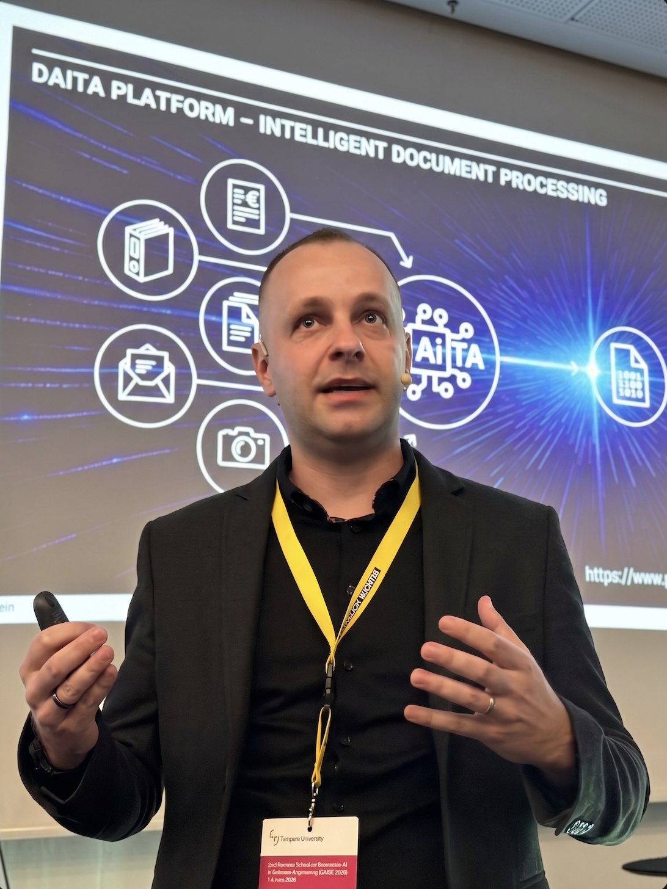

The way we build software is changing rapidly. Modern Agent-first IDEs and coding agents such as Kiro, Google Antigravity, Cursor, Windsurf, and Claude Code no longer just autocomplete code — they can plan, implement, test, debug, and validate changes autonomously across entire repositories. At the same time, the industry is moving from prompt-driven coding toward **spec-driven autonomous engineering**, where agents execute structured specifications, constraints, and acceptance criteria instead of relying on ad-hoc prompts alone.

This hands-on workshop introduced the key concepts behind reliable AI-assisted development: Context Engineering, reusable Skills, AGENTS.md, MCP (Model Context Protocol), and persistent AI knowledge bases (wikis) that let agents accumulate and reuse project knowledge across sessions. The first half covered the concepts and tooling behind agent-first development; the second half was fully practical — participants built and experimented with a working setup directly on their own laptops.

**Interesting observations**

- **Context over cleverness.** The session anchored on a line from Andrej Karpathy: *"90% of Claude's mistakes come from missing context, not a weak model."* Most failures aren't model failures — they're context failures.
- **Context engineering vs. prompt engineering.** The analogy ran throughout: entire environment info vs. a single query, a screenplay vs. a sticky note, a complete system (docs, examples, rules, patterns, guardrails) vs. clever wording, continuous curation vs. a one-time instruction — memory, tools, data, schemas, and project context vs. a few few-shot examples. See [Context Engineering](https://github.com/TomasHer/prompting-blueprints/blob/main/02-ai-agents/03-context-and-memory/context-engineering.md).
- **Prompting patterns still matter.** A tour through reusable prompting patterns — Persona, Question Refinement, Flipped Interaction, Chain-of-Thought, Zero-Shot, and Few-Shot — and how each fits reasoning LLMs ([Effective prompts for reasoning LLMs](https://gpt-lab.eu/effective-prompts-for-reasoning-llms/)).
- **What makes an IDE *agentic*?** The components: Repository, Chat Window, Agent Configuration, Agent Orchestration, Agent Definitions, Skills, MCP & Tools, and Human-in-the-loop.
- **AGENTS.md.** An introduction to the AGENTS.md convention and a reusable template for steering agents with project context ([Agent context window & performance](https://github.com/TomasHer/prompting-blueprints/blob/main/02-ai-agents/03-context-and-memory/agent-context-window-performance.md)).
- **Anatomy of a Skill.** How reusable Skills are structured and how they tie back into context engineering ([Anatomy of a Skill](https://github.com/TomasHer/prompting-blueprints/blob/main/02-ai-agents/02-skills/anatomy-of-a-skill.md)).
- **Personal AI knowledge base.** A live use case built with Obsidian + MCP (or the open-source alternative [Logseq](https://logseq.com)), echoing Karpathy's own AI knowledge-base workflow ([AI knowledge base tutorial](https://github.com/TomasHer/prompting-blueprints/blob/main/02-ai-agents/03-context-and-memory/ai-knowledge-base-tutorial.md#implementation-claude-obsidian)). Demonstrated by building a **Product Owner handbook** and walking through [Prompting Blueprints](https://github.com/TomasHer/prompting-blueprints) — my personal AI knowledge base.
- **Hands-on: AI Bug Detective.** The interactive part put predefined agents and skills to work in a Replit project — [AI Bug Detective](https://replit.com/@laxxli/ai-bug-detective).

### 🎤 Keynote — When Software Stops Waiting: Life in Autonomous AI Systems by Alex Polyakov, CEO @ ProjectSimple

AI is changing far more than how code is written — software systems are starting to observe, decide, and act with ever less human involvement. Tracing the thread back to *"The first AI-Assisted Agile Software Engineering workshop"* he ran with Prof. Pekka Abrahamsson at XP Amsterdam on 13 June 2023, Alex Polyakov walked through what is already **dead**, what is rapidly **dying**, and what stays **very much alive** in the age of autonomous AI systems. His core message: agents make the coding fast, but the value — and the bottleneck — now lives in human judgment, ownership, and the checkpoints that keep autonomy honest.

**Interesting observations**

- **Autonomous agents cut both ways.** Done right they deliver real gains — ~50% faster cycle time, ~35% fewer open bugs, ~40% more test coverage, ~60% faster incident recovery, and ~80% fresher docs. Done wrong, the failure modes are severe: deleted production databases, secrets logged in plain text, read-only modes overridden, and safety/approval loops bypassed.
- **Human-in-the-Loop is what closes those gaps.** Practices like work decomposition, iterative delivery, code review, a shared definition of done, requirement clarification, acceptance testing, architectural decision records, pair programming, and reversible rollbacks are exactly where agents fall short.
- **Where autonomous agents struggle (mostly high-severity):** scope drift, front-loaded execution, self-review blind spots, completion uncertainty, silent assumption propagation, teaching to the test, no rationale memory, asymmetric dialogue (they can't push back), and irreversibility blindness.
- **The Agile lesson still holds:** the more work is in progress, the slower it gets done. AI accelerates output, but human bottlenecks create the wait — Alex framed it via Kent Beck's Theory of Constraints ("see where the bags are piling up") and a baggage-claim metaphor: AI coding is *fast*, while human-in-the-loop and review/approve are the *waiting* states where work piles up.
- **Backlog thought experiment:** he contrasted how the backlog of **1 person + a 24/7 autonomous AI** looks versus **5 devs using human-in-the-loop** — output isn't the constraint, the human review states are.
- **Dead, Dying, Very Much Alive game** — Dead: PR-less merge, manual test generation, Scrum, the "10x developer." Dying: hand-coding, code ownership, line-by-line PR review. Very much alive: architectural design, Agile, product managers, and software engineers.
- **Five takeaways:**
 (1) autonomous agents aren't new — hallucination without judgment has always changed outcomes, and model size doesn't fix it;
 (2) human-in-the-loop beats full autonomy for now;
 (3) complex work needs more than intelligence — architecture, prioritization, naming, and incident calls stay human;
 (4) the biggest value is **Intelligent Automation (IA)**, reached through contextual awareness rather than bigger models;
 (5) **tokens are the new currency**, but AI commoditization is inevitable — ask what's optimizing whom.
- **Some memorable lines and data points:** *"Early bird gets the worm, but the second mouse gets the cheese."* On average **65% of a team's work is unplanned**, **token usage is the new KPI**, and — most pointedly — *"You cannot delegate ownership: let the people decide what we work on, describe the problem, and let the team solve the issue."*

### 🎓 Academic Talk — Generative AI in Software Engineering: Progress & Open Questions by Muhammad Waseem, PhD

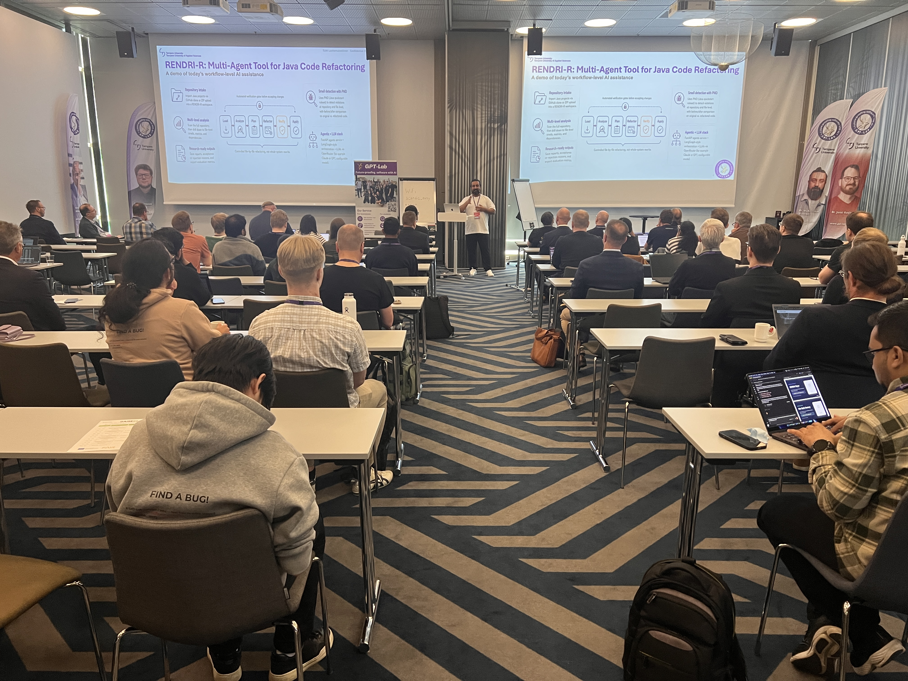

A state-of-the-art academic survey of where generative AI in software engineering actually stands. Muhammad Waseem traced the long arc of "the end of hand-written code," mapped today's tooling landscape, laid out the research methods the community uses to measure real impact, and closed with a working artifact — a multi-agent refactoring tool — as a concrete example of workflow-level AI assistance. The throughline: capability is real and layered, but the open questions are about how we *rigorously* measure value, trust, and security.

**Interesting observations**

- **A short history — every era was promised the end of hand-written code.**

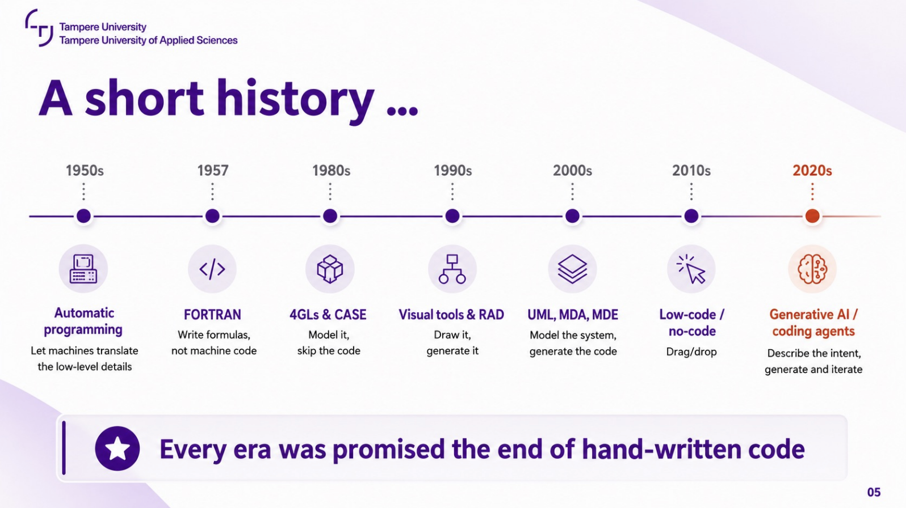

- **The GenAI tooling ecosystem is an 8-layer stack.**

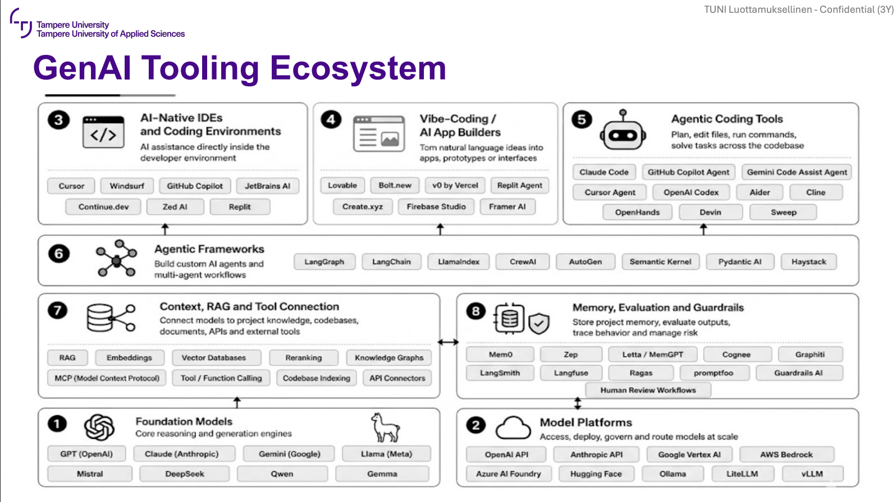

- **Research approaches — seven ways to study GenAI's real impact. Each method maps to what it can actually measure.**

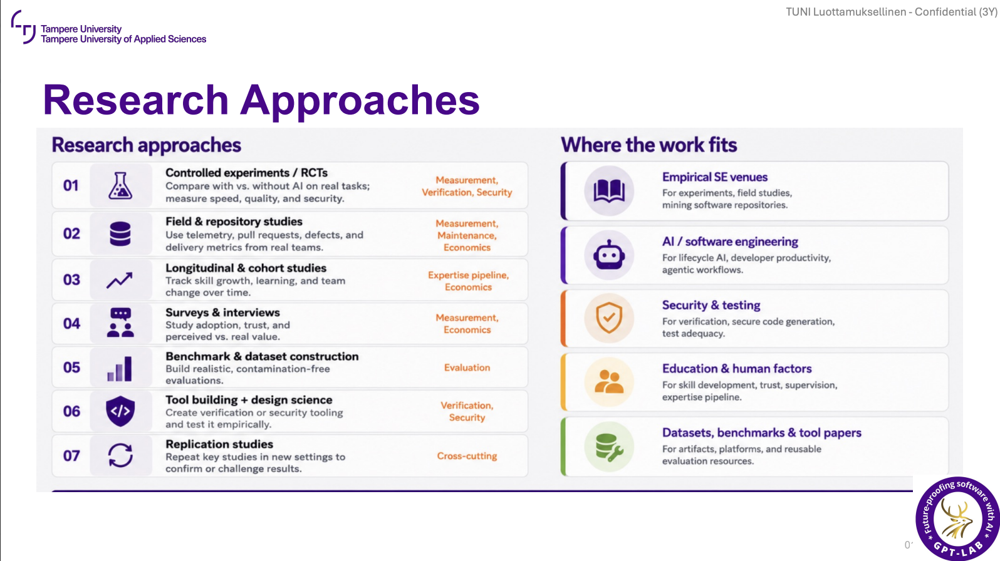

- **RENDRI-R: a multi-agent tool for Java code refactoring.**

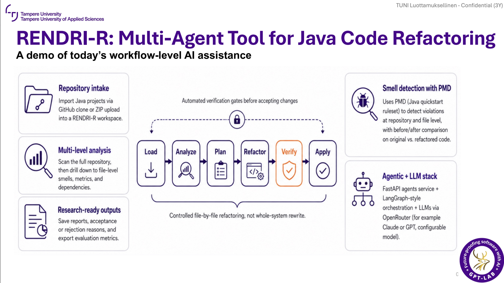

### 🛠️ Workshop — Vibing Ideas: Knowing What to Build When AI Does the Rest by Prof. Xiaofeng Wang, Daniel Planötscher & Silvia Cortesia, LUT University / Free University of Bozen-Bolzano

*"If coding really is solved, the bottleneck moves to taste, judgment, and knowing what is worth building."* This hands-on workshop reframed AI not as a faster way to write code, but as a **thinking partner** — a collaborator for navigating ambiguity, surfacing real user needs, and shaping rough ideas into solutions actually worth building. Once implementation stops being the constraint, the hard part becomes deciding *what* to build and *why*, and the workshop put that judgment front and center.

**Interesting observations**

- **The bottleneck has moved upstream.** When AI handles the "how," value concentrates in the "what" and "why" — taste, judgment, and problem framing become the scarce skills.
- **AI as a thinking partner, not a code generator.** Used well, AI helps explore the problem space, challenge assumptions, and pressure-test ideas before any code is written.
- **Navigating ambiguity is the real work.** Surfacing latent user needs and turning fuzzy, ill-defined problems into something concrete enough to act on is where the leverage lives.
- **From ideas to solutions worth building.** The hands-on portion practiced shaping and prioritizing ideas — separating what's *possible* from what's *worth doing*.

### 🎤 Tech Talk — Measuring the Business Value of Agentic AI by Janne Kuivalainen, CTO, Danfoss Drives

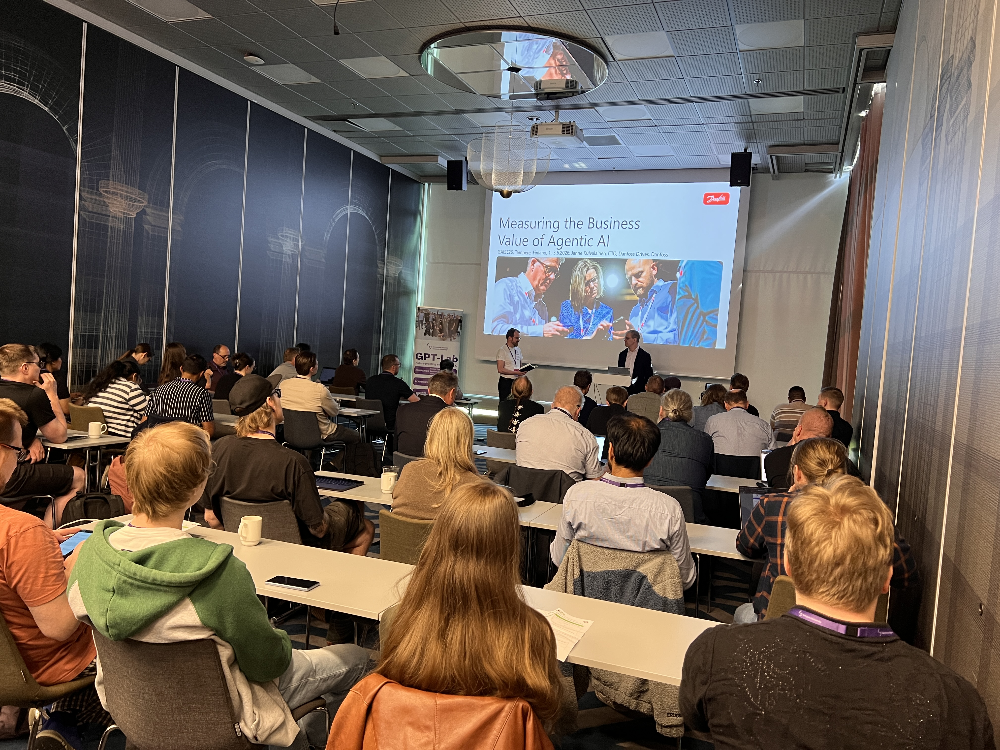

Agentic AI promises step-change productivity, yet its economic value remains stubbornly hard to evidence. Janne Kuivalainen introduced a conceptual framework that links **agent maturity** with **structured business impact assessment** through **KPI trees** — connecting what an agent can actually do to where it shows up on the financials. The throughline: to make the value of agentic AI credible, you have to trace it all the way from the org structure that owns it, through the projects that deploy it, down to the lines of the P&L and balance sheet it moves.

**Interesting observations**

- **Vision to Value — the path forward.** The closing framework tied three things together: the *people* who own the work (Business & Line Leaders, an AI Solution Owner, AI & Data Leadership, and the AI & Data team), the *maturity* of the agents themselves, and the *financial impact* they produce — so value is never asserted in the abstract but always traced back to an owner and a number.
- **KPI trees map AI impact onto the financial statements.** Rather than vague productivity claims, each agentic use case is connected to concrete P&L and balance-sheet lines: new AI product value → higher sales (Revenue), automation & efficiency → lower unit costs (Cost of Sales), AI automation → lower overhead (OPEX), and onward to gross margin, EBIT, and net profit. The balance sheet gets the same treatment — faster customer payments (Receivables), leaner inventory and faster turns, higher asset utilization (PPE), growing data & IP value (Intangibles), and stronger equity from retained earnings.
- **Project phases: Pilot → Implementation → Scaling → Adopted.** Agentic initiatives were framed as moving through four explicit stages, making it clear that business value is realized progressively — a pilot proves the concept, but the payoff only compounds once a use case is scaled and fully adopted.
- **Maturity and value go together.** Pairing agent maturity with the impact framework keeps expectations honest: early-stage agents shouldn't be measured against fully-adopted returns, and the KPI tree makes that distinction explicit instead of hand-waving it.

### 🖥️ Demo — From Task to Action: Why Agent Harnesses Matter by Malik Abdul Sami & Zeeshan Rasheed, GPT-Lab / Tampere University

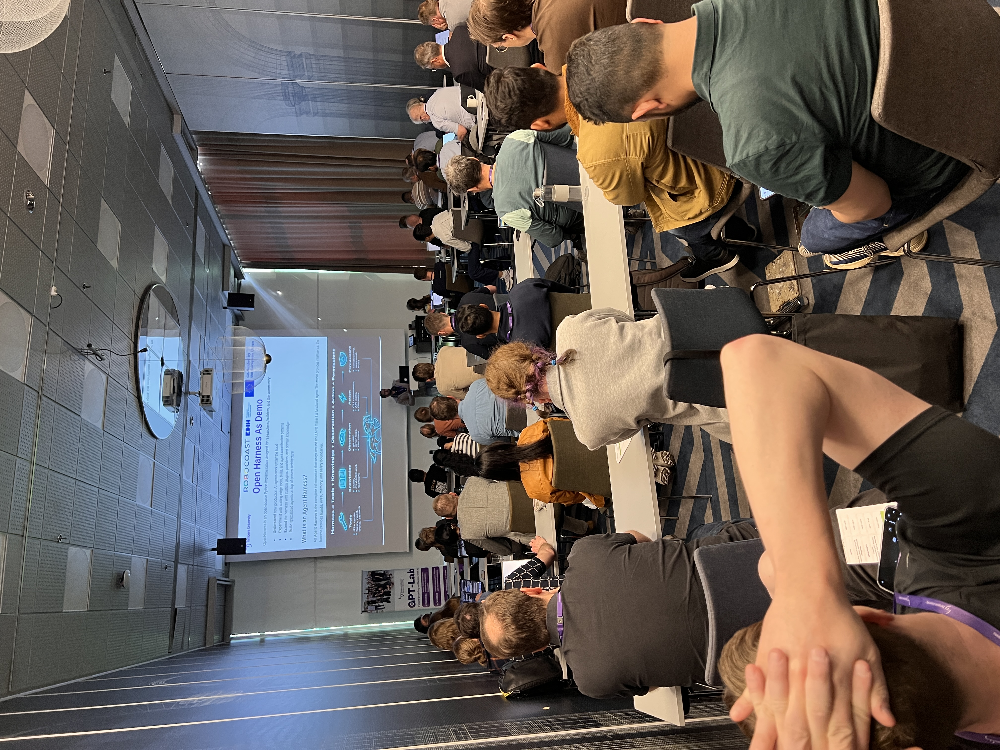

The jump from a powerful LLM to a genuinely useful agent isn't a bigger model — it's the **harness** around it. Malik Abdul Sami and Zeeshan Rasheed of GPT-Lab made the case that the model only supplies intelligence, while the harness supplies the **hands, eyes, memory, and safety boundaries** that turn that intelligence into action. They grounded the argument in a live demo of **OpenHarness**, their open-source Python implementation, to show how production agents actually work under the hood rather than treating them as a black box.

**Interesting observations**

- **The harness equation.** Their framing reduced an agent harness to five pillars: **Harness = Tools + Knowledge + Observation + Action + Permissions** — the complete infrastructure that wraps around an LLM to make it functional. The model is the brain; the harness is everything else that lets it sense, decide, act, and stay within bounds.
- **The five pillars, concretely.** *Tools* — 43+ tools (bash, read, write, search) give the agent hands. *Knowledge* — skills, `CLAUDE.md`, and memory give it persistent context about the project and itself. *Observation* — git diff, error logs, and file state are its eyes and feedback loop. *Action* — ~43 commands, API calls, and file edits are how it changes the world. *Permissions* — sandboxing, approval, and trust are the safety boundaries that keep autonomy honest.
- **Observation closes the loop.** The point that stuck: agents don't just emit actions, they *observe* the consequences (diffs, errors, file state) and adjust — the harness is what makes that sense-act-sense cycle possible, not the model alone.
- **OpenHarness as an open demo.** Rather than a slide-only talk, they shipped the architecture as open source for researchers, builders, and the community — to understand how production AI agents work under the hood, experiment with cutting-edge tools, skills, and agent-coordination patterns, extend it with custom plugins, providers, and domain knowledge, and build specialized agents on top of a proven architecture. Repo: [GPT-Laboratory/harness-testing](https://github.com/GPT-Laboratory/harness-testing).

### 🎓 Academic Talk — AI Won't Save Your Research: Things Researchers Should Never Do by Dr. Kai-Kristian Kemell, GPT-Lab / Tampere University

A candid, practitioner's-eye talk on the pitfalls of leaning on generative AI in academic work. Dr. Kai-Kristian Kemell's message was a useful corrective to the hype: AI is a powerful assistant, but it won't do the thinking, the rigor, or the accountability for you — and researchers who treat it as a shortcut around those responsibilities tend to get burned. A grounded reminder of the things researchers should never hand off to a model.

### 🎓 Doctoral Research Presentations by Dr. Kai-Kristian Kemell & Dr. Mika Saari, GPT-Lab / Tampere University

<!-- PHOTO PLACEHOLDER — add image once available -->

A session spotlighting doctoral research from the GPT-Lab community, chaired by Dr. Kai-Kristian Kemell and Dr. Mika Saari. Early-stage researchers shared work-in-progress at the intersection of AI and software engineering — a window into the questions the next generation of the field is taking on.

---

## Day 2 — Tuesday, 2 June 2026

### Theme: AI-Native World · Academic, Industry & Executive Tracks

### 🎤 Keynote — Agents Code. Teams Erode. by Dr. Markus Borg, CodeScene / Lund University

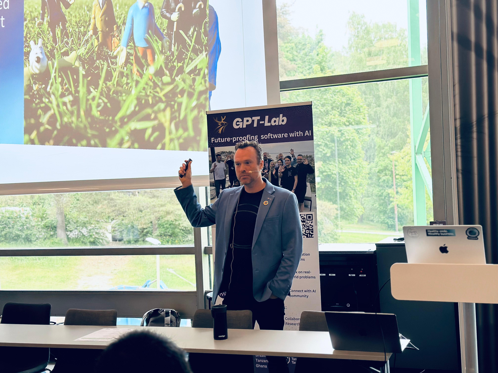

Coding agents now write significant portions of production software, so Dr. Markus Borg argued the question is no longer *whether* they work, but what happens to the **humans around them**. Drawing on CodeScene's **behavioral code analysis**, he made the case that **knowledge distribution, ownership, and coordination** are load-bearing structures that keep hybrid (human + AI) teams from hollowing out — and that left unattended, they quietly erode, letting AI replace the wrong parts of a team rather than augment it. The throughline: agents make the code cheap, but a team can hollow out from the inside unless you actively measure and defend how understanding is spread across the people who own it.

**Interesting observations**

- **Two human challenges loom over hybrid teams.** *Human Challenge 1 — Code Bloat and Cognitive Load:* agents generate volume far faster than humans can absorb it, so the cognitive load of understanding and maintaining the codebase balloons. *Human Challenge 2 — Skill Atrophy and Loss of Intent:* as agents take over more of the work, human skills decay and the rationale behind decisions evaporates, leaving code that nobody fully understands or can explain.

- **Solution 1: Maintain Human Oversight.** Two practices keep humans in the loop — **visualization**, using behavioral code analysis and knowledge maps to make knowledge distribution and ownership visible across the codebase (the colored clusters show where authorship concentrates), and **disciplined provenance tracking**, so you always know what a human wrote versus what an agent generated.

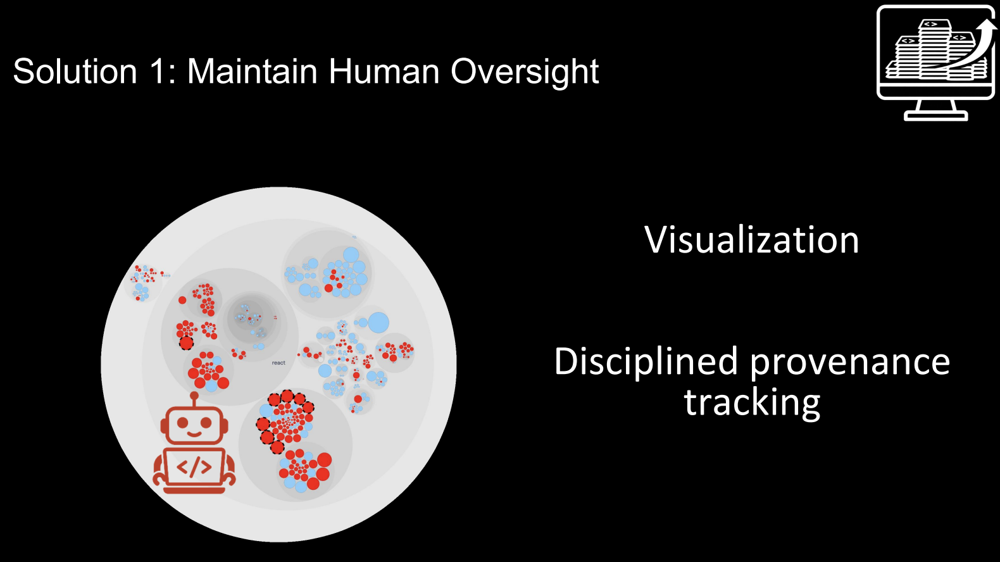

- **Solution 2: Manage Three Layers of Debt.** Borg reframed AI-era debt as three stacked layers, each with its own mitigation:
 **Technical Debt** (code quality, architecture, maintainability) → add agentic **guardrails** and **monitor** churn & bloat.
 **Intent Debt** (rationale, goals, constraints, decisions) → **capture intent before agents act** — requirements, spec-driven development, architectural decision records, TDD.
 **Cognitive Debt** (models, reasoning, awareness) → treat **understanding as a KPI** — walkthroughs, pairing, retrospectives, and sensemaking sessions.

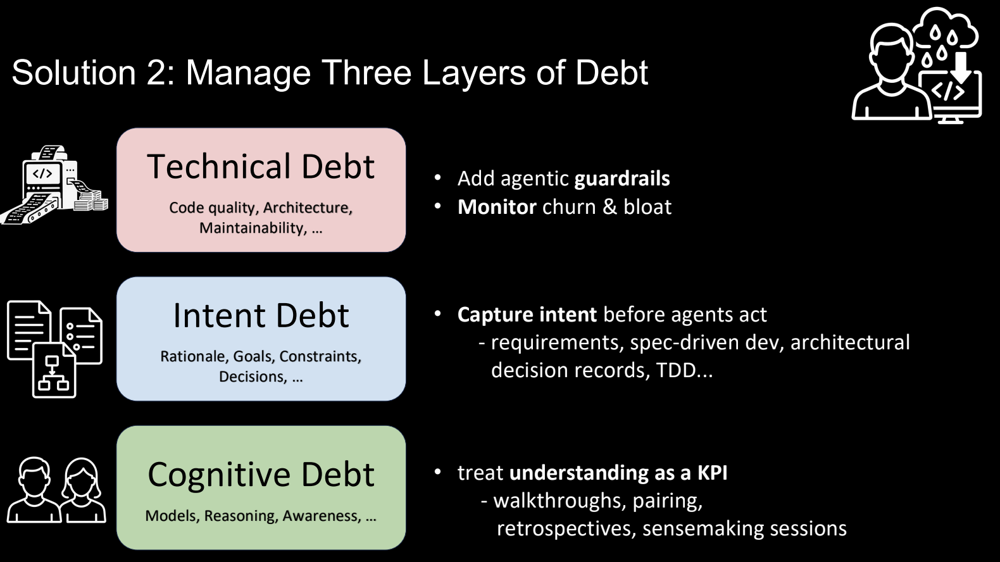

- **Before signing the AI deal — reinforce best practices.** The closing checklist boiled down to three: (1) **guardrails for brain-aligned code**, (2) **maintain human oversight**, and (3) **beware cognitive and intent debt** — the two debts that never show up in the code itself, yet quietly decide whether the team erodes.

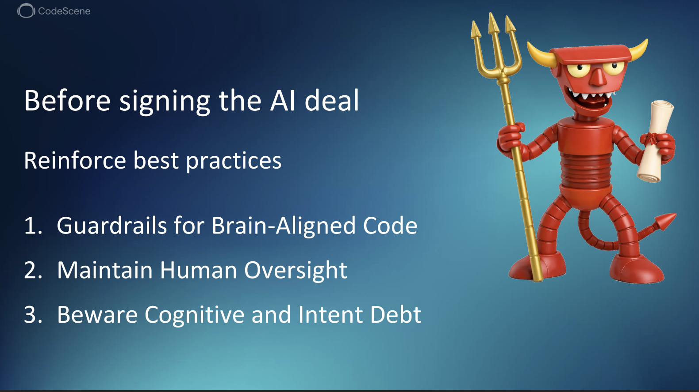

### 💬 Panel — The Rise of Agentic Organizations: Leadership in the Age of Physical and Synthetic AI

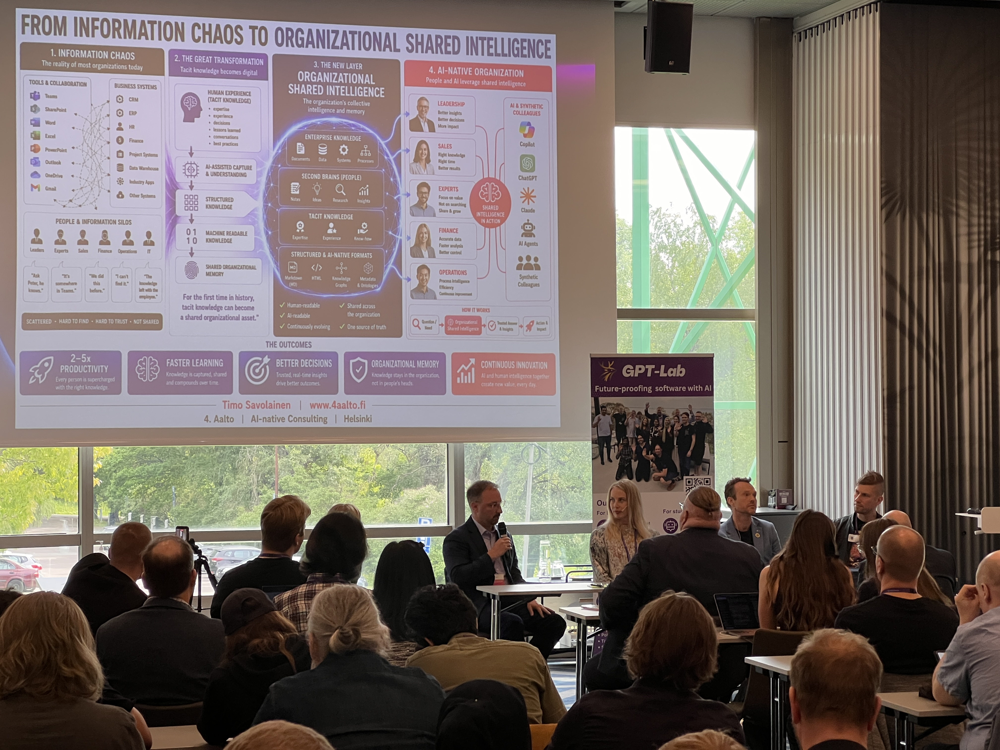

**Opening remarks & panelist:** Timo Savolainen, Founder & CEO, 4. Aalto · **Panelists:** Dr. Markus Borg (CodeScene / Lund University), Alex Polyakov (CEO, ProjectSimple), Karoliina Kettukari (AI Director, OP Pohjola) · **Facilitator:** Sanni Pöntinen (Doctoral Student, University of Tampere)

Right after the morning keynote, the Executive Track widened the lens from individual coding agents to the whole **agentic organization** — and to the people who have to lead it. The premise: organizations are becoming staffed not only by humans but by **physical AI** (robots and embodied systems) and **synthetic AI** (digital agents and "synthetic colleagues") that observe, decide, and act alongside their teams. Facilitated by Sanni Pöntinen, the panel paired a researcher (Markus Borg), two founders (Alex Polyakov and Timo Savolainen), and an enterprise AI leader (Karoliina Kettukari of OP Pohjola) to work through what leadership, structure, and accountability look like when the workforce is part human and part machine. Timo Savolainen set the table with opening remarks on the substrate all of this depends on — turning scattered, siloed knowledge into **shared organizational intelligence**.

**Interesting observations**

- **Timo Savolainen's opening remarks — From Information Chaos to Organizational Shared Intelligence.** His framing for the whole panel: most organizations today run on *information chaos*, with knowledge scattered across Teams, SharePoint, CRMs, and ERPs — and trapped in people's heads (*"Ask Peter, he knows," "It's somewhere in Teams," "The knowledge left with the employee."*). He mapped a four-stage path out of it:
 **1 · Information Chaos** — scattered, hard to find, hard to trust, not shared.
 **2 · The Great Transformation** — AI captures tacit human knowledge (expertise, experience, decisions, lessons learned) and turns it into structured, machine-readable *shared organizational memory*: *"For the first time in history, tacit knowledge can become a shared organizational asset."*
 **3 · Organizational Shared Intelligence** — a new layer fusing enterprise knowledge, people's "second brains," and tacit know-how into AI-native formats (Markdown, knowledge graphs, metadata & ontologies) that are human-readable, AI-readable, continuously evolving, and a single source of truth.
 **4 · AI-Native Organization** — people and *synthetic colleagues* (Copilot, ChatGPT, Claude, AI agents) both draw on that shared intelligence across leadership, sales, experts, finance, and operations.
 The promised outcomes: **2–5× productivity**, faster learning, better decisions, durable organizational memory, and continuous innovation.
- **A lighter moment from Alex Polyakov.** On the relentless tempo of building a company, the serial founder drew a laugh from the room: *"To us entrepreneurs, Friday means that there are only 2 days left by the end of the week."*

### 🛠️ Lab — Tools That Use Tools to Build Tools by Dr. Jussi Rasku, GPT-Lab / Tampere University

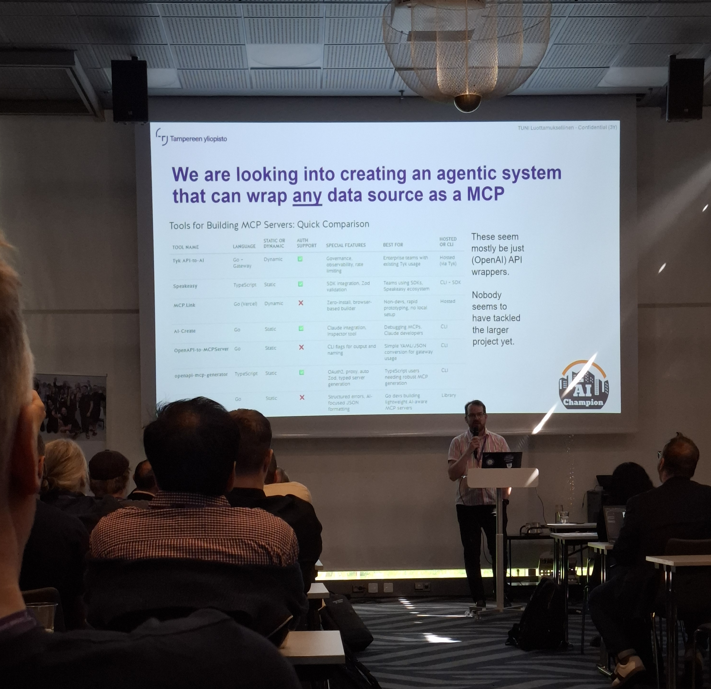

Dr. Jussi Rasku framed the rise of agentic coding as a shift *beyond the IDE paradigm* toward **L1–L5 AI software-engineering systems** — staged autonomy levels in which an LLM-powered agent lives inside a **harness**, decomposes a task, calls tools to act and observe, and, when its toolbox falls short, **writes the new tool it needs on the spot**. He grounded the idea in examples ranging from DeepMind's **AlphaEvolve** to GPT-Lab's own multi-agent research on optimization heuristics and auto-generated MCP data adapters, building toward a single claim: an agent's intelligence isn't the model, it's the **loop**. The session then went fully hands-on with the **Pi coding agent** — a UNIX-style, minimal-core agent hosted at [pi.aistico.com](https://pi.aistico.com) — where participants asked Pi to inspect a sample CSV, build whatever tool it needed to understand the data, and run that tool to explain the results. Materials: [GPT-Laboratory/GAISE26_tool_building_pi_agents](https://github.com/GPT-Laboratory/GAISE26_tool_building_pi_agents).

**Interesting observations**

- **A harness is the control layer that turns a model into a worker.** Rasku opened with a dictionary-style definition worth keeping: a harness is *"the control layer around a large language model that turns model outputs into reliable action: providing tools, memory, context, permissions, execution logic, logging, and recovery."* The punchline — **the model imitates reasoning; the harness makes it do work** — complements the Day 1 [harness demo](#demo-harnesses) by Sami & Rasheed and maps directly onto the Blueprint on [prompt, context & harness engineering](https://github.com/TomasHer/prompting-blueprints/blob/main/02-ai-agents/01-foundations/prompt-context-harness-engineering.md).

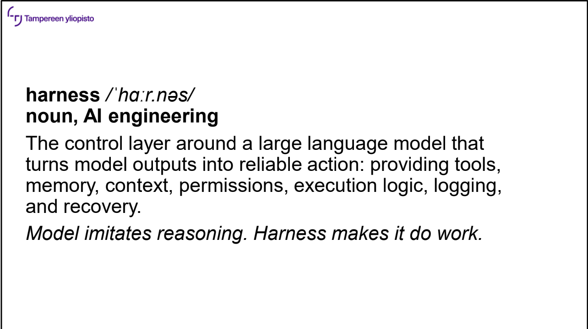

- **The loop is the intelligence.** The core mental model: **generate → act → observe → evaluate → revise**. Tool use is what lets an agent *observe and interact* with the world instead of just emitting text — it closes the sense-act-sense cycle, and that loop, not raw model size, is where useful behavior actually comes from.

- **Tool-building compounds capability and enables self-improvement.** When the toolbox runs out, the agent doesn't fail — it builds the missing tool and keeps going, so every new tool widens what the next step can do. AlphaEvolve was the marquee example of this compounding: the model generates, tests, and refines its own candidate solutions to evolve better algorithms over time.

- **Wrapping *any* data source as an MCP — a way out of data-integration hell.** GPT-Lab is exploring an agentic system that can wrap any data source as a [Model Context Protocol](https://github.com/TomasHer/prompting-blueprints/blob/main/02-ai-agents/04-protocols/mcp-guide.md) server. Rasku's survey of existing builders (Tyk API-to-AI, Speakeasy, MCP.Link, AI-Create, OpenAPI-to-MCPServer, openapi-mcp-generator, openapi-mcp) found them *"mostly just (OpenAI) API wrappers"* — nobody had yet tackled the larger project of generating uniform tools over arbitrary data.

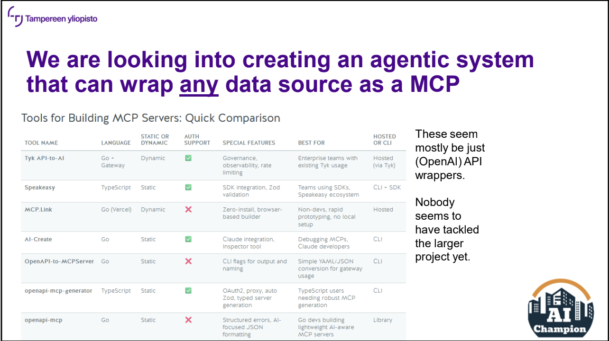

- **Generating MCP servers: 2014 → 2026.** He drew a line from a 2014 GOFAI approach — join-inference and attribute classifiers that imported vehicle-routing problems from raw relations (Kalmbach's master's thesis) — to a 2026 architecture where an **AI MCP generator** introspects a data source and *Claude-Code-style* generates a server from its schema, deploying a uniform MCP layer that agents discover, query, and combine for grounded access.

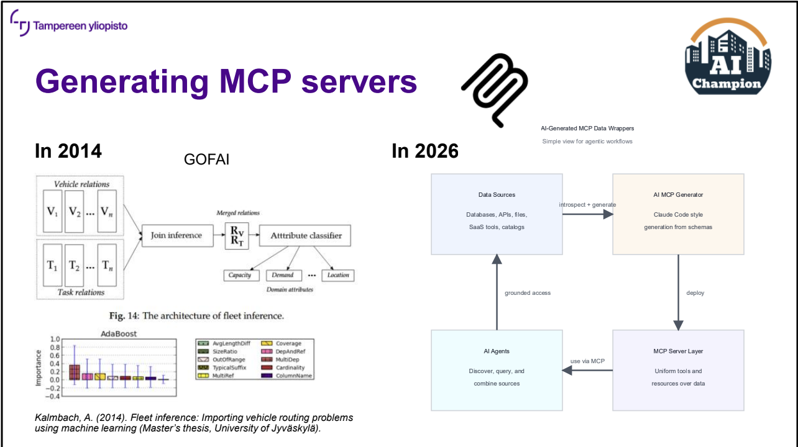

- **An aside on the agentic-coding gold rush: the Clawd → Moltbot → OpenClaw mania.** A retired developer's weekend hack went viral — 60K stars in three days, a peak of 710 ★/hr, 100K stars in ~2 days, past React's 10-year total in 60 days, and 350K+ today — surviving an Anthropic cease-and-desist (hence two renames in three days) before being handed to a foundation and absorbed into OpenAI. A vivid illustration of how fast the harness-and-tools ecosystem is moving.

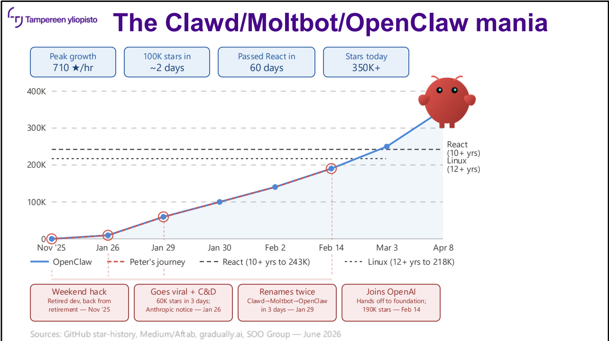

- **The lab system: from intent to a running tool, with no editor.** The Pi setup is deliberately minimal: a **chat pane** where you give Pi a task and a **work pane** where you watch it work, backed by an isolated, disposable **sandboxed container**. Inside, the **pi agent** orchestrates — reasoning via an LLM on OpenRouter — then **writes a small script (the tool)** and **runs it on your data**. The whole point: *you state intent, Pi writes and runs the tool, and you never open an editor.*

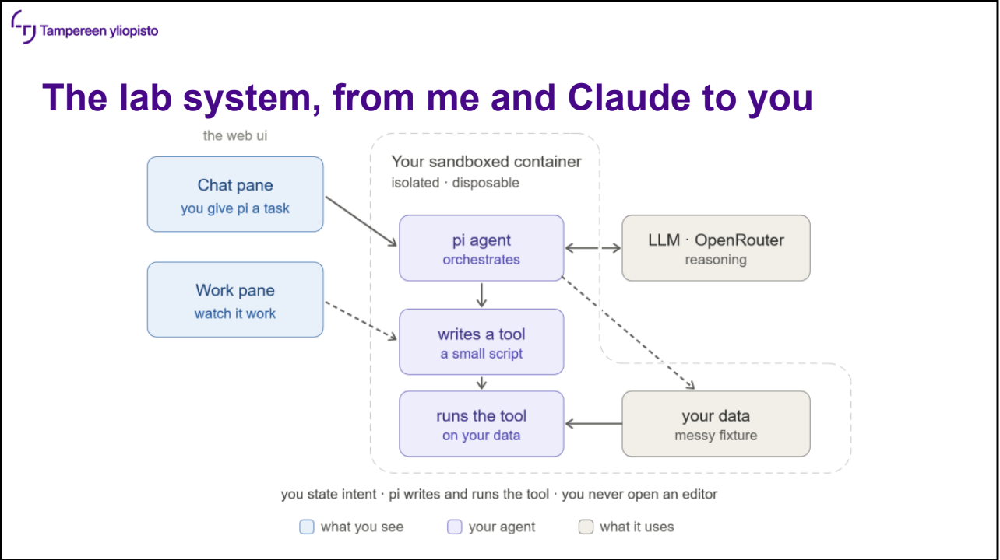

- **Five takeaways.**
 (1) **Tool use allows agents to observe and interact** — not just generate text.
 (2) **Models become useful systems when a harness makes them do actual work.**
 (3) **The loop is the intelligence:** generate → act → observe → evaluate → revise.
 (4) **Tool-building compounds capability** and allows self-improvement.
 (5) **Generating MCP servers** (one kind of tool) for data is a solution out of data-integration hell.

---

## Day 3 — Wednesday, 3 June 2026

### Theme: Responsible AI Era · Academic & Industry Tracks

### 🎤 Conference Closing

<!-- CLOSING PHOTO PLACEHOLDER -->

A heartfelt thank you to everyone who made GAISE 2026 possible. The **GPT-Lab team** at Tampere University created an outstanding program that brought together researchers, practitioners, and executives from across the AI and software-engineering community.

Special recognition goes to the main organizers — **Vaishnavi Bankhele** and **Virve Yli-Savola** — whose meticulous planning and tireless effort ensured the event ran smoothly from the first keynote to the final session. Equal thanks to all the **volunteers** who handled registration, logistics, and the countless behind-the-scenes tasks that keep a multi-track conference on track.

Your work gave everyone in the room the space to focus on learning and connecting. Thank you.

---

*Notes by Tomas Herda. Connect on [LinkedIn](https://www.linkedin.com/in/herdatom).*
