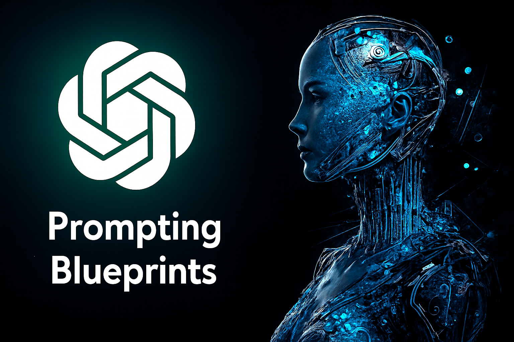

# Prompting Blueprints

Reusable prompt patterns, copy‑ready prompt packs, model‑specific tips (GPT‑5, Gemini), and tool playbooks (NotebookLM, Perplexity Comet, Copilot Agents). Includes example evaluations with **promptfoo**.

<p align="left">
  <a href="./LICENSE"></a>
  <a href="./docs/LICENSE-CC-BY-4.0.txt"></a>
  <a href="./CONTRIBUTING.md"></a>
  <a href="https://github.com/TomasHer/prompting-blueprints/stargazers"></a>
</p>

> Use this repo as your **prompting portfolio & playbook**: share highlights on LinkedIn, fork for your team, and adapt patterns to your use cases.

---

## TL;DR
- **Prompts & patterns:** prompt packs and reusable scaffolds (role + constraints + format) → `./03-prompts-and-patterns`
- **Models & evaluations:** model tips, evaluation overviews, and promptfoo configs → `./06-models-and-evaluations`
- **Tools:** tactics for NotebookLM, Perplexity Comet, Copilot Agents → `./05-tools`
- **AI Agents:** agent architectures, protocols, context engineering, and skills playbooks → `./02-ai-agents`
- **Guides:** deep-dive primers and a PDF library (Gemini Prompting Guide 101, Google Startup AI Agents) → `./04-guides` (see `./04-guides/overview.md`)
- **Use cases:** applied flows (e.g., research notes) → `./use-cases`
- **Research:** tutorials, reusable blueprints, and collaboration signals for academic researchers → `./research` and `./01-about-author/research`
- **Speaking:** keynote decks, talk outlines, and submission notes → `./01-about-author/speaking`
- **External sources:** curated references cited across guides and playbooks → `./external-sources.md`

Quick links: [AI agents overview](./02-ai-agents/ai-agents-overview.md) · [context engineering](./02-ai-agents/context-engineering.md) · [prompts & patterns](./03-prompts-and-patterns) · [models & evaluations](./06-models-and-evaluations) · [tools](./05-tools) · [guides overview](./04-guides/overview.md) · [use‑cases](./use-cases) · [research](./research) · [author research](./01-about-author/research) · [speaking](./01-about-author/speaking) · [external sources](./external-sources.md) · [changelog](./CHANGELOG.md)

> Want more? Browse the publicly accessible [Google NotebookLM notebook](https://notebooklm.google.com/notebook/c486e20f-f02a-439c-8168-853472335263) for extended context, references, and drafts.

---

## Who is this for?
- **Practitioners & teams** who want consistent, high‑quality outputs
- **Leads & educators** who need examples they can demo and share
- **Everyone** looking for opinionated, “just‑paste‑this” prompts with structure

## What’s inside
- A **pattern catalog**: role, constraints, format, guardrails
- **Copy‑ready prompt packs** organized by job/function
- **Model guides**: nuances, capabilities, and pitfalls
- **Tool playbooks**: tactical prompts and workflows for NotebookLM, Copilot, and more
- **Prompting guides**: long-form walkthroughs with downloadable references
- **Evaluation samples**: promptfoo assertions & runs
- **Research tutorials**: academic-ready walkthroughs and blueprints for researchers exploring prompting workflows

[🎥 Watch the Prompting Blueprints introduction video](https://youtu.be/5ZxBHNKWJYs?si=7eJwo2Iy0FfNRm0U) for a guided tour of the repo purpose.

[🧠 View the repository mind map](assets/prompting_blueprints_mindmap.png) for a visual overview of key folders and resources.

---

## Repository structure
```text
01-about-author/           # maintainer background (speaking, research, program committees)
  program-committee/    # program committee & track leadership overview
  research/             # research focus areas & collaboration signals
  speaking/             # keynote outlines and talk prep
02-ai-agents/           # AI agents playbooks, protocols, and skills
03-prompts-and-patterns/    # prompt packs and pattern catalog
04-guides/              # long-form prompting guides & PDFs
05-tools/               # NotebookLM, Perplexity Comet, Copilot Agents
06-models-and-evaluations/  # model guides, evaluation overviews, and promptfoo configs
assets/                 # social previews and supporting images
docs/                   # documentation site extras (e.g., licenses)
research/               # research tutorials, reusable blueprints, and collaborations
use-cases/              # applied workflows
website/                # static HTML experiments (e.g., AI toolkit preview)
CHANGELOG.md            # updates (Keep a Changelog)
CONTRIBUTING.md         # how to contribute
CODE_OF_CONDUCT.md      # community expectations
CITATION.cff            # how to cite
LICENSE                 # MIT (code)
docs/LICENSE-CC-BY-4.0.txt  # CC BY 4.0 (docs & prompts)
external-sources.md     # curated references & attributions
mkdocs.yml              # documentation site navigation
```

---

## Contributing
Contributions are welcome! Please read [CONTRIBUTING.md](./CONTRIBUTING.md) and follow the [Code of Conduct](./CODE_OF_CONDUCT.md). If you add a new pattern or prompt pack, include:
1. **Intent** (problem it solves)
2. **Constraints** (guardrails)
3. **Output format** (JSON/Markdown schema)
4. **Example input & output**

---

## License

- **Code:** MIT — see [`LICENSE`](./LICENSE).
- **Documentation & non-code content:** CC BY 4.0 — see [`docs/LICENSE-CC-BY-4.0.txt`](./docs/LICENSE-CC-BY-4.0.txt).

---

## Cite this work
Researchers and educators can cite this repo via [CITATION.cff](./CITATION.cff).

```bibtex
@software{herda_prompting_blueprints,
  title = {Prompting Blueprints},
  author = {Herda, Tomas},
  year = {2025},
  url = {https://github.com/TomasHer/prompting-blueprints}
}
```

---

## Credits
**Author:** [Tomas Herda](https://www.linkedin.com/in/herdatom)
<br>

<br>
Repository social preview image: [Image](./assets/prompting_blueprints_herda_social.png)

---

## Speaking & Keynotes & Organization
Explore Tomas Herda’s upcoming appearances, talk topics, and booking details on the dedicated [Speaking & Keynotes overview](./01-about-author/speaking/index.md).

For conference organization work - including program committees and track leadership see the [Program Committee & Track Leadership overview](./01-about-author/program-committee/index.md).

## Research
Review ongoing investigations, experiment logs, and calls for collaboration in the [Research overview](./01-about-author/research/overview.md).

---

## FAQ
**Q: Can I use these prompts commercially?**  
A: Yes. Code is MIT; docs/prompts are CC BY 4.0 (attribution required).

**Q: Which models are supported?**  
A: Patterns are model‑agnostic; guides cover GPT‑5 and Gemini explicitly.

**Q: How do I run evaluations without exposing secrets?**  
A: Use environment variables and a local `.env` file that is git‑ignored.
