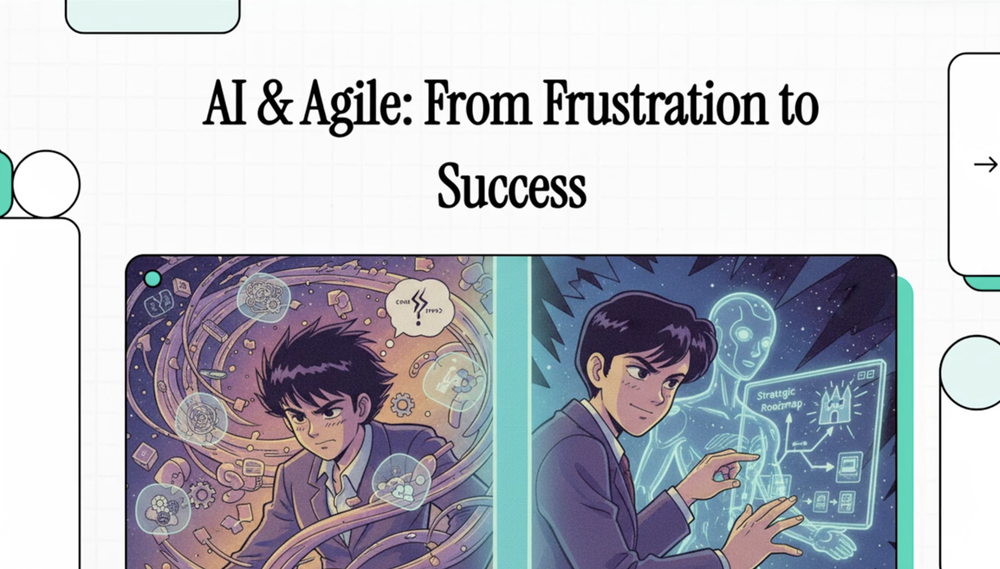

# Author's Research Involvement

## Intent
Document research initiatives co-authored by Tomas Herda and provide quick access to source material for deeper review.

## 2025

- **Involvement:** [AI and Agile 2025 at XP Conference](https://conf.researchr.org/home/xp-2025/aiandagile-2025)
- **Published papers:**
  - [arXiv:2506.20159 - XP2025 AI and Agile - Workshop Summary](https://arxiv.org/abs/2506.20159)
  - [arXiv:2508.20563 - XP2025 AI and Agile - Research Roadmap](https://arxiv.org/abs/2508.20563)
  - [AI and Agile Software Development: From Frustration to Success — XP2025 Workshop Summary](https://link.springer.com/chapter/10.1007/978-3-032-05799-0_1) (Springer Nature, 30 Oct 2025)
- **Summary:** Full-day XP 2025 workshop with four connected sessions (Retrospective, Review, Ideation, Collaborative Research Roadmap) designed to turn AI-in-Agile friction points into actionable investigations.
- **Key Findings:**
  - Practical, hands-on structure culminating in a shared research roadmap deliverable.
  - Brings together industry and academia to surface integration challenges and opportunities.
  - Public agenda highlights accepted talks and program flow for follow-up.

- **A Multi-agent LLM System for Automated Requirements Analysis: A Study on User Story Generation and Prioritization**
  - **ArXiv:** Not available; proceedings chapter only as of September 2025.
  - **Publication:** Springer Nature Switzerland, First Online 09 Sep 2025 (print 2026) — [Chapter](https://link.springer.com/chapter/10.1007/978-3-032-04200-2_12).
  - **Summary:** Explores a role-based multi-agent stack (GPT-3.5, GPT-4o, Llama 3.3, Mistral-Nemo) to generate user stories from project briefs and prioritize them with stakeholder-specific prompts.
  - **Key Findings:**
    - Generated stories maintain strong functional relevance and semantic similarity to expert baselines.
    - Prioritization aligns moderately with expert rankings, especially for mid- and lower-priority items.
    - Notes run-to-run variability and uneven clarity or conciseness across different models.

## 2024

- **TimeLess: A Vision for the Next Generation of Software Development**
  - **ArXiv:** [arXiv:2411.08507](https://arxiv.org/abs/2411.08507) — submitted 13 Nov 2024.
  - **Publication:** Preprint; conference or journal release pending.
  - **Summary:** Vision paper proposing multi-agent AI that captures meeting discussions and executes development tasks to shift meetings from planning to immediate action.
  - **Key Findings:**
    - Targets reductions in delivery complexity, time, and cost through AI execution.
    - Envisions meetings generating tangible progress as agents act on decisions in real time.
    - Frames the future development environment as human strategic direction paired with automated follow-through.
- **Exploring Human-AI Collaboration in Agile: Customised LLM Meeting Assistants**
  - **ArXiv:** [arXiv:2404.14871](https://arxiv.org/abs/2404.14871) — submitted 23 Apr 2024.
  - **Publication:** Springer Nature Switzerland, 31 May 2024 — [Open PDF](https://library.oapen.org/bitstream/handle/20.500.12657/90931/978-3-031-61154-4.pdf?sequence=1#page=171).
  - **Summary:** Action-research deployments of AI meeting assistants tailored for Daily Scrum and feature refinement ceremonies, including readiness guidance and lessons learned.
  - **Key Findings:**
    - Finds assistants most valuable in longer planning or review sessions where UX quality matters.
    - Provides a readiness and assessment checklist covering integration, data, and compliance factors.
    - Shows real-time recommendations are helpful but sensitive to configuration and prompting.
- **Generating Test Scenarios from NL Requirements Using Retrieval-Augmented LLMs: An Industrial Study**
  - **ArXiv:** [arXiv:2404.12772](https://arxiv.org/abs/2404.12772) — submitted 19 Apr 2024.
  - **Publication:** IEEE, 24 Jun 2024 — [IEEE Xplore](https://ieeexplore.ieee.org/abstract/document/10628480).
  - **Summary:** Introduces the RAGTAG approach (retrieval-augmented LLM pipeline) and evaluates it on two Austrian Post projects with bilingual requirements via expert assessment.
  - **Key Findings:**
    - Produced scenarios rated relevant with strong coverage, coherence, and feasibility.
    - Demonstrates the need for a human-in-the-loop to refine correctness and domain nuance.
    - Emphasizes the importance of domain document retrieval to handle bilingual specifications.
- **Prioritizing Software Requirements Using Large Language Models**
  - **ArXiv:** [arXiv:2405.01564](https://arxiv.org/abs/2405.01564) — submitted 5 Apr 2024.
  - **Publication:** Currently circulating as an arXiv preprint; dissemination venue forthcoming.
  - **Summary:** Presents a web-based prototype that applies AI agents and prompt engineering to automate or support requirement prioritization techniques.
  - **Key Findings:**
    - Shows feasibility of LLM-assisted prioritization within Agile workflows.
    - Highlights time and budget savings plus more reproducible decision procedures.
    - Releases prototype code to enable experimentation and benchmarking versus human baselines.
- **LLM-Based Agents for Automating the Enhancement of User Story Quality: An Early Report**
  - **ArXiv:** [arXiv:2403.09442](https://arxiv.org/abs/2403.09442) — submitted 14 Mar 2024.
  - **Publication:** Springer Nature Switzerland, 31 May 2024 — [Chapter](https://link.springer.com/chapter/10.1007/978-3-031-61154-4_8) • [Open PDF](https://library.oapen.org/bitstream/handle/20.500.12657/90931/978-3-031-61154-4.pdf?sequence=1#page=126).
  - **Summary:** Details the ALAS autonomous agent system piloted at Austrian Post to uplift user story quality across six Agile teams.
  - **Key Findings:**
    - Reports improved clarity, specificity, and value articulation in refined stories.
    - Reinforces the need for product owner oversight to preserve context and integrity.
    - Positions agentic workflows as pragmatic for INVEST-aligned requirement quality checks.

## 2023

- **Generative Artificial Intelligence for Software Engineering—A Research Agenda**
  - **ArXiv:** [arXiv:2310.18648](https://arxiv.org/abs/2310.18648) — submitted 28 Oct 2023.
  - **Publication:** Wiley (Software: Practice and Experience), 29 Jul 2025 — [Article](https://onlinelibrary.wiley.com/doi/10.1002/spe.70005).
  - **Summary:** Literature review combined with five-month focus groups to map how GenAI is influencing software engineering and to propose a structured research agenda.
  - **Key Findings:**
    - Catalogues 78 open research questions across 11 software-engineering areas.
    - Finds GenAI most effective for partial automation and decision support throughout the lifecycle.
    - Highlights evidence gaps in requirements, design, and education compared with implementation, QA, and maintenance.
    - Surfaces cross-cutting concerns around dependability, data access, transparency, and sustainability.
