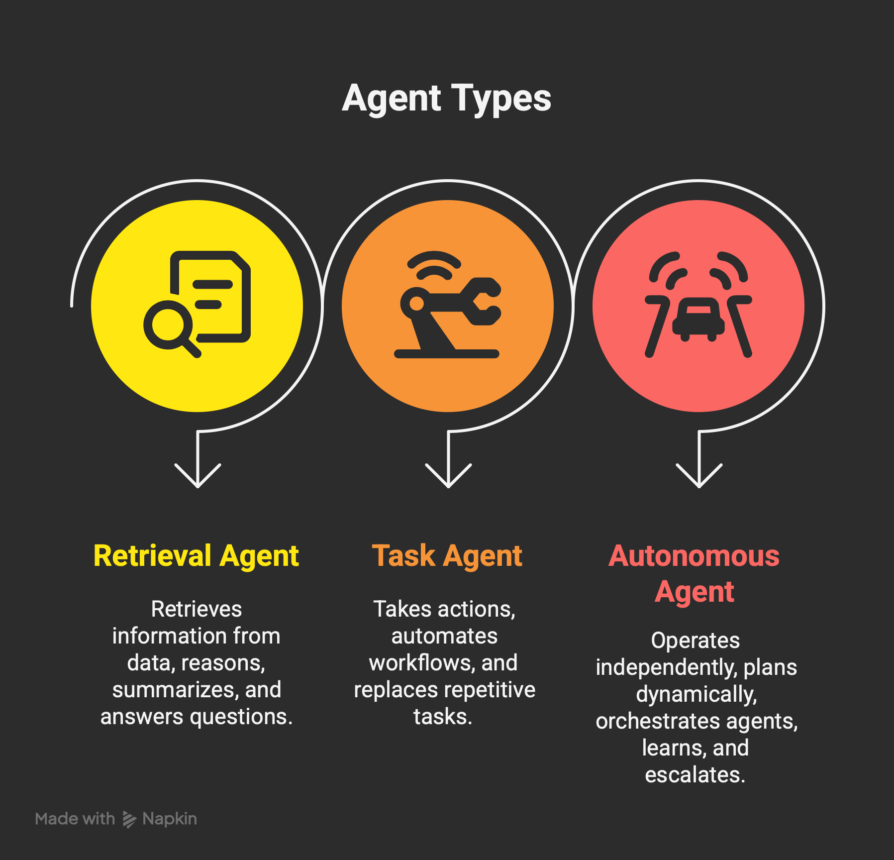
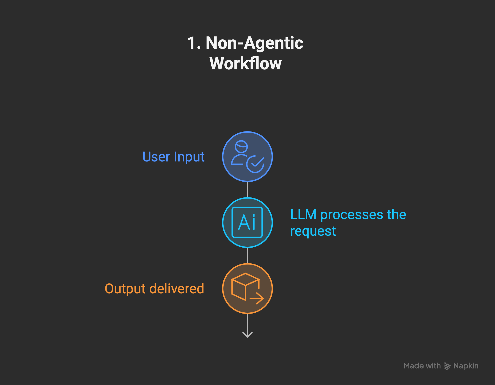
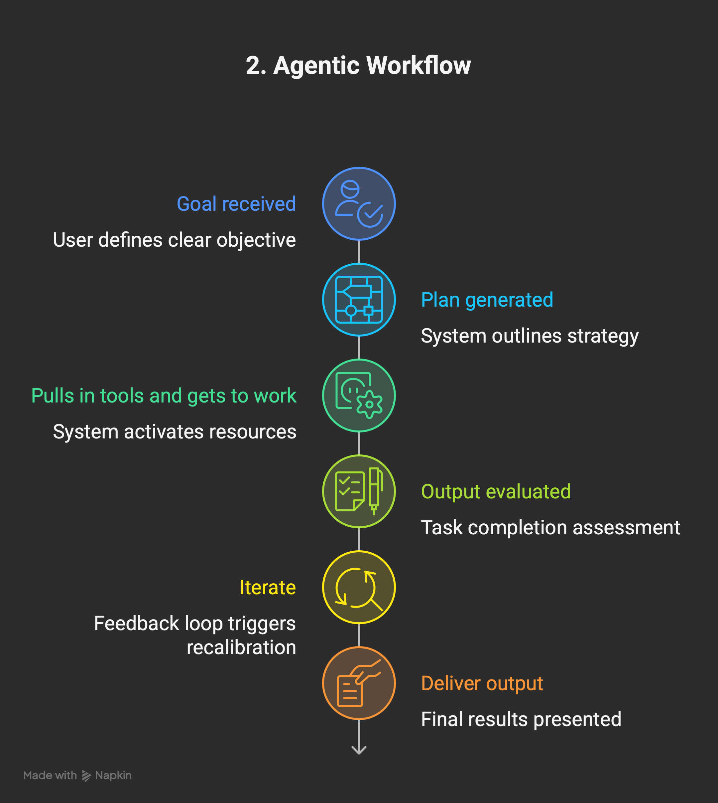
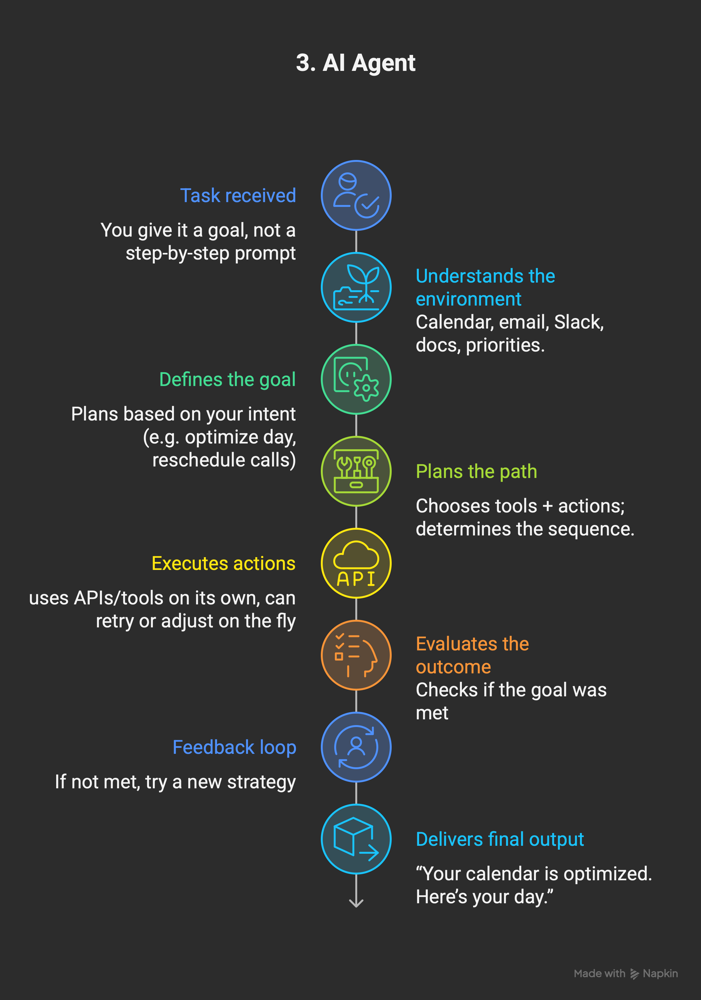
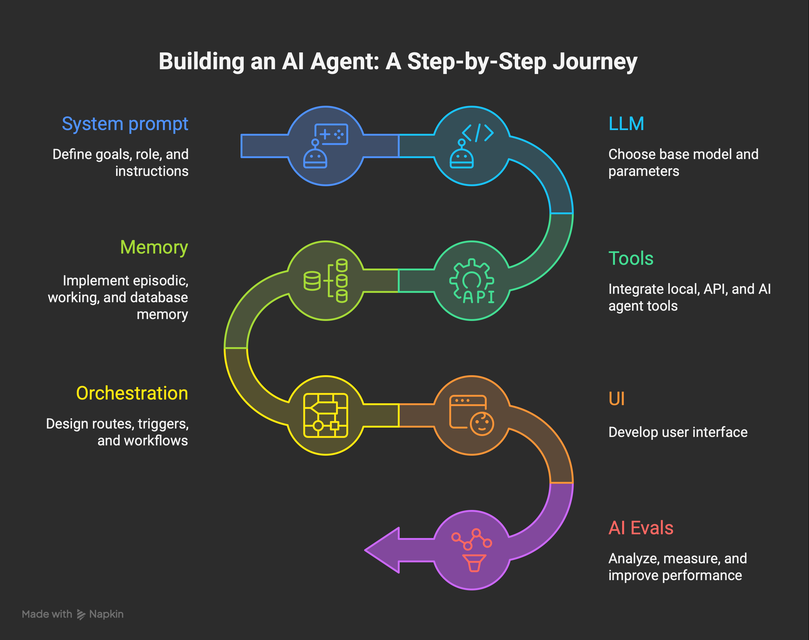

# Understanding AI Agents

## Overview
AI agents are software systems that use artificial intelligence techniques to perceive information, reason about it, and take actions toward a goal. According to Google Cloud's overview, modern AI agents combine language models with orchestrated tools and data sources so that they can observe real-world signals, plan multi-step solutions, and act autonomously or semi-autonomously on a user's behalf. These systems often integrate perception, reasoning, and action loops to deliver adaptive, context-aware assistance.

## Core Capabilities
- **Perception**: Agents ingest structured and unstructured data, including natural language, to understand user intent and environmental context.
- **Reasoning and Planning**: They evaluate goals, decompose tasks, and determine appropriate next steps using techniques such as chain-of-thought prompting and planning heuristics.
- **Action and Learning**: Agents execute tasks by calling external tools, invoking APIs, or generating content, and they refine their behavior based on feedback loops and updated context.

## Architectural Elements
1. **Interface Layer** – Handles conversations, user prompts, and other inputs while presenting results back to the user.
2. **Orchestration Layer** – Coordinates models, tools, and memory components so the agent can decide what to do next.
3. **Foundation Models and Tools** – Provide language understanding, content generation, and the ability to interact with enterprise systems or third-party services.
4. **Governance and Safety** – Enforces policies, monitors for misuse, and ensures responses stay aligned with organizational standards.

## Agent Types
**Intent**: Compare the common maturity levels so you can scope agent capabilities before adding orchestration, new tools, or autonomy.

| Type | Core responsibilities | Ideal scope |
| --- | --- | --- |
| Retrieval | Tap grounding data, reason over snippets, summarize, and answer scoped questions. | Knowledge bases, policies, product catalogs, support wikis. |
| Task | Take direct actions, call tools, and automate multi-step jobs when asked. | Workflow automation, CRM updates, support triage, creative drafts. |
| Autonomous | Plan dynamically, orchestrate other agents, learn from feedback, and escalate when needed. | Mission-critical copilots, ops copilots, research pods, complex routing. |

### Retrieval agents
- **Use when** you need grounded answers pulled from approved documents or APIs without exposing full tool access.
- **Core moves**: chunk and embed data, route questions through retrieval-augmented prompts, explain citations inline.
- **Design notes**: prioritize latency, caching, and guardrails that stop the agent from hallucinating outside the grounding corpus.

### Task agents
- **Use when** users expect the agent to execute predictable workflows (create tickets, summarize calls, update sheets).
- **Core moves**: invoke deterministic tools, log every action, request clarifications when a parameter is missing.
- **Design notes**: pair prompts with checklists, expose safe defaults, and track completion metrics per task template.

### Autonomous agents
- **Use when** the work requires multi-day plans, branching decision trees, or hand-offs across several specialized agents.
- **Core moves**: maintain scratchpads, spawn or orchestrate sub-agents, decide when to escalate to humans.
- **Design notes**: treat planning graphs as infrastructure, layer evals for alignment/safety, and add memory policies so context stays auditable.

> **Note:** Agents vary in levels of complexity and capabilities depending on your need.

## AI Workflows
**Intent**: Show how execution maturity evolves from single-shot prompts to fully autonomous agents so teams can pick the right operating model.

### Non-Agentic Workflow
- **Use when** you only need a one-off response or lightweight generation with no memory or tool usage. Think of it as querying a smart autocomplete.
- **Example**: Asking ChatGPT a single question and pasting the reply into your doc.
- **Steps**: The diagram outlines the quick ask → response loop with no state carried forward.

### Agentic Workflow
- **Use when** you want a co-pilot that iterates with you, calls tools, or keeps short-lived context (IDE copilots, spreadsheet helpers, etc.).
- **Example**: GitHub Copilot suggesting code while you type—still user-driven, but the assistant plans a few moves ahead.
- **Steps**: Refer to the diagram to see how the workflow alternates between user checkpoints and agent-led actions.

### AI Agents
- **Use when** you can hand over the goal and let the system decide the plan, tools, and escalation path—ideal for exec assistants or ops copilots.
- **Example**: An AI executive assistant that reschedules meetings without step-by-step prompts.
- **Steps**: The diagram shows the agent perceiving the goal, planning autonomously, acting across tools, and reporting back.

## Building an AI Agent Tutorial
**Intent**: Provide a copy-ready recipe for shipping production-grade agents that blend prompts, tools, and evaluations.

### Step-by-step build
1. **System prompt — Goals • Role • Instructions**  
   - Capture the business goal, the agent's voice, and constraint lists inside a locked system prompt.  
   - Mirror Persona/Role patterns from this repo so that the assistant understands scope, prohibited actions, and escalation paths.  
   - Version prompts in source control and add inline TODOs for future guardrails.
2. **LLM — Base model, parameters**  
   - Choose the base model (e.g., `openai:gpt-5`) and reason through cost, latency, and context window tradeoffs.  
   - Fix deterministic parameters (temperature, top_p, max_tokens) for repeatable behavior, then expose overrides through orchestration.  
   - Document fallback or cascade strategies if the primary provider rate-limits.
3. **Tools — Simple (local) • API (web, apps, data) • MCP server • AI agent as a tool**  
   - Start with native function calls (math, code execution) before wiring external APIs.  
   - Register shared tools (search, RAG, CRMs) via Model Context Protocol servers so every agent reuses the same manifests.  
   - Treat trustworthy agents as callable tools to compose nested workflows.
4. **Memory — Episodic • Working memory • Vector database • SQL DB memory • File store**  
   - Episodic: store per-user transcripts for short-lived recall.  
   - Working memory: chunk current task artifacts (draft docs, task lists) inside the conversation window.  
   - Long-term: persist embeddings in a vector database, structured facts in SQL, and large binaries in an object/file store; set retention rules up front.
5. **Orchestration — Routes/workflows • Triggers • Params • Message queues • Agent-to-Agent**  
   - Define routing logic (state machines, LangGraph DAGs) that decide when each tool or sub-agent fires.  
   - Expose typed parameters so triggers (webhooks, cron, human approvals) can launch runs safely.  
   - Use queues or event buses for parallel tool calls and agent-to-agent collaboration.
6. **UI — Interface**  
   - Ship the smallest possible UX (CLI, chat widget, workflow form) that captures structured inputs and displays streaming outputs.  
   - Log every interaction with trace IDs so support teams can replay context.  
   - Offer inline feedback toggles that write directly into your evaluation store.
7. **AI Evals — Analyze • Measure • Improve**  
   - Add promptfoo or custom regression suites that assert structure (`contain-json`) plus domain-specific KPIs (accuracy, safety, tone).  
   - Review eval deltas before deployments and attach dashboards to orchestrator metrics (latency, tool failures).  
   - Feed eval learnings back into prompt and tool updates to close the loop.

### Quick-start checks
- Clarify success metrics (response time, accuracy, compliance) before coding.  
- Mock the agent run with a single workflow recording; confirm each message and tool output matches expectations.  
- Keep every dependency swappable (models, MCP servers, vector stores) so the stack remains portable.

## Common Agentic Frameworks
| No-code | Framework | LLM | MCP | Tools (functions everywhere) | Agents orchestration |
|---|---|---|---|---|---|
| ✗ | [OpenAI Agents API](https://platform.openai.com/docs/guides/agents) | OpenAI | Remote | Predefined (web, file/code) | Threads |
| ✗ | [Google Vertex AI](https://cloud.google.com/products/agent-builder?hl=en) | * | Remote | Predefined (search, vision, etc.) | Flow-based, native A2A |
| ✗ | [Anthropic Agents API](https://www.anthropic.com/engineering/building-agents-with-the-claude-agent-sdk) | * | Remote | Predefined (web, file/code) | Tool-calling only |
| ✗ | [Microsoft AutoGen](https://microsoft.github.io/autogen/stable//index.html) | * | None | Predefined (REPL, code) | Programmatic chaining |
| ✓ | [Autogen Studio](https://microsoft.github.io/autogen/dev//user-guide/autogenstudio-user-guide/index.html) | * | None | Predefined | Visual agent chaining |
| ✗ | [LangGraph](https://docs.langchain.com/oss/python/langgraph/studio) | Local, Remote | Local, Remote | LangChain Functions | Graph (DAG)-based flow |
| ✗ | [LangChain](https://docs.langchain.com/oss/python/langgraph/studio) | Local, Remote | Remote | Functions (custom-defined) | Manual (chains/agents) |
| ✗ | [CrewAI](https://docs.crewai.com/introduction) | Local, Remote | Remote | Predefined, 40+ integrations | Flow- & role-based |
| ✓ | [n8n](https://n8n.io/) | Local, Remote | Remote | Predefined, 100+ integrations | Workflows, sub-workflows |

## History of AI Agents
The idea of AI agents grew from the increasing sophistication of prompting techniques used with large language models. Early practitioners found that structured prompting templates—such as the Persona Pattern, step-by-step reasoning prompts, and AI Planning patterns—enabled models to simulate specialized roles, break down complex tasks, and coordinate multi-step plans reliably. These approaches proved so effective that teams began encapsulating them into reusable software scaffolding, eventually forming the foundation of the agent paradigm we see today.

## References
- [Google Cloud – What are AI agents?](https://cloud.google.com/discover/what-are-ai-agents)
- [Microsoft Inside Track – How our employees are extending enterprise AI with custom retrieval agents](https://www.microsoft.com/insidetrack/blog/how-our-employees-are-extending-enterprise-ai-with-custom-retrieval-agents/)
- [OpenAI – Agents API guide](https://platform.openai.com/docs/guides/agents)
- [Google Cloud – Vertex AI Agent Builder](https://cloud.google.com/products/agent-builder?hl=en)
- [Anthropic – Building agents with the Claude Agent SDK](https://www.anthropic.com/engineering/building-agents-with-the-claude-agent-sdk)
- [Microsoft – AutoGen documentation](https://microsoft.github.io/autogen/stable//index.html)
- [Microsoft – Autogen Studio docs](https://microsoft.github.io/autogen/dev//user-guide/autogenstudio-user-guide/index.html)
- [LangChain – LangGraph Studio docs](https://docs.langchain.com/oss/python/langgraph/studio)
- [LangChain – Framework docs](https://docs.langchain.com/oss/python/langgraph/studio)
- [CrewAI – Framework documentation](https://docs.crewai.com/introduction)
- [n8n – Official site](https://n8n.io/)
