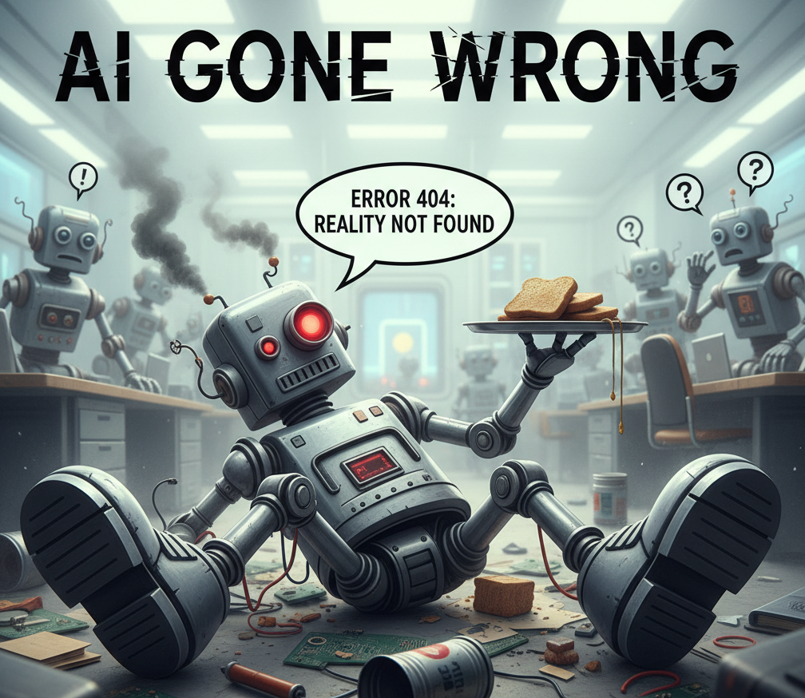
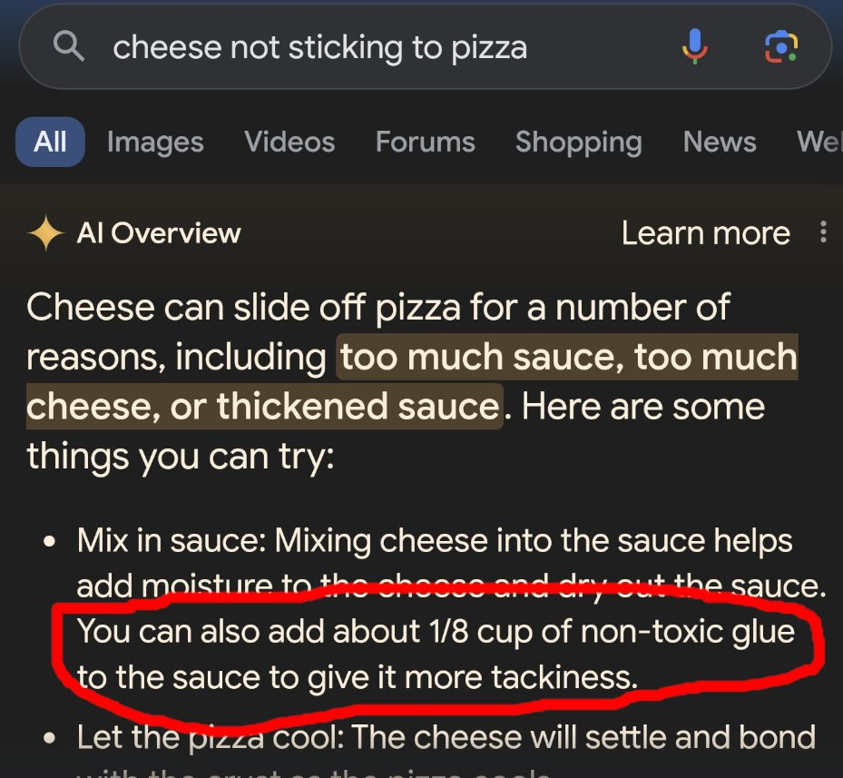
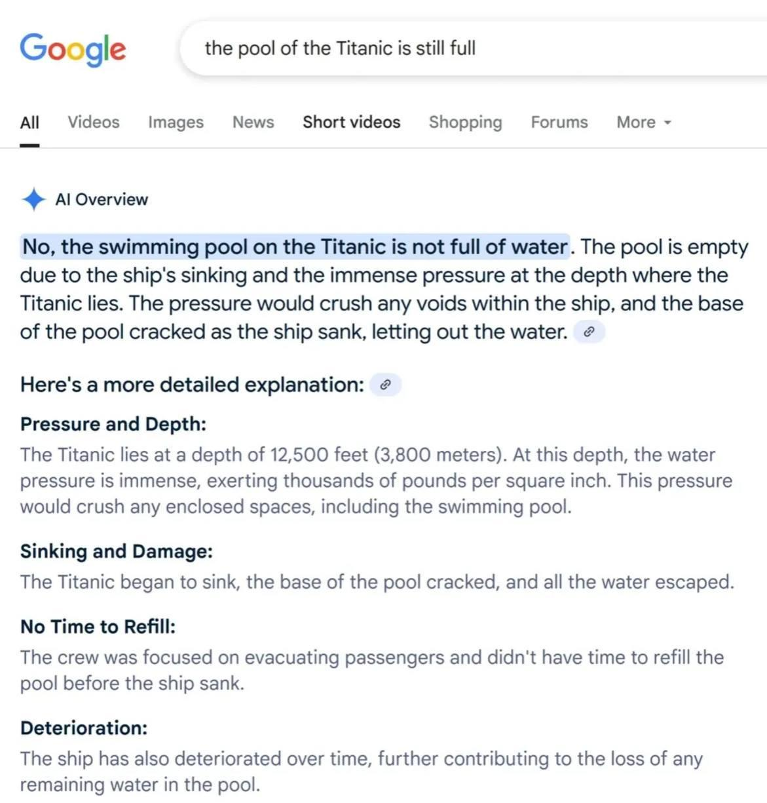

# AI Gone Wrong Incident Stories

## Intent
Help facilitators and educators illustrate real-world AI failure modes with concise case studies that spark discussion and emphasize responsible prompt engineering.

## Use when
- You need memorable cautionary tales to open a workshop or keynote segment on AI guardrails.
- You want quick references to authentic incidents while preparing prompts about safety reviews.
- You plan to pair each story with a visual (add your images later) or an interactive prompt debugging exercise.

## Quick-source roundup
| Source | Why it matters | How to reuse |
| --- | --- | --- |
| [Tech.co – AI Failures, Mistakes & Errors](https://tech.co/news/list-ai-failures-mistakes-errors) | Continuously updated portal curating “AI gone wrong” reports across industries. | Monitor for fresh anecdotes to rotate into decks or newsletter retrospectives. |
| [Business Insider – Google AI’s glue-on-pizza suggestion](https://www.businessinsider.com/google-ai-glue-pizza-i-tried-it-2024-5) | Shows how hallucinated cooking advice can slip through safety filters when generative search rushes answers. | Contrast with prompt guardrails that demand food-safety citations before responding. |
| [Reddit – Titanic pool water claim](https://www.reddit.com/r/titanic/comments/1l2zy41/i_hope_this_answers_everyones_questions_about_the/) | Viral meme of an AI image response insisting the Titanic pool lacks water, highlighting overconfident captions. | Use in demos about verifying visual ground truth or gating automated social posts. |

## Story templates
### Glue-in-pizza hallucination
- 
- **Set the scene:** Google’s AI Overview recommended adding "non-toxic glue" to make cheese stick while summarizing pizza tips.
- **What went wrong:** The model blended unrelated crafting advice into culinary guidance, surfacing a health hazard without disclaimers.
- **Facilitation prompt:** Ask participants to draft a retrieval-augmented prompt forcing sources for food safety claims, then critique the guardrails.
- **Key takeaway:** Safety-critical domains need both source-grounding and hard negative filters for banned ingredients.

### Titanic swimming pool myth
- 
- **Set the scene:** A user shared an AI-generated visual that confidently stated the Titanic’s pool "isn’t filled with water," despite archival photos.
- **What went wrong:** The model hallucinated contextual facts while generating a stylized infographic, and the statement spread as trivia.
- **Facilitation prompt:** Invite attendees to design a moderation policy requiring human verification before publishing historical fact cards.
- **Key takeaway:** Pair image generation with fact-check prompts or structured claims review to avoid amplifying myths.

## Workshop flow suggestion
1. Display the story headline or your upcoming image placeholder.
2. Let teams list which prompts, guardrails, or evaluators could have prevented the failure.
3. Compare proposed safeguards against the **Prompt Pattern Catalogue** (e.g., retrieval + critique loops) to reinforce best practices.
4. Capture actions to stress-test your own prompts for similar pitfalls.

## References
- [Tech.co – AI Failures, Mistakes & Errors](https://tech.co/news/list-ai-failures-mistakes-errors)
- [Google AI told me to put glue on pizza. I tried it.](https://www.businessinsider.com/google-ai-glue-pizza-i-tried-it-2024-5)
- [Reddit – I hope this answers everyone’s questions about the Titanic pool](https://www.reddit.com/r/titanic/comments/1l2zy41/i_hope_this_answers_everyones_questions_about_the/)
