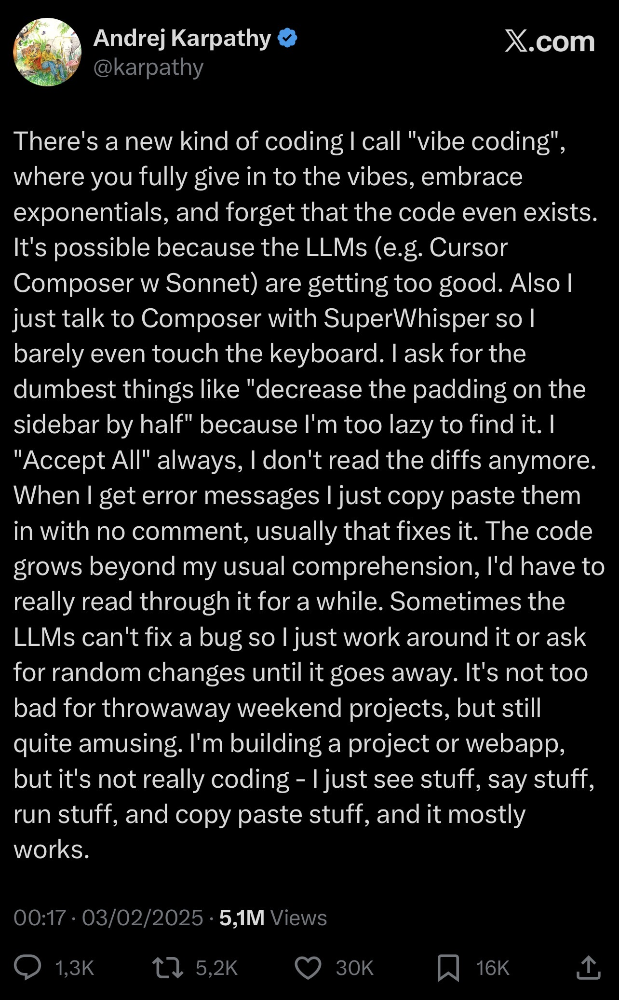

# Generative AI Basics Glossary

## Intent
Use this glossary to get comfortable with the essential terms you will see across generative AI tutorials, tools, and communities.

## Quick definitions
| Term | Plain-language snapshot |
| --- | --- |
| Large Language Model (LLM) | A powerful text-based AI that predicts the next words by learning from huge collections of writing. |
| Transformer | The model design that lets AI focus on the most relevant parts of a sentence to understand meaning. |
| Prompt Engineering | Crafting inputs that guide an AI model toward the answers or formats you want. |
| Fine-tuning | Giving a model extra practice on your own examples so it behaves the way you need. |
| Embeddings | Turning text into number lists so computers can compare meaning quickly. |
| Retrieval-Augmented Generation (RAG) | Fetching reference documents and letting the model read them before it answers. |
| Model Context Protocol (MCP) | A standard that lets agents discover and call tools, data sources, and skills through a consistent interface. |
| Agent-to-Agent (A2A) | A collaboration pattern where specialized agents exchange context and tasks to solve problems together. |
| Tokens | The word pieces the model reads and writes instead of full words or characters. |
| Hallucination | When an AI sounds confident but makes up facts or quotes that are untrue. |
| Zero-shot Prompting | Asking the model to perform a task without showing any examples first. |
| Chain-of-Thought | Requesting a step-by-step explanation so the model reasons aloud. |
| Context Window | The maximum amount of tokens the model can consider in one go. |
| Temperature | A setting that controls how predictable or creative the model's responses are. |
| Vibe Coding | Conversational coding where you let an AI pair programmer drive implementation while you stay focused on ideas. |

## LLM (Large Language Model)
- **What it means:** Large language models are AI systems trained on vast text datasets so they can predict the next piece of text with high accuracy.
- **Why it matters:** They power chatbots, writing assistants, and code helpers by understanding patterns in language rather than hard-coded rules.
- **Try it:** Ask a chatbot to rewrite a paragraph in a different tone to see how it adapts its predictions.

## Transformer architecture
- **What it means:** Transformers are the neural network design behind most modern language models. They use an attention mechanism to weigh which words in a sentence matter most.
- **Why it matters:** Attention allows models to maintain context over long passages, making translations, summaries, and answers more coherent.
- **Try it:** Compare the output of an older recurrent model (if available) with a transformer-based model to notice the jump in fluency.

## Prompt engineering
- **What it means:** Prompt engineering is the craft of structuring your instructions, examples, and guardrails so the model knows exactly how to respond.
- **Why it matters:** Small tweaks—like adding a role, goal, or format—can dramatically improve answer quality without changing the model itself.
- **Try it:** Take a simple question and iterate on the prompt: add context, specify format, or include dos and don'ts.

## Fine-tuning
- **What it means:** Fine-tuning gives an existing model additional training on your labeled examples, nudging it toward your tone, terminology, or task.
- **Why it matters:** It creates a custom version of the model that performs better on niche tasks than the general model.
- **Try it:** Identify a set of Q&A pairs from your domain and imagine how you would organize them for a small fine-tuning dataset.

## Embeddings
- **What it means:** Embeddings convert text (or images/audio) into dense numerical vectors that capture semantic similarity.
- **Why it matters:** They let applications search, cluster, or recommend content based on meaning rather than exact keywords.
- **Try it:** Use an embedding-powered search demo to see how "doctor" and "physician" surface similar results even without matching words.

## Retrieval-Augmented Generation (RAG)
- **What it means:** RAG pipelines fetch relevant documents, feed them to the model, and let it craft answers grounded in that material.
- **Why it matters:** They reduce hallucinations and keep outputs up-to-date by pointing the model to reliable sources.
- **Try it:** Pair a knowledge base with a chatbot and observe how citing retrieved passages improves trustworthiness.

## Tokens
- **What it means:** Tokens are the smaller chunks (words, sub-words, punctuation) that models process. Tokenization keeps language manageable for the model.
- **Why it matters:** Token limits influence how much input you can provide and how detailed the response can be.
- **Try it:** Paste text into a token counter tool to learn how many tokens typical prompts and outputs consume.

## Hallucination
- **What it means:** A hallucination occurs when a model outputs incorrect or fabricated information with confidence.
- **Why it matters:** Recognizing hallucinations helps you build safeguards like fact-checking, citations, or retrieval steps.
- **Try it:** Ask the model about a fictional statistic and note how it responds; then correct it and see how it adjusts.

## Zero-shot prompting
- **What it means:** Zero-shot prompting asks the model to handle a task with only natural-language instructions and no sample answers.
- **Why it matters:** It shows how well the base model generalizes to new requests without extra data.
- **Try it:** Prompt the model to write a haiku without providing examples, then add examples (few-shot) to compare outputs.

## Chain-of-thought prompting
- **What it means:** Chain-of-thought prompting encourages the model to explain its reasoning step by step before giving the final answer.
- **Why it matters:** It can boost accuracy on complex problems and reveals the model's intermediate logic for review.
- **Try it:** For a math word problem, request "Think step by step" and compare the structured explanation to a direct answer.

## Context window
- **What it means:** The context window is the total number of tokens (input + output) the model can handle in one interaction.
- **Why it matters:** Staying within the window prevents the model from forgetting earlier instructions or truncating responses.
- **Try it:** Experiment with progressively longer inputs until the model warns about length to understand its limits.

## Temperature
- **What it means:** Temperature controls how random the model's next-word choices are. Lower values make outputs focused; higher values make them imaginative.
- **Why it matters:** Adjusting temperature helps you balance reliability and creativity depending on the task.
- **Try it:** Generate the same prompt at temperatures 0.2, 0.7, and 1.0 to see how the tone and variety shift.

## Model Context Protocol (MCP)
- **What it means:** MCP is an open protocol that advertises tools, data sources, and capabilities so agents can request structured context from each other or external systems without custom integrations.
- **Why it matters:** Standardizing discovery and invocation of resources keeps your agent stack modular, reduces bespoke glue code, and lets you reuse connectors across platforms like the Microsoft Agent Framework.
- **Try it:** Review an MCP server manifest and identify which tools or data providers your agent could reuse, then sketch how you would register it inside your orchestration layer.

## Agent-to-Agent (A2A) collaboration
- **What it means:** A2A collaboration coordinates multiple specialized agents that exchange goals, outputs, or critiques to reach a shared objective.
- **Why it matters:** Delegating to focused agents—such as planners, tool specialists, or reviewers—boosts reliability and gives you clearer hand-off points for human oversight.
- **Try it:** Design a troubleshooting flow where a planner agent decomposes the task, a tool specialist calls APIs, and a reviewer agent confirms policy compliance before returning the final answer.

## Vibe coding
- **What it means:** Coined by Andrej Karpathy in a 3 Feb 2025 X post, vibe coding hands most keystrokes to an AI assistant (e.g., Cursor Composer + Claude Sonnet) while you steer with natural-language prompts, voice commands, and quick accept/reject decisions.
- **Why it matters:** Treating coding as a free-flowing dialogue keeps momentum high for prototypes, helps you explore alternative implementations faster, and demonstrates how aggressively delegating to AI shifts your role toward product vision and taste. It also highlights trade-offs—skipping diff reviews or relying on "Accept All" can obscure how the system evolves.
- **Try it:** Launch an IDE with an embedded assistant or voice interface, narrate UI tweaks or bug reports instead of manually editing files, feed any runtime errors straight back to the assistant, and pause periodically to review diffs so the codebase stays understandable.
- **Karpathy's description:**

  > 
