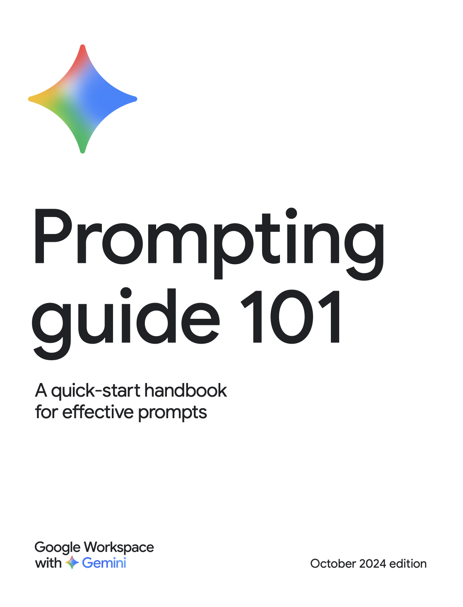

# Guides Overview

## Gemini Prompting Guide 101
<figure>
  
  <figcaption>Click the preview to open the Gemini Prompting Guide 101 PDF.</figcaption>
</figure>

## OpenAI: A Practical Guide to Building Agents
<figure>
  
  <figcaption>Click the preview to open the OpenAI practical guide to building agents PDF.</figcaption>
</figure>

## OpenAI: AI in the Enterprise
<figure>
  
  <figcaption>Click the preview to open the OpenAI AI in the Enterprise PDF.</figcaption>
</figure>

## OpenAI: Identifying and Scaling AI Use Cases
<figure>
  
  <figcaption>Click the preview to open the OpenAI identifying and scaling AI use cases PDF.</figcaption>
</figure>

## Perplexity: Perplexity at Work Guide
<figure>
  
  <figcaption>Click the preview to open the Perplexity at Work Guide PDF.</figcaption>
</figure>

## Microsoft: M365 Copilot Prompting Guide
<figure>
  
  <figcaption>Click the preview to open the Microsoft M365 Copilot prompting guide PowerPoint.</figcaption>
</figure>

## Guides Library
- [Gemini Prompting Guide 101](../assets/guides/gemini-prompting-guide-101.pdf) — Core prompting patterns, guardrails, and examples for Gemini models.
- [OpenAI: A Practical Guide to Building Agents](../assets/guides/openai-a-practical-guide-to-building-agents.pdf) — Blueprint for designing agent workflows, orchestration, and evaluation.
- [OpenAI: AI in the Enterprise](../assets/guides/openai-ai-in-the-enterprise.pdf) — Frameworks for deploying AI capabilities across enterprise functions.
- [OpenAI: Identifying and Scaling AI Use Cases](../assets/guides/openai-identifying-and-scaling-ai-use-cases.pdf) — Tactics to spot high-value AI opportunities and drive adoption.
- [Perplexity: Perplexity at Work Guide](../assets/guides/pplx-at-work.pdf) — Adoption roadmap, prompt patterns, and rollout guidelines for Perplexity's enterprise workspace.
- [Microsoft: M365 Copilot Prompting Guide](../assets/guides/microsoft-m365-copilot-prompting-guide.pptx) — Prompts, patterns, and deployment tips tailored for Microsoft 365 Copilot scenarios.
- [Microsoft 365 Copilot Prompting Guide](microsoft-365-copilot-prompting-guide.md) — Markdown digest of Microsoft’s prompt starters, do’s and don’ts, ACRUE rubric, and long-document tactics.
