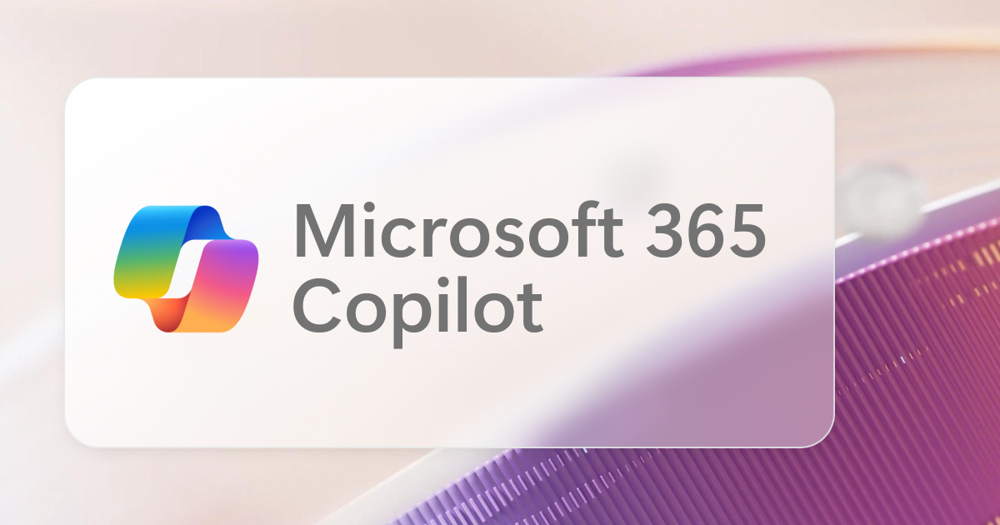

# Microsoft Copilot Prompt Template

## Intent
- Craft structured prompts for Microsoft Copilot experiences (Word, Outlook, Teams, Loop, etc.).
- Provide repeatable guardrails so responses stay relevant, on-tone, and sourced.
- Help collaborators quickly adapt the template to new goals, audiences, and knowledge bases.

## Use When
- You need Copilot to transform, summarize, or generate content for a defined business scenario.
- Your output must reflect a specific tone, format, or length.
- The response should leverage internal assets (documents, emails, calendar data) alongside Copilot's general knowledge.

## Core Structure
Pair four ingredients every time you brief Copilot:

1. **Goal** – What you want Copilot to deliver.
2. **Context** – Why you need it and who it's for.
3. **Expectations** – How the response should look or read.
4. **Source** – Which materials Copilot must reference.

### Prompt Template
```text
I want a {goal} for {context}. Respond in {expectations} and use {source}.
```

### Goal Starters
- Brief summary of {topic}.
- Email about {topic or action item}.
- Insights to help me {specific challenge or decision}.
- Template for {deliverable, e.g., a job post or proposal}.
- Letter or announcement about {topic}.

### Context Starters
- For an upcoming meeting with {audience profile or stakeholder}. 
- To learn more about {topic, initiative, or product}. 
- To plan onboarding for {role or team}. 
- To present in a course or workshop about {subject}. 
- To highlight the value of our {product/service} to {prospect or customer segment}.

### Expectation Starters
- Short yet formal tone.
- Friendly voice that matches how I normally communicate.
- SEO-optimized copy suited for Google rankings.
- Bullet-point overview with scannable sections.
- Simple but technically precise language.

### Source Starters
- Information from {internal site, wiki, or knowledge base URL}.
- My calendar entries from {time period}.
- Email or Teams thread with {contact or group name}.
- Customer feedback notes stored in {repository or document name}.
- If nothing is provided, rely on your own general knowledge.

## Assembly Tips
- Mix and match starters, then refine with specifics (dates, names, metrics, deliverable length).
- Add constraints like "limit to 200 words" or "organize as a table" to reduce follow-up edits.
- Mention compliance or confidentiality needs up front when outputs must be share-ready.
- Call out attachments or uploaded documents so Copilot prioritizes them over generic knowledge.

## Example Prompts
- "Write a short summary (1-2 paragraphs) that I can share with my board of directors. Show all five arguments I can use in our primary business case and keep the tone friendly yet confident."
- "Create a SWOT analysis of our biggest competitor using data in this PDF upload plus insights from earnings calls and press releases from the last six months."
- "Draft a question bank for interviewing senior AI engineer candidates at our startup. Focus each question on gauging hands-on experience with production model deployment."
- "Summarize all shareholder updates in an energetic, inspiring voice. Highlight two or three verbatim quotes I can reuse to promote the company's achievements on LinkedIn."
- "Write a future-looking narrative about our product strategy grounded in insights from the Q1 leadership summit notes. Keep it to three short paragraphs."

## Related Resources
- [Microsoft Copilot Agents Blueprint](../tools/microsoft-copilot-agents.md)
- [Prompt Pattern Catalogue Guide](prompt-pattern-catalogue-guide.md)
