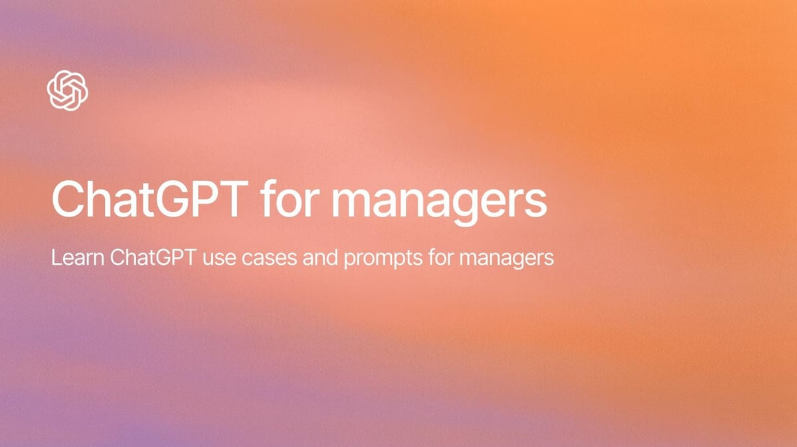

# Prompting Blueprints for Managers

This tutorial distills proven prompting patterns managers can copy, paste, and adapt to accelerate people-management workflows. Each blueprint highlights the inputs you should gather, the outcomes you can expect, and follow-up prompts that keep the conversation productive. The prompts below originate from OpenAI's "Use cases for managers" resource and are adapted for day-to-day execution by frontline and senior leaders alike. [Original source](https://academy.openai.com/public/clubs/work-users-ynjqu/resources/use-cases-for-managers).

---

## 1. Run a Skills Gap Analysis

**Use this when:** You have a snapshot of your team's current capabilities and a vision for where they must be in the next quarter or year (e.g., new tech stack, compliance requirements, or customer demands).

**Collect before prompting:**
- Current skill matrix (e.g., spreadsheet, table, capability ratings).
- Target skill state or role expectations.
- Constraints such as available budget, timeline, or headcount limits.

**Primary prompt (copy/paste):**
```text
You are an HR analyst helping me evaluate team capabilities.
I’m trying to assess skill gaps on my team. Here’s our current skill matrix and desired future state:
CURRENT STATE:
[insert skill matrix or summary]
DESIRED FUTURE STATE:
[insert target skills, proficiency levels, or new responsibilities]
Identify key gaps and suggest training or hiring solutions. Return findings in a short table that includes columns for Skill, Current Level, Target Level, Gap Severity, and Recommended Action (training, coaching, hiring, or automation).
```

**Follow-up ideas:**
- "Highlight which gaps can be closed within 90 days and what learning resources to use."
- "Draft a communication plan to present the gap analysis to the executive team."
- "Simulate the impact if we add two senior hires and rerun the gap assessment."

**Implementation tips:**
- Feed structured data directly (e.g., CSV snippet) to improve accuracy.
- Ask for confidence levels or required metrics if you need more rigor before presenting findings.

---

## 2. Create a 1:1 Template

**Use this when:** You want consistent, high-quality conversations with direct reports that balance performance management, career development, and continuous feedback.

**Collect before prompting:**
- Team cadence (weekly, biweekly, monthly).
- Focus areas (e.g., project delivery, well-being, growth milestones).
- Any organizational rituals (OKRs, competency frameworks, values).

**Primary prompt (copy/paste):**
```text
You are an executive coach who designs effective manager-direct report meetings.
Draft a 1:1 meeting template for my direct reports. I want it to include check-ins on progress, roadblocks, career growth, and feedback.
Format it as a bulleted agenda with guiding questions under each section.
Adapt the template so it fits meetings that last [insert length, e.g., 30 minutes] and aligns with our team focus on [insert themes, e.g., product delivery, well-being, innovation].
```

**Follow-up ideas:**
- "Add pre-read and follow-up sections for both the manager and direct report."
- "Convert the agenda into a fillable Google Doc outline with headings and checkboxes."
- "Suggest metrics or KPIs to discuss during the progress check-in segment."

**Implementation tips:**
- Save the generated agenda to your team wiki or calendar invites to reinforce routine.
- Encourage direct reports to add topics asynchronously, then prompt the model to merge inputs into a final agenda before the meeting.

---

## 3. Prepare for a Difficult Conversation

**Use this when:** Sensitive feedback, performance issues, or interpersonal conflicts require a thoughtful, empathic approach that balances candor with support.

**Collect before prompting:**
- A concise description of the issue (behaviors, impact, prior conversations).
- Desired outcome for both the individual and the team.
- Any organizational policies or HR considerations that must be respected.

**Primary prompt (copy/paste):**
```text
You are an experienced people manager and mediator.
I have a difficult conversation coming up with a team member about [insert issue].
Help me think through what to say, how to open, and what questions to ask.
Return a 3-part conversation guide with sections titled Opening, Core Discussion, and Next Steps.
Within each section, include bullet points for key messages, empathetic phrasing, and specific questions that encourage dialogue.
```

**Follow-up ideas:**
- "Generate role-play dialogue so I can practice likely responses from the team member."
- "Suggest objective data or examples I should gather before the meeting."
- "Create a summary email template to document the conversation and agreed actions."

**Implementation tips:**
- Pair the guide with HR-reviewed policies to ensure compliance.
- Re-run the prompt after the conversation to capture lessons learned and adjust future messaging.

---

## Putting the Blueprints in Motion

1. **Integrate with your workflow:** Store these prompts in your team handbook, project management tool, or personal note system so they are one click away.
2. **Customize continuously:** Each prompt includes placeholders. Replace them with specifics (data, deadlines, names) to increase relevance.
3. **Reflect and iterate:** After each AI-assisted session, capture what worked and what did not. Use that feedback to refine the next prompt run.

By combining structured inputs with these blueprints, managers can make faster, better-informed decisions while maintaining empathy and clarity in every interaction.
