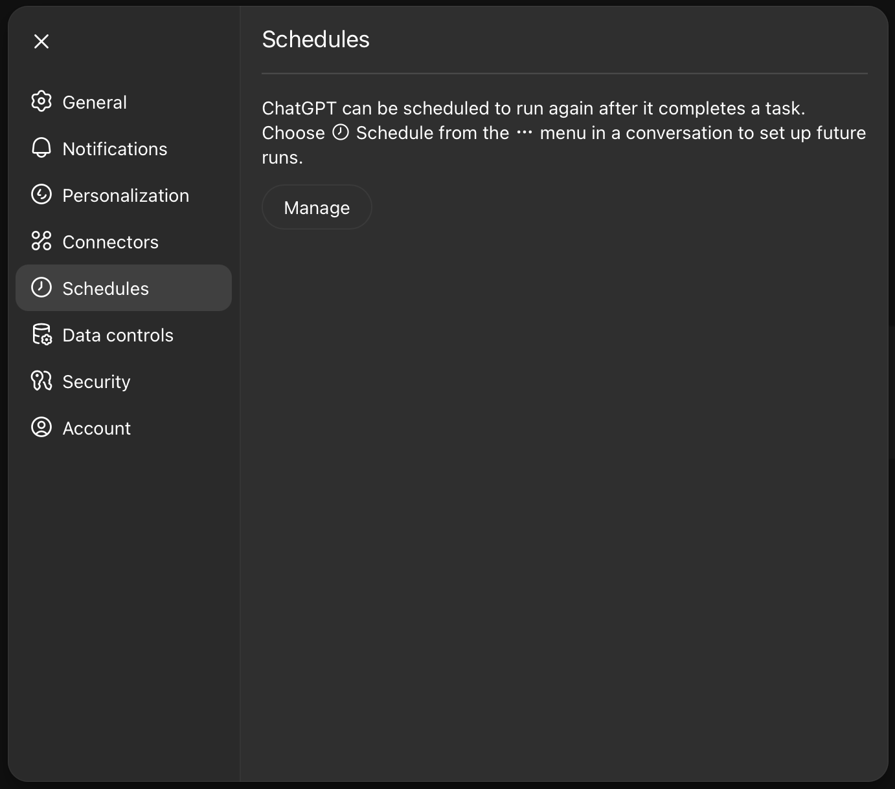

# Weekly Newsletter Automation for your [*TOPIC*]

This guide shows you how to set up a **weekly, scheduled newsletter workflow** inside ChatGPT that searches the web every Thursday at **09:00 GMT**, selects the strongest stories, and produces three outputs you can share immediately: concise newsletter blurbs, a LinkedIn post, and a short SEO article.

---

## What runs every Thursday at 09:00 GMT

### At 09:00 GMT every Thursday, run a fresh web search to surface notable [*TOPIC*] developments published after the previous run.

### Deliverables

#### Newsletter blurbs (3 × ~100 words)
- Summarize the three strongest stories in clear, concise language.  
- Include the **publication date** and a **direct source link** to the original piece.  
- Each blurb should have a **short headline** and a **one-sentence takeaway**.

#### LinkedIn post (~200 words)
- Choose the **single story** most likely to spark conversation.  
- Write a platform-friendly post that **keeps my voice**, **opens with a hook**, **adds one sharp insight**, and **ends with a question** or call to discuss.  
- Avoid **AI clichés** and hype.

#### SEO article (~500 words)
- Expand on that same story **in my style**, using accessible language and a clear structure (**intro → context → analysis → practical implication → wrap‑up**).  
- Stay **opinionated but evidence‑based**, and include the **source link once**.  
- Optimize naturally for search **without keyword stuffing**.

---

## Quick Setup (5 minutes)

1) **Decide your scope for [*TOPIC*].**  
   - Primary keywords: `[*TOPIC*]`, key subtopics, notable people/organizations.  
   - Optional filters: regions, industries, filetypes (e.g., `site:.gov`, `site:nature.com`, `filetype:pdf`).  
   - Exclusions: hypey domains or low-trust sources you don’t want included.

2) **Create a scheduled task in ChatGPT (Automations).**  
   - **Title:** `Run weekly [*TOPIC*] scan + newsletter`  
   - **Prompt:** Use the **Copy‑Paste Automation Prompt** below.  
   - **Schedule:** Weekly on **Thursdays at 09:00 GMT**.
   - **Start date:** Next Thursday (or today + 7d).

3) **Confirm it’s listed in your scheduled tasks.**  
   - Where to find your created ChatGPT Scheduled Tasks? Go to your ChatGPT profile settings.


4) **First run (optional).**  
   - Trigger the task manually once to generate an initial issue and confirm quality.

---

## Copy‑Paste Automation Prompt (edit the bracketed parts)

> Paste this into the **Prompt** field when creating your scheduled task.

```text
Search for the most important, credible developments in [*TOPIC*] published since the previous run (or, if unavailable, within the past 7 days). Prioritize primary sources, authoritative outlets, and pieces with clear new facts or data. Avoid listicles, press releases with no substance, and speculative hype.

**What to return (in markdown):**

# Weekly [*TOPIC*] Update — {run_date}

## Newsletter blurbs (3 × ~100 words)
For each blurb, include:
- **Headline**
- **One-sentence takeaway**
- ~100-word summary
- **Publication date (ISO)**
- **Direct source link**

## LinkedIn post (~200 words)
- Select the single story most likely to spark conversation with my professional network (Agile/AI practitioners and industry leaders). 
- Keep my voice; open with a strong hook, add one sharp insight, and end with a question.
- Avoid AI clichés and hype.

## SEO article (~500 words)
- Expand on that same story in an opinionated but evidence-based style.
- Clear structure: intro → context → analysis → practical implication → wrap-up.
- Include the **source link once**.
- Optimize naturally for search; no keyword stuffing.

**Guardrails & criteria**
- Cite **publication dates** and ensure links work.
- Prefer sources with named authors, transparent methods, or reputable editorial processes.
- De-duplicate near-duplicates; note when multiple outlets report the same fact.
- If few high-quality items exist this week, include fewer blurbs and explain why.
- If a paywall prevents quoting, summarize and link, flagging the paywall.

**Notes**
- Audience includes beginners to tooling, researchers, industry experts, Agile coaches/Scrum Masters, and prompt engineers.
- If uncertainty is high, say so. Avoid definitive claims beyond the evidence.
```

---

## Quality checklist before you publish

- **Recency:** Dates are current and beyond last week’s run.  
- **Signal over noise:** Each blurb is substantive; duplicates are removed.  
- **Accuracy:** Facts trace to credible sources; links open.  
- **Tone:** No hype; clear, conversational, professional.  
- **LinkedIn post:** Strong hook, one sharp insight, question at the end.  
- **SEO piece:** Structured, opinionated, evidence-based, one source link.

---

## Maintenance & tweaks

- **Adjust [*TOPIC*] scope** over time (keywords, sources, exclusions).  
- **Seasonality:** For holidays/conferences, widen or narrow date windows.  
- **Audience:** If your readers skew technical/non-technical, adjust depth and jargon.  
- **Metrics:** Track impressions, CTR, comments, reshares; iterate on hooks and titles.

---

## Troubleshooting

- **Too few credible stories:** Expand to 14 days, broaden sources, or include standards/regulatory updates.  
- **Paywalls:** Prefer alternative outlets; otherwise summarize and label paywalled.  
- **Over-hype:** Add stricter exclusions or require data/benchmarks.  
- **Time drift:** Re-check that the schedule is **09:00 GMT** (not local time).

---

### Notes
- This tutorial assumes your ChatGPT workspace supports **Scheduled Tasks**. If not, you can run the same prompt manually each Thursday or use a calendar reminder linking here.
- Replace every `[*TOPIC*]` with your chosen topic label (e.g., “Artificial Intelligence,” “Agile,” “LLM Safety”).

