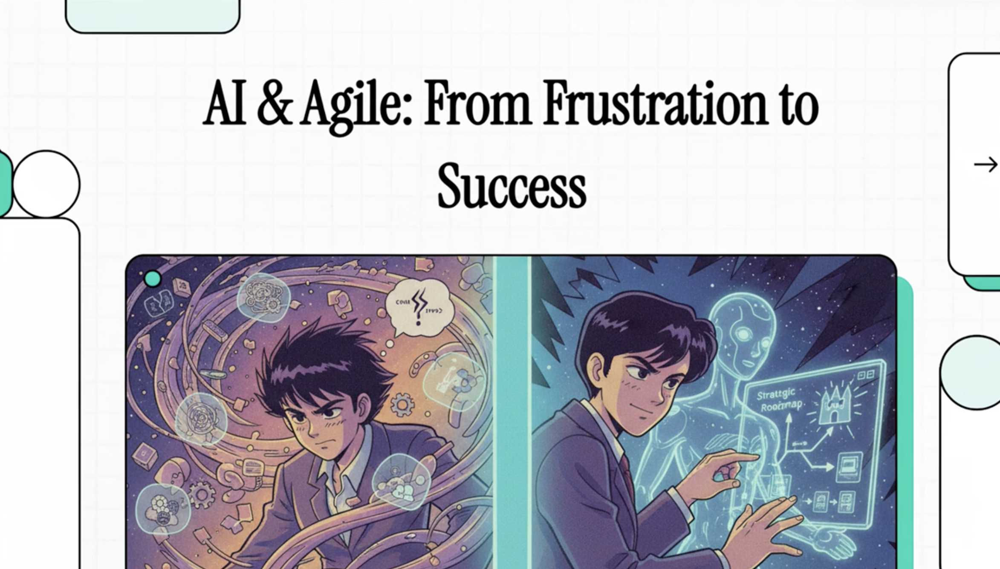

# Author's Research Involvement

## Intent
Document research initiatives co-authored by Tomas Herda and provide quick access to source material for deeper review.

## Current Topics
### AI and Agile XP 2025

- **Involvement:** [AI and Agile 2025 at XP Conference](https://conf.researchr.org/home/xp-2025/aiandagile-2025)
- **Published papers:**
  - [arXiv:2506.20159 - XP2025 AI and Agile - Workshop Summary](https://arxiv.org/abs/2506.20159)
  - [arXiv:2508.20563 - XP2025 AI and Agile - Research Roadmap](https://arxiv.org/abs/2508.20563)

## Looking Ahead
More research topics will be added later as Tomas Herda publishes new findings and resources.
