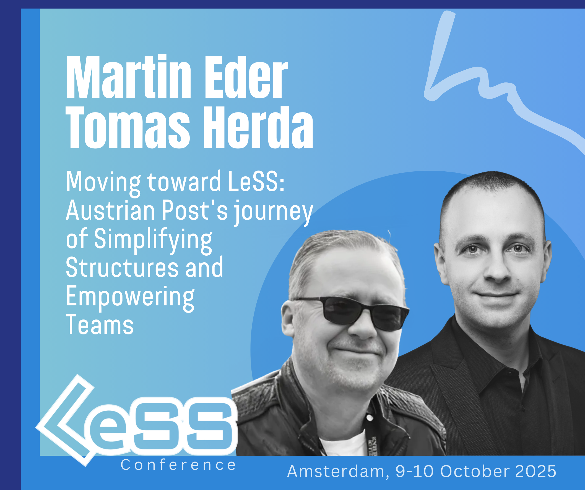
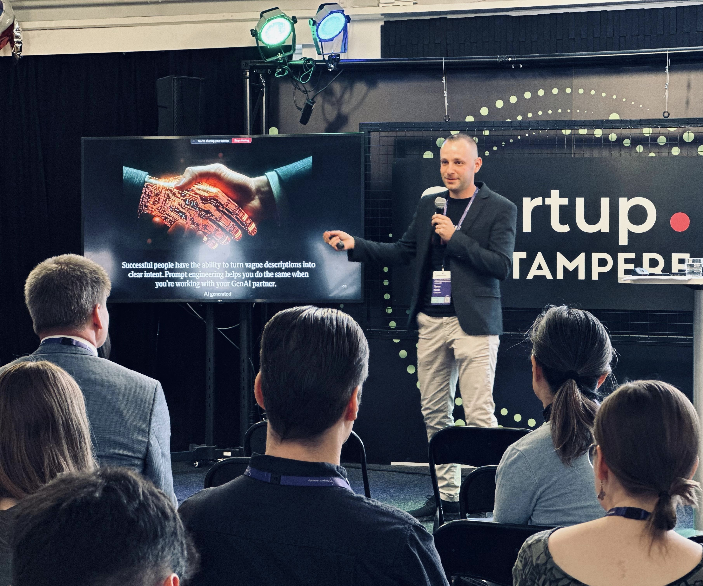
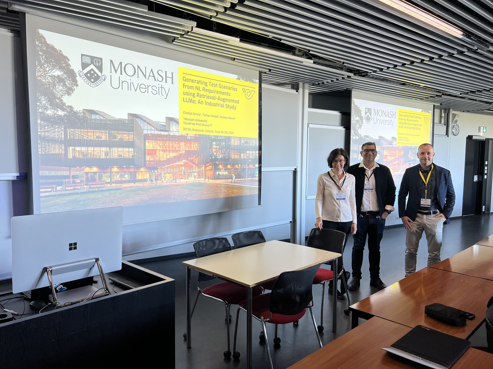

# Speaking & Keynotes

## Intent
Use this page to explore Tomas Herda's recent and upcoming speaking engagements and find the fastest way to book a talk or workshop.

## Upcoming & recent engagements
- **9 Oct 2025 — 2025 Global LeSS Conference** (Amsterdam, the Netherlands)  
  “Moving toward LeSS: Austrian Post's journey of Simplifying Structures and Empowering Teams” — [Session page](https://less.works/conferenza/sessions/2025-global-less-conference-amsterdam-moving-toward-less-austrian-post-s-journey-of-simplifying-structures-and-empowering-teams-446)

- **17 Jun 2025 — GAISE 2025 Summer School** (Tampere University, Finland)  
  “Prompting by AI Center of Excellence – Austrian Post” — [Schedule](https://gpt-lab.eu/gaise-2025/schedule/)

  
- **2 Jun 2025 — XP 2025** — details coming soon

- **28 Nov 2024 — LSZ Talents for IT Future** (Graz, Austria)  
  “Delivering the Future: Österreichische Post AG – AI Center of Excellence” — [Event](https://lsz.at/Talents-Graz-Downloadarea)

  
- **27 Jun 2024 — RE’24 (32nd IEEE International Requirements Engineering)** (Reykjavik, Iceland)  
  “Generating Test Scenarios from NL Requirements via LLMs: An Industrial Study” — [Track](https://conf.researchr.org/track/RE-2024/RE-2024-industrial-innovation-papers)

  
- **25 Jun 2024 — AIRE’24 (AI and Requirements Engineering Workshop)** (Reykjavik, Iceland)  
  “80% Complete AI-Generated Functional Tests: Austrian Post — Lightning Talk” — [Workshop](https://aire-ws.github.io/aire24/)

  
- **5-7 Jun 2024 — XP 2024 — AI & Agile Track** - details coming soon

- **5 Jun 2024 — XP 2024 — Research Paper Track** - details coming soon

- **14 May 2024 — Austrian Post** - details coming soon

  
- **13 Jun 2023 — XP 2023** — details coming soon

## Topics
- Generative AI in practice (prompt patterns, evaluation, guardrails)
- AI & Agile delivery (LeSS, team workflows, governance)
- Case studies from Austrian Post’s AI Center of Excellence

## Formats
Keynotes (30–45 min) · Conference talks (10–30 min) · Workshops (2–8 h)

## Contact
- Email: **herda.tom@gmail.com**
- LinkedIn: [Tomas Herda](https://www.linkedin.com/in/herdatom)
- Based in Vienna, Austria · Available onsite/remote
