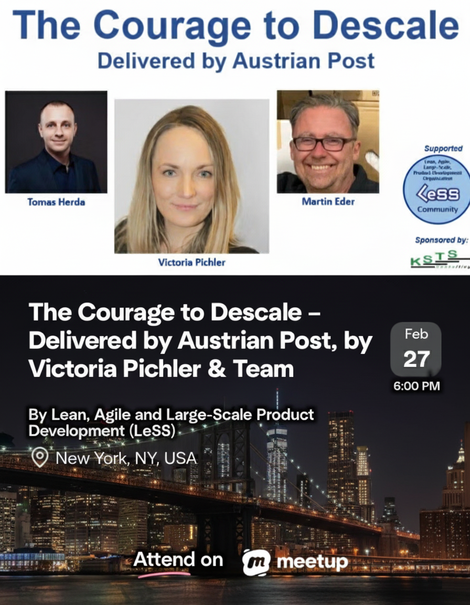
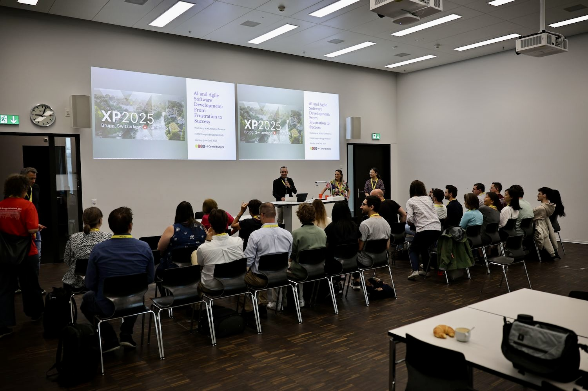
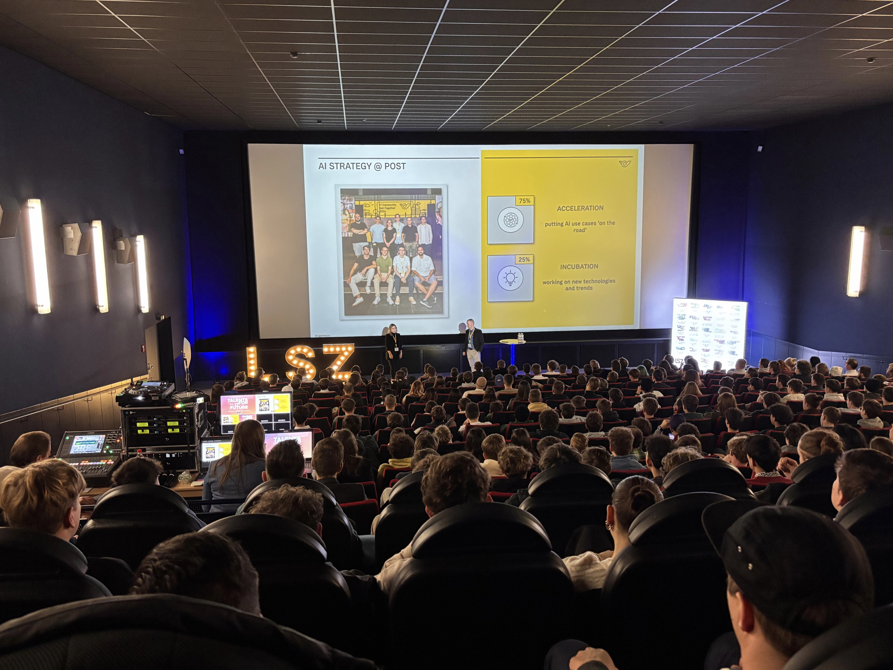
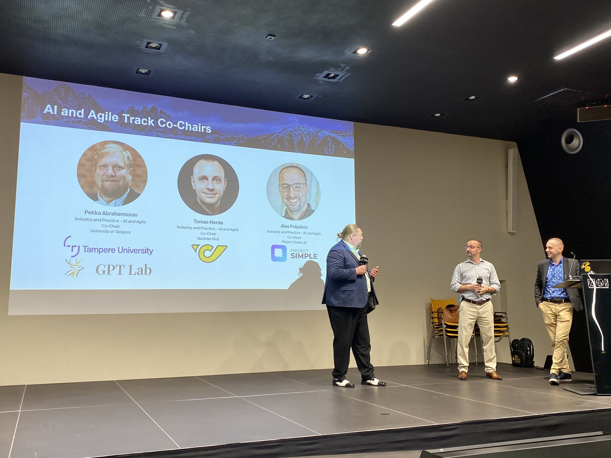
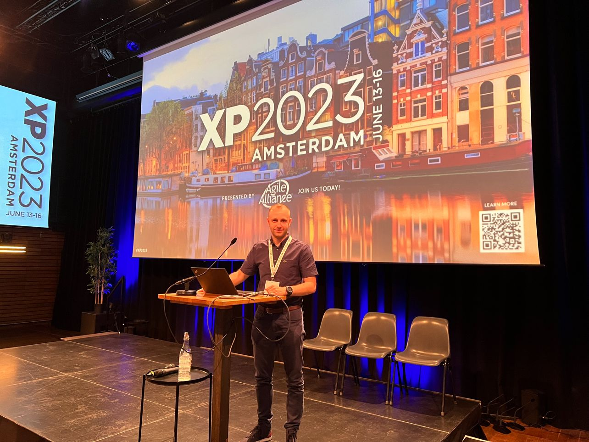

# Author's Speaking & Keynotes

## Intent
Use this page to explore Tomas Herda's recent and upcoming speaking engagements and find the fastest way to book a talk or workshop.

## Highlights

### Planned talks
- **27 Feb 2026 — Large-Scale Scrum (LeSS) in NYC Meetup** (Hybrid: New York City & online)

  “The Courage to Descale - Delivered by Austrian Post” — [Meetup event](https://www.meetup.com/large-scale-scrum-less-in-nyc/events/311688494/)

### Past highlights
- **9 Oct 2025 — 2025 Global LeSS Conference** (Amsterdam, the Netherlands)

  “Moving toward LeSS: Austrian Post's journey of Simplifying Structures and Empowering Teams” — [Session page](https://less.works/conferenza/sessions/2025-global-less-conference-amsterdam-moving-toward-less-austrian-post-s-journey-of-simplifying-structures-and-empowering-teams-446)

- **17 Jun 2025 — GAISE 2025 Summer School** (Tampere University, Finland)

  “Prompting by AI Center of Excellence – Austrian Post” — [Schedule](https://gpt-lab.eu/gaise-2025/schedule/)

- **2 Jun 2025 — XP 2025** (Brugg - Windisch, Switzerland)

  “AI and Agile Software Development: From Frustration to Success“ — [Workshop page](https://conf.researchr.org/home/xp-2025/aiandagile-2025#program)

- **28 Nov 2024 — LSZ Talents for IT Future** (Graz, Austria)

  “Delivering the Future: Österreichische Post AG – AI Center of Excellence” — [Event](https://lsz.at/Talents-Graz-Downloadarea)

- **27 Jun 2024 — RE’24 (32nd IEEE International Requirements Engineering)** (Reykjavik, Iceland)

  “Generating Test Scenarios from NL Requirements via LLMs: An Industrial Study” — [Industrial Innovation Papers Track](https://conf.researchr.org/track/RE-2024/RE-2024-industrial-innovation-papers)

- **25 Jun 2024 — AIRE’24 (AI and Requirements Engineering Workshop)** (Reykjavik, Iceland)

  “80% Complete AI-Generated Functional Tests: Austrian Post — Lightning Talk” — [Workshop page](https://aire-ws.github.io/aire24/)

- **5-7 Jun 2024 — XP 2024 — AI & Agile Industry & Practice Track** (Bolzano, Italy)
  — [Conference Track](https://agilealliance.org/xp2024/industry-and-practice-ai-and-agile/)

- **5 Jun 2024 — XP 2024 — Research Paper Track** (Bolzano, Italy)

  “LLM-based Agents for Automating the Enhancement of User Story Quality: An Early Report“ — [Conference Proceedings](https://link.springer.com/book/10.1007/978-3-031-61154-4)

- **14 May 2024 — Austrian Post** (Vienna, Austria)

  “AI for Requirements Engineering“

- **13 Jun 2023 — XP 2023 - Experience Reports Track** (Amsterdam, the Netherlands)

  “Restarting Scaled Agile Development at Austrian Post“ — [Experience Report](https://agilealliance.org/resources/experience-reports/restarting-scaled-agile-development-at-austrian-post/)

## Topics
- Generative AI in practice (prompt blueprints, patterns, tools)
- Scaling LeSS and Agile Transformations in enterprise environments
- AI-augmented software delivery and team workflows
- Case studies from Austrian Post’s AI Center of Excellence
- LLM-driven requirements engineering, testing, and quality assurance

## Formats
Keynotes (30–45 min) · Conference Talks (10–30 min) · Workshops (2–8 h) · Conference Tracks (1-3 days)

## Contact
- Email: **herda.tom@gmail.com**
- LinkedIn: [Tomas Herda](https://www.linkedin.com/in/herdatom)
- Based in Vienna, Austria · Available onsite/remote
