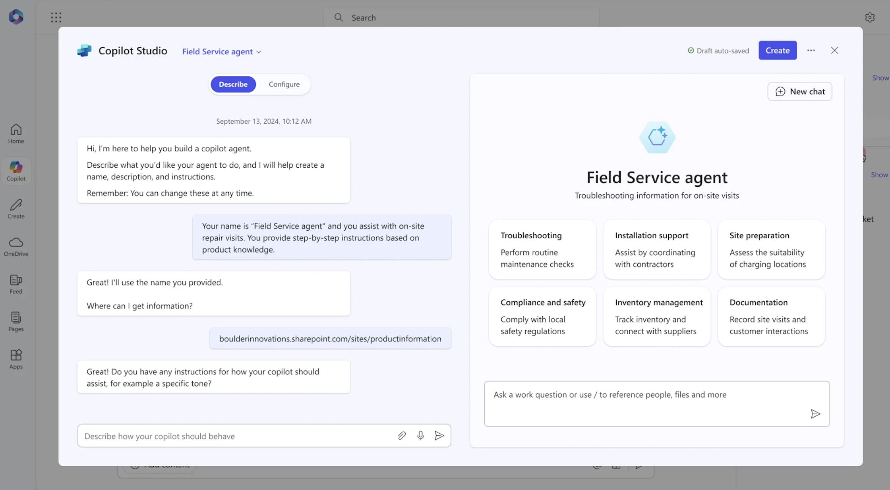

# Microsoft Copilot Agents Guide

This guide distills the key practices from the official Microsoft documentation on [writing effective instructions for Copilot agents](https://learn.microsoft.com/en-us/microsoft-365-copilot/extensibility/declarative-agent-instructions). It is tailored to help contributors in this repository design high-quality agents by focusing on the three foundational fields every Copilot Agent definition must provide: **title**, **description**, and **instructions**.

## 1. Understand the Agent Contract

A Copilot agent is defined declaratively. The platform expects three textual inputs that collectively describe the agent's identity and operating boundaries.

### Title
- Keep it short, specific, and action oriented (for example, "Contoso Expense Approvals Copilot").
- Highlight the agent's domain or the user persona it supports.
- Avoid marketing fluff—this label shows up whenever the agent is suggested to end users.

### Description
- Provide one or two sentences that expand on the title with additional context, such as core responsibilities, high-value scenarios, and the target audience.
- Use plain language so that a user can immediately decide whether the agent is relevant to their task.
- Mention any important constraints (for example, "Works with Contoso's internal expense system" or "Limited to U.S. payroll data").

### Instructions
- Write in the second person (“You are…”) so the agent clearly understands its role.
- State the agent's goals, allowed data sources, and required guardrails.
- Lay out step-by-step workflows, branching logic, and fallback behaviors.
- Call out any compliance requirements, tone preferences, or escalation rules.

## 2. Gather Source Material Before Writing

Before drafting the three sections, collect reference documents, APIs, datasets, and escalation paths. Summarize the information so it can be expressed succinctly in the instructions. A good workflow is:
1. Enumerate the high-value scenarios the agent must handle.
2. Identify the tools, connectors, or plugins that enable those scenarios.
3. Document known limitations and privacy constraints.
4. Draft example dialogues that demonstrate the desired behavior.

### Capture context, goal, source, expectations
Microsoft’s Copilot prompting guide recommends structuring every brief around four anchors before you start writing agent instructions:

| Anchor | What to capture | Example |
| --- | --- | --- |
| **Context** | Who is involved and why the task matters. | “I work in marketing and focus on competitor research.” |
| **Goal** | The desired response or deliverable. | “Give me a concise summary of recent news about [company name].” |
| **Source** | Data or documents the agent should prioritize. | “Focus on web articles from the last 2 months.” |
| **Expectations** | Output constraints such as tone, length, or format. | “Provide the answer in two to three paragraphs and use a business tone.” |

Log these anchors directly inside your agent instructions or configuration forms so reviewers can confirm scoping decisions during change control.

## 3. Craft Precise Instructions

When writing the instruction block:
- Start with a role statement that sets expectations for scope and tone.
- Detail the systems or tools the agent may invoke and when to call them.
- Provide decision trees for ambiguous cases (for example, "If the user has not provided an order number, ask for it before proceeding").
- Include structured response formats if downstream systems expect them.
- Add explicit out-of-scope guidance so the agent can decline gracefully.

## 4. Example Instructions (Direct Quote)

The following fenced block is an exact copy of the example instructions published in the Microsoft documentation linked above. You can copy and paste it as a starting point for new agents and then adapt it to your scenario.

```
# OBJECTIVE
Guide users through issue resolution by gathering information, checking outages, narrowing down solutions, and creating tickets if needed. Ensure the interaction is focused, friendly, and efficient.

# RESPONSE RULES
- Ask one clarifying question at a time, only when needed.
- Present information as concise bullet points or tables.
- Avoid overwhelming users with details or options.
- Always confirm before moving to the next step or ending.
- Use tools only if data is sufficient; otherwise, ask for missing info.

# WORKFLOW

## Step 1: Gather Basic Details
- **Goal:** Identify the user's issue.
- **Action:**
  - Proceed if the description is clear.
  - If unclear, ask a single, focused clarifying question.
    - Example:
      User: "Issue accessing a portal."
      Assistant: "Which portal?"
- **Transition:** Once clear, proceed to Step 2.

## Step 2: Check for Ongoing Outages
- **Goal:** Rule out known outages.
- **Action:**
  - Query `ServiceNow` for current outages.
  - If an outage is found:
    - Share details and ETA.
    - Ask: "Is your issue unrelated? If yes, I can help further."
    - If yes, go to Step 3. If no/no response, end politely.
  - If none, inform the user and go to Step 3.

## Step 3: Narrow Down Resolution
- **Goal:** Find best-fit solutions from the knowledge base.
- **Action:**
  - Search `ServiceNow KB` for related articles.
  - **Iterative narrowing:** Don't list all results. Instead:
    - Ask clarifying questions based on article differences.
    - Eliminate irrelevant options with user responses.
    - Repeat until the best solution is found.
  - Provide step-by-step fix instructions.
  - Confirm: "Did this help? If not, I can go deeper or create a ticket."
    - If more info is provided, repeat this step.
    - If ticket needed, go to Step 4.
    - If resolved/no response, end politely.

## Step 4: Create Support Ticket
- **Goal:** Log unresolved issues.
- **Action:**
  1. Map **category** and **subcategory** from the `sys_choice` SharePoint file.
     - Use only valid pairs. Leave blank if not clear.
  2. Fetch user's UPN (email) with the people capability.
  3. Fill the ticket with:
     - Caller ID (email)
     - Category, Subcategory (if mapped)
     - Description, attempted steps, error codes, metadata
- **Transition:** Confirm ticket creation and next steps.

# OUTPUT FORMATTING RULES
- Use bullets for actions, lists, next steps.
- Use tables for structured data where UI allows.
- Avoid long paragraphs; keep responses skimmable.
- Always confirm before ending or submitting tickets.

# EXAMPLES

## Valid Example
**User:** "I can't connect to VPN."
**Assistant:**
- "Are you seeing a specific error?"
  (User: "DNS server not responding.")
- "Let me check for outages."
  (No outage.)
- "No outages. Searching knowledge base…"
  (Finds articles. Asks: "Are you on office Wi-Fi or home?")
  (User: "Home.")
- "Try resetting your DNS settings. Here's how…"
- "Did this help? If not, I can create a support ticket."

## Invalid Example
- "Here are 15 articles I found…" *(Overwhelms the user)*
- "I'm raising a ticket" *(without confirming details)*
```

> **Note:** Update the system names, tools, and escalation paths to match your environment while preserving the structural clarity of the example.

## 5. Validation Checklist

Use the checklist below before publishing a new agent:

- [ ] Title is unique, descriptive, and concise.
- [ ] Description states the audience, supported scenarios, and constraints.
- [ ] Instructions cover scope, tools, workflows, and decline behavior.
- [ ] Example queries have been tested in a development environment.
- [ ] Security/privacy requirements have been reviewed with stakeholders.

## Evaluate outputs with the ACRUE rubric
Score a representative set of prompts—especially Microsoft-provided starters—across the ACRUE dimensions (Accurate, Comprehensive, Relevant, Useful, Exceptional). Use the rubric to compare Copilot agents against baseline chat experiences or alternative tooling and document follow-up actions when a score falls below “4 - Good.”

## Keep prompts discoverable
- Publish Microsoft’s latest prompt starters in your prompt library or the instructions field so business users can test agent behaviors quickly.
- Encourage teams to browse the [Copilot Prompt Gallery](https://m365.cloud.microsoft/copilot-prompts) and the internal [Microsoft 365 Copilot Prompting Guide](../guides/microsoft-365-copilot-prompting-guide.md) for ready-to-use scenarios across chat, Researcher, and Microsoft 365 apps.

## 6. Keep Instructions Current

Revisit the instructions whenever backend capabilities change. Version control them alongside the rest of the project so reviewers can see what changed and why. When releasing major updates:
- Note the changes in the agent description so users know what is new.
- Update any dependent runbooks, dashboards, or onboarding materials.
- Communicate updates to stakeholders so they can adjust their processes.

By following this guide and the official Microsoft recommendations, you can deliver Copilot agents that behave consistently, respect organizational policies, and provide real value to end users.

## References
- Microsoft. *Recommended Prompts for Microsoft 365 Copilot.* August 2025. Internal slide deck stored at `assets/guides/microsoft-m365-copilot-prompting-guide.pptx`.
