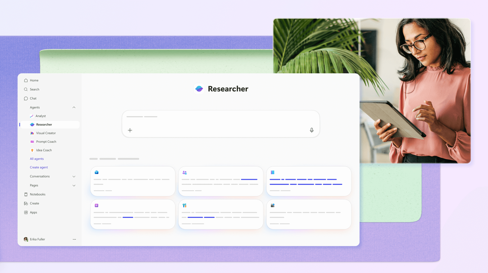

# Microsoft Copilot Researcher Agent Blueprint

## Intent
Equip Microsoft Copilot Researcher Agent users with a ready-to-run blueprint for deep-dive investigations that require exhaustive reasoning, synthesis across diverse sources, and delivery of comprehensive research reports.

## When to use this blueprint
Use when you need a Copilot Researcher Agent to:
- Handle **thorough investigations or reports** that gather, reconcile, and synthesize evidence from many inputs.
- Perform **recursive, “exhaustive” reasoning** to surface deep insights, conflicting viewpoints, and nuanced conclusions.
- Produce **comprehensive, detailed reports** tailored to senior stakeholders or project teams.
- Lead **in-depth research, cross-source synthesis, and deep dives** that benefit from structured workflows and transparent reasoning traces.

### Agent profile quick reference
- **Type of task:** Thorough investigations or reports: Comprehensive tasks requiring gathering and synthesizing information from lots of sources
- **Depth of reasoning:** Recursive, “exhaustive” reasoning for deep inferences and synthesis
- **Output format:** Comprehensive, detailed reports
- **Ideal use case:** In-depth research, cross-source synthesis, deep dives
- **Example use cases:**
  - Compile a competitive analysis on…
  - Summarize the new research on x and compare it to our internal strategy
  - Create a detailed brief before a large meeting
- **Sample prompt:** “Build a full go-to-market strategy for [product x]. Include competitive positioning, internal readiness, lessons learned from past launches, and external trends.”

## Workflow overview for Copilot Researcher
1. **Scope the investigation.** Confirm the research goal, audience, preferred deliverable format, and decision-making deadlines. Capture success criteria inside the instructions field so Copilot can track completion.
2. **Ground in authoritative sources.** Use Copilot Researcher’s Microsoft 365 graph access (SharePoint, OneDrive, Loop, Teams, email) and approved external connectors. List priority repositories in the data access section of your agent configuration.
3. **Plan recursive synthesis loops.** Break the brief into sub-questions. After each loop, direct Copilot to summarize findings, flag gaps, and propose the next set of queries.
4. **Structure the final report.** Define headings, tables, and appendices in advance. Copilot Researcher can populate each section iteratively as evidence arrives.
5. **Audit and fact check.** Reserve a pass for verifying citations, dates, and quantitative claims. Document verification status for handover.

## Microsoft prompt starters to seed instructions
Pull ready-to-run scenarios from the Microsoft M365 Copilot prompting guide to accelerate agent configuration and onboard stakeholders. Use the prompts below as seed instructions or quick tests when validating the agent’s grounding in your tenant data.

### Researcher agent
| Scenario | Prompt |
| --- | --- |
| Comprehensive research report | “Based on the internal meeting discussion on [topic], draft a comprehensive research report evaluating the ideas proposed. Incorporate relevant insights from web-based research on [topic] and solutions.” |
| Project management tracker | “Create an action-item tracker based on all communication channels and information from the past 7 days. Split it into actions pending on me (sorted by urgency and relevance) and actions I requested from others (with follow-up status and elapsed time). Recommend who needs a follow-up.” |
| Product launch campaign | “Using our internal knowledge base, previous campaign data, and customer insights, create a launch content package for the new product update. Include a customer announcement email, blog post, LinkedIn and Twitter captions, internal team update, and help center entry.” |
| Competitive landscape review | “Draft a research report identifying market gaps based on internal stakeholder discussions (sales, research and development, support) and competitive insights plus sales data.” |
| Executive project recap | “Draft a project update based on our last [meeting series]. Include KPI performance, major wins/losses, risks, competitive moves, likely tough questions, and suggested answers. Flag any major metric changes.” |

### Share across teams
- Drop these starters into your Copilot Researcher instructions library so new collaborators can test common workflows immediately.
- Point business partners to the [Copilot Prompt Gallery](https://m365.cloud.microsoft/copilot-prompts) for additional Microsoft-curated prompts they can bookmark inside Copilot Chat.
- Reference the [Microsoft 365 Copilot Prompting Guide](microsoft-365-copilot-prompting-guide.md) for full do/don’t lists, evaluation rubric, and long-document tactics.

## Reasoning prompt patterns from GPT-Lab
The GPT-Lab resource “Effective Prompts for Reasoning LLMs” highlights patterns that pair exceptionally well with Copilot Researcher’s long-context and document-grounding capabilities. Keep the examples verbatim inside your instructions or prompt library so reviewers can trace external sourcing.

### Reference template (verbatim)
*Source: [GPT-Lab – Effective Prompts for Reasoning LLMs](https://gpt-lab.eu/effective-prompts-for-reasoning-llms/)*

```
# Goal: I want a list of the best romantic and unique restaurants in Vienna to surprise my 
girlfriend.
Each restaurant should offer a memorable atmosphere, delicious food, and be lesser known or 
off the beaten path.

# Return Format:
For each restaurant, return:
- The name of the restaurant as I'd find it on Google or TripAdvisor
- The address
- The type of cuisine
- Average price range
- Opening hours
- What makes it a romantic and unique experience
Return the top 3.

# Warnings
Be careful to make sure that the restaurant actually exists, that it’s open, and that the 
information is up to date.

# Context Dump
For context: my girlfriend and I love discovering cozy, atmospheric places with great food. 
We’ve already been to some of the more famous spots in Vienna, so we’re looking for something 
a bit more hidden or special. She’s going to be away for a while, so I want this to be a 
really thoughtful and memorable experience. Bonus points if the place has a view, live music, 
or a creative menu.
```

**How to use it in Copilot Researcher:**
- Drop this block in the instructions library as a canonical reasoning template. Replace the goal, warnings, and context dump with your research topic, verification guardrails, and stakeholder background.
- Encourage collaborators to fill the `# Context Dump` with recent Teams/Loop highlights so Copilot can cross-reference primary sources automatically.

### Prompt enhancement helper (verbatim)
*Source: [GPT-Lab – Effective Prompts for Reasoning LLMs](https://gpt-lab.eu/effective-prompts-for-reasoning-llms/)*

```
Based on the above Reasoning LLM Prompt Template enhance my prompt draft:

What is the best approach if I want to find the best prompt examples for Intent 
Classification within Customer Service Tickets? Start with a research phase.
```

**How to use it in Copilot Researcher:**
- Store this helper in your reusable prompts. When stakeholders paste a rough request, Copilot Researcher can self-upgrade it to the structured template above before running the investigation.
- Pair it with Copilot’s follow-up questions so the agent can collect missing context (target markets, timeline, prior work) prior to execution.

## Adapting prompts for Microsoft Copilot Researcher
- **Anchor instructions in Microsoft 365 artifacts.** Reference specific SharePoint libraries, Teams channels, or Loop pages inside the `# Context Dump` so Copilot grounds its synthesis in trusted evidence.
- **Capture reviewer expectations.** Use the `# Warnings` section to log compliance checks (privacy, retention) and red-team instructions (cite every claim, surface conflicting findings).
- **Favor markdown outputs.** Copilot Researcher exports easily into Word or Loop when your `# Return Format` specifies headings, bullet lists, callouts, and tables.
- **Log reasoning breadcrumbs.** Request a “Chain-of-Thought Appendix” in detailed briefs so downstream reviewers can audit Copilot’s hops and replicate the search path.
- **Schedule recap checkpoints.** In long-running engagements, ask Copilot to summarize progress at fixed intervals and compare against the original goal statement.

## Microsoft documentation alignment
Microsoft’s official guidance for Researcher in Microsoft 365 Copilot emphasizes clarifying objectives, narrowing the scope, and supplying curated source lists. Align your agent instructions with the [Get started with Researcher in Microsoft 365 Copilot](https://support.microsoft.com/en-us/topic/get-started-with-researcher-in-microsoft-365-copilot-e63ab760-f3de-4c47-ae87-dad601b0e9c4) article to ensure compliance, especially when configuring tenant-wide data access and sharing outputs beyond your team.

## References
- GPT-Lab. “Effective Prompts for Reasoning LLMs.” https://gpt-lab.eu/effective-prompts-for-reasoning-llms/
- Microsoft. “Get started with Researcher in Microsoft 365 Copilot.” https://support.microsoft.com/en-us/topic/get-started-with-researcher-in-microsoft-365-copilot-e63ab760-f3de-4c47-ae87-dad601b0e9c4
- Microsoft. *Recommended Prompts for Microsoft 365 Copilot.* August 2025. Internal slide deck stored at `assets/guides/microsoft-m365-copilot-prompting-guide.pptx`.
