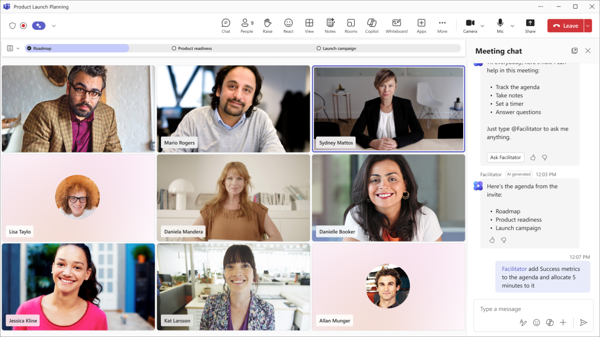

# Microsoft Facilitator Agent Blueprint

## Intent
Help Teams meeting organizers and presenters use the Microsoft Facilitator Agent to capture structured notes, action items, and insights in real time—so meetings stay focused, inclusive, and easy to hand off.

## When to use this blueprint
Use when you want Facilitator Agent to:
- Keep hybrid meetings on track with **live co-authoring of agendas, notes, and follow-up tasks** inside Microsoft Teams.
- Summarize key decisions and open questions directly in the **Meeting Notes** tab as the conversation evolves.
- Monitor participation, surface reminders, and automatically publish meeting recaps for people who could not attend.
- Coordinate recurring or high-stakes meetings that need consistent templates, ownership, and accountability.

### Agent profile quick reference
- **Type of task:** Guided meeting facilitation with shared notes, decision tracking, and task assignments.
- **Depth of reasoning:** Near-real-time summarization and contextual follow-ups based on the live transcript.
- **Output format:** Structured meeting notes with sections for agenda, highlights, decisions, and action items.
- **Ideal use case:** Cross-functional project reviews, leadership syncs, customer engagements, workshops.
- **Example prompts:**
  - “Facilitator, keep the agenda visible, record decisions with owners, and nudge us if we skip the budget discussion.”
  - “Capture customer feedback themes, log blockers as tasks, and prep a shareable recap before we close.”

## Workflow overview for Facilitator Agent
1. **Confirm prerequisites.** Ensure everyone who needs the Facilitator Agent has a Microsoft 365 Copilot license and that live transcription/recording is enabled for the meeting so the agent can operate.
2. **Prep the meeting space.** Before sending the invite, add the Facilitator Agent, upload documents to the meeting’s Files tab, and seed the Notes tab with agenda sections and ownership cues.
3. **Run the meeting with checkpoints.** During the call, ask the agent to keep the agenda on track, summarize each topic, and confirm tasks with assignees. Use chat reactions or @mentions to direct attention to open questions.
4. **Close with a recap.** Five minutes before ending, have Facilitator Agent read back the decisions, clarify outstanding items, and publish the notes/recap to attendees and absentees.
5. **Follow through asynchronously.** After the meeting, review the generated tasks in Planner/To Do, share trimmed summaries with stakeholders, and update next meeting agendas based on flagged gaps.

## Before the meeting: configuration checklist
- **Add Facilitator Agent to the invite.** When scheduling in Teams, choose *Add an app* → **Facilitator** so the agent is available when the meeting starts.
- **Set the meeting language and transcription.** Facilitator relies on the live transcript; enable recording/transcription in Meeting Options and pick the primary language up front.
- **Co-design the agenda.** Draft agenda bullets in the Meeting Notes tab and @mention speakers beside each section so Facilitator can spotlight who is up next.
- **Attach prep materials.** Upload briefs, decks, and dashboards to the meeting Files tab. Reference them by name inside the Notes so Facilitator Agent can link back when summarizing.
- **Decide on task ownership rules.** Agree on whether Facilitator will assign tasks automatically to the person speaking or wait for explicit confirmation.
- **Brief presenters.** Share a quick explainer so speakers know they can ask Facilitator for reminders, recaps, or to log decisions on the fly.

## During the meeting: live facilitation moves
- **Kickoff cue:** “Facilitator, start the meeting and display the agenda. Keep us aligned to the timings we set.”
- **Segment summaries:** At the end of each topic, ask: “Facilitator, summarize the key points, list any decisions, and capture tasks with owners.”
- **Engagement checks:** Use prompts like “Facilitator, note if anyone has not spoken during this section and invite input,” especially in hybrid meetings.
- **Context references:** When someone mentions a linked doc, request “Facilitator, reference the product brief from the Files tab when you log this decision.”
- **Meeting Notes navigation:** Direct participants to the Notes tab to view real-time updates. Facilitator saves drafts every few minutes so everyone sees the latest version without refreshing.
- **Transcript anchors:** If you need a follow-up clip, ask “Facilitator, tag this discussion as ‘Risk Review’ for the recap.”
- **Flex for late changes:** When the agenda shifts, instruct “Facilitator, add a new section called ‘Executive Q&A’ and give us a five-minute warning before the end.”

## After the meeting: recaps and handoffs
- **Finalize the notes.** Review the Meeting Notes tab, confirm decisions, and edit task descriptions for clarity before sharing widely.
- **Distribute automatically.** Let Facilitator publish the summary to attendees and invitees who declined so they can catch up asynchronously.
- **Sync tasks.** Check the assigned action items in Microsoft Planner or To Do; adjust due dates and ownership if the agent used defaults.
- **Archive learnings.** Export the recap to OneNote, Loop, or SharePoint so future meetings can reuse the structure and decisions.
- **Plan the next session.** Ask Facilitator to create a follow-up agenda draft that rolls incomplete items forward and highlights dependencies.

## Template: meeting blueprint for Facilitator Agent
```
# Meeting purpose
Describe the goal, stakeholders, and timeboxed outcomes.

# Agenda & timing
1. Topic / presenter / duration
2. …

# Decisions to capture
- Decision statement → approval owner → due date

# Action items format
- Task → assignee → due date → reference link

# Engagement guardrails
- Call on remote participants first for each decision
- Surface risks, blockers, or unanswered questions as separate bullets

# Wrap-up checklist
- Confirm next steps and deadlines aloud
- Publish meeting recap to attendees & absentees
- Highlight unresolved items for the next agenda
```
Use this template as pre-read text in the Notes tab. Facilitator Agent will treat the headings as anchors when organizing the live transcript into sections.

## Alignment with Microsoft guidance
Microsoft’s official Facilitator Agent documentation highlights its role in co-authoring notes, summarizing transcripts, capturing tasks, and ensuring everyone can see the Meeting Notes tab in Teams. Follow their recommendations to enable transcription, manage permissions, and educate participants on how to collaborate with the agent during and after the meeting.

## References
- Microsoft. “Facilitator in Microsoft Teams meetings.” https://support.microsoft.com/en-us/office/facilitator-in-microsoft-teams-meetings-37657f91-39b5-40eb-9421-45141e3ce9f6
- Daniel Brayer. “Facilitator Agent Cheat Sheet” (2025).
