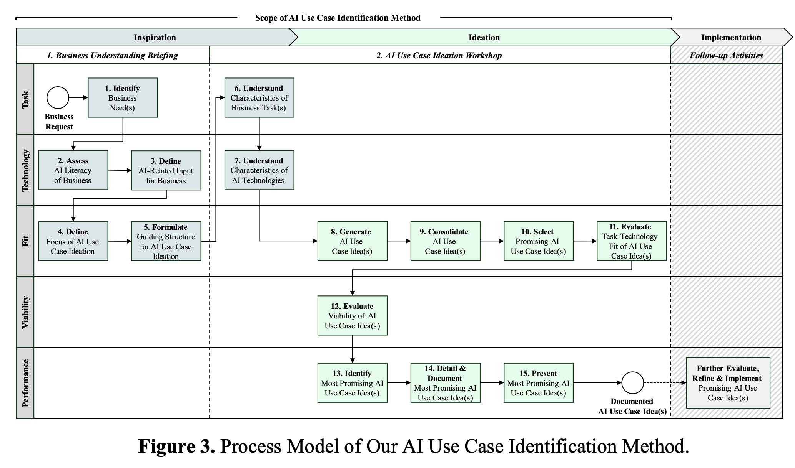
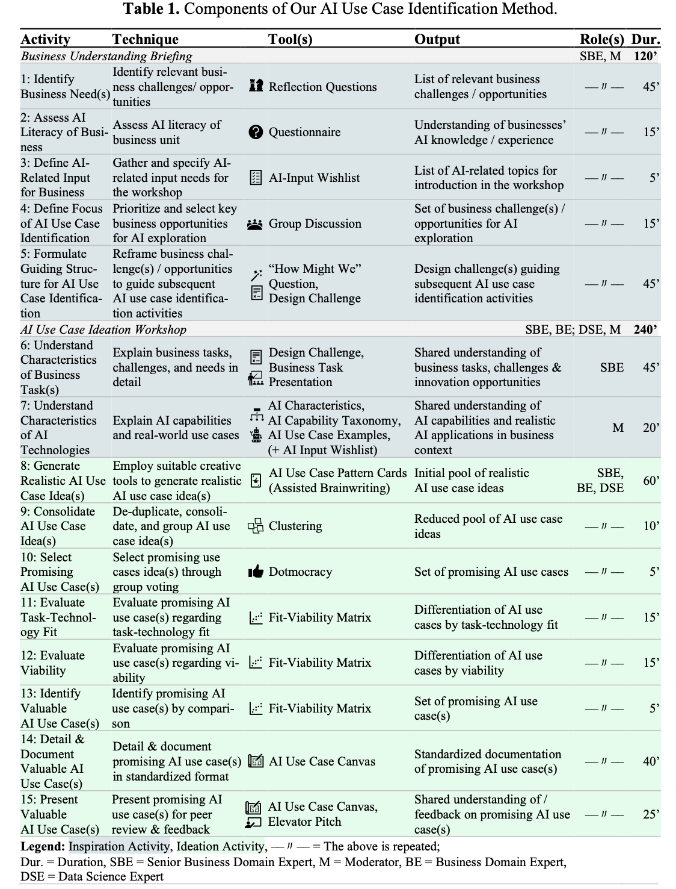

# AI Use Case Identification

**Intent:** Help product and transformation teams identify high-value AI opportunities under real-world business constraints.

## When to Use
- You need a repeatable method to filter AI ideas coming from executives, product teams, and operational leaders.
- Business sponsors ask for proof that AI can deliver measurable value before unlocking budget.
- Teams must translate strategic goals (e.g., cost reduction, risk mitigation, customer growth) into feasible AI experiments.

## Overview
Ground this workflow in the study by Vom Brocke et al. on how organizations evaluate AI under non-laboratory conditions. The method combines strategic framing, opportunity scouting, and implementation design so that AI ideas are linked to measurable business goals and technical feasibility.



### Four Outcomes You Should Capture
1. **Business goal clarity** – every idea maps to an owner, KPI, and success horizon.
2. **Data reality check** – you can source, clean, and govern the data needed for the AI workflow.
3. **Solution concept sketch** – stakeholders understand the user journey, AI touchpoints, and human-in-the-loop controls.
4. **Execution decision** – the portfolio of AI use cases is prioritized with transparent scoring and next steps.

## Method Components


| Component | Why it matters | Prompts to unblock the team |
| --- | --- | --- |
| **Opportunity Radar** | Keeps ideation grounded in business capabilities, value levers, and pain points. | "List the top 3 recurring breakdowns in our [process], and note who feels the pain and how often." |
| **Use Case Canvas** | Captures the core elements of a candidate AI use case (actors, inputs, AI task, outputs, guardrails). | "Fill in a one-page canvas with actor, trigger, AI decision/action, required data, success metric." |
| **Readiness Assessment** | Evaluates data, compliance, talent, and change-management readiness. | "Score data availability, quality, and access for this use case on a 1–5 scale and justify each rating." |
| **Prioritization Matrix** | Provides a transparent comparison across value, feasibility, and strategic alignment. | "Rank the short-listed AI use cases by business value, effort, and risk mitigation impact." |

## Step-by-Step Playbook

### 1. Frame the Business Challenge
- Interview business sponsors to capture strategic themes and measurable objectives.
- Translate vague goals ("improve customer satisfaction") into metrics (e.g., NPS uplift, churn reduction).
- Draft guardrails: compliance, ethics, data residency, existing vendor constraints.

**Prompting support:**
```text
You are an AI strategy facilitator.
Synthesize the business sponsor's objectives and clarify desired outcomes, metrics, and constraints.
Return a table with columns: Objective, KPI, Desired Trend, Constraints, Notes.
```

### 2. Scout and Refine Use Case Ideas
- Run cross-functional ideation sessions using the Opportunity Radar and Use Case Canvas.
- Anchor brainstorming in user journeys and pain points instead of generic AI capabilities.
- Capture assumptions about data sources, model types, and human reviews.

**Prompting support:**
```text
You are moderating an AI ideation workshop.
For each customer journey stage provided, list potential AI interventions, required data assets, and expected value.
Flag red-amber-green feasibility based on data readiness.
```

### 3. Validate Feasibility and Risks
- Conduct rapid discovery on data availability, data quality, and integration points.
- Identify regulatory, ethical, and change-management implications early.
- Use the Readiness Assessment to document blockers and enablers.

**Prompting support:**
```text
You are a data due diligence analyst.
Assess data readiness for the proposed AI use case, covering availability, quality, access controls, and compliance.
Highlight gaps and suggest remediation actions with owners.
```

### 4. Shape Solution Concepts
- Outline the target workflow, including human-in-the-loop checkpoints and escalation paths.
- Prototype the AI interaction (e.g., prompt drafts, UI wireframes) to validate user expectations.
- Align on minimal viable data pipelines, monitoring, and change-management support.

**Prompting support:**
```text
You are a service designer.
Draft the end-to-end workflow for the AI use case with swimlanes for Human, AI System, and Supporting Tools.
Include key decisions, handoffs, and fallback procedures.
```

### 5. Prioritize and Decide on Execution
- Score each use case using the Prioritization Matrix (value, feasibility, strategic fit, risk exposure).
- Visualize the portfolio to highlight quick wins, strategic bets, and items requiring more discovery.
- Document the decision (proceed, experiment, park) and identify accountable leaders.

**Prompting support:**
```text
You are preparing an AI portfolio review.
Summarize each candidate use case with value score, feasibility score, risk profile, estimated timeline, and recommended next step.
Output as a markdown table sorted by highest strategic fit.
```

## Operating Tips for Real Business Conditions
- **Timebox discovery** to 2–4 weeks per use case to maintain momentum and stakeholder attention.
- **Co-own decisions** with both business and technical leads to avoid "IT-only" or "business-only" blind spots.
- **Capture learning debt**—record what must be validated in pilots (e.g., data labeling cost, user adoption). Revisit before scaling.
- **Keep ethics visible** by integrating red-teaming questions and bias checks into each workshop.

## Deliverables Checklist
- Prioritized backlog of AI use cases with owners and KPIs.
- Data readiness scorecards with remediation actions.
- Solution concept briefs, including human oversight steps and monitoring requirements.
- Executive summary slide or memo referencing Figure 3 and Table 1 once visuals are added.

## References
- [Vom Brocke, J., Maedche, A., & Leimeister, J. M. (2023). _How to Identify Promising AI Use Cases Under Real Business Conditions_. Proceedings of the 56th Hawaii International Conference on System Sciences.](https://www.alexandria.unisg.ch/server/api/core/bitstreams/35316f07-8d0b-47dc-bbf0-36753ca834b3/content)
