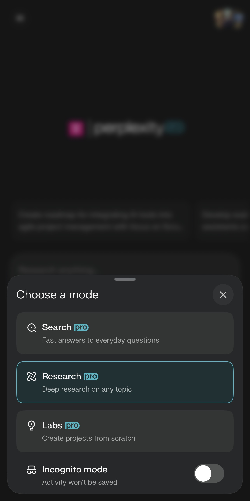
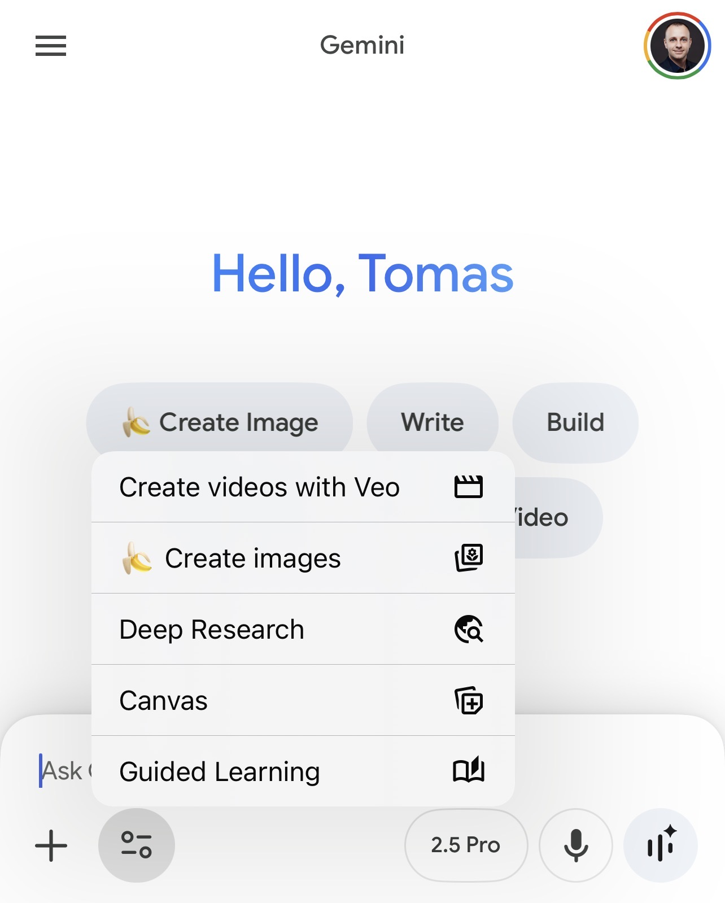
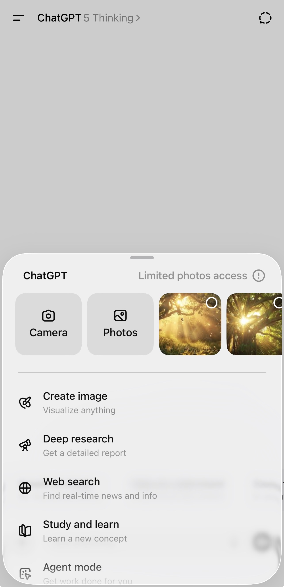

# Deep Research Tutorial

## Intent
Help researchers and strategists choose and operationalize deep research modes in Perplexity, Gemini, and ChatGPT. Summarize core capabilities, when to deploy each workflow, and how to enable the relevant tooling.

## When to Use
- You need multi-step reasoning that goes beyond quick fact lookups.
- The task requires synthesizing multiple sources with traceability.
- You want to compare deep research offerings before granting team access or building SOPs.

## Quick Comparison
| Capability | Perplexity Deep Research | Gemini Deep Research | ChatGPT Deep Research |
| --- | --- | --- | --- |
| Ideal strengths | Iterative web-scale investigations with auto-expanding search branches. | Multi-modal (text + imagery) insights grounded in Google corpus and Workspace context. | Structured research briefs with custom criteria and up-to-date browsing. |
| Best for | Exploratory market sweeps, literature dives, “unknown unknowns.” | Cross-format intelligence, Workspace-native projects, multilingual needs. | Executive summaries, product requirement deep-dives, configurable deliverables. |
| Key controls | Adjustable duration, focus areas, citation harvesting. | Research focus selection, Workspace integration, output tone guidance. | Prompt-level guardrails, deliverable templates, follow-up query queue. |
| Typical output | Threaded findings with citations, recommended next steps. | Multi-section briefs with evidence highlights, image-rich insights. | Tailored reports (slides, briefs) with inline references and follow-up tasks. |
| Pricing / access | Paid add-on for Pro/Enterprise; time-boxed runs. | Gemini Advanced subscription | ChatGPT Enterprise / Plus / Pro; availability varies by org policy. |

## Workflow Highlights

### Perplexity Deep Research
1. Frame the research objective with explicit target audience, scope, and deliverable.
2. Use focus areas to steer the crawler (e.g., “competitive pricing,” “founder interviews”).
3. Let the run complete; harvest citations and recommended follow-ups for action plans.
4. Export summaries to your knowledge base and set review cadence for updates.

> 

**Enablement tips**
- Ensure the Deep Research add-on is toggled in workspace settings for eligible seats.
- Establish run-length defaults (e.g., 5 or 10 minutes) to balance depth vs. cost.
- Create tagging conventions for outputs so future runs can build on prior work.

### Gemini Deep Research
1. Start from a clear “What you’re researching” brief and note expected artifacts.
2. Select relevant focus cards (market, technology, strategy) and attach Workspace docs for grounding.
3. Iterate on section summaries, using follow-up prompts to add visuals or data tables.
4. Export to Google Docs or Slides for stakeholder review.

> 

**Enablement tips**
- Verify Gemini Advanced access and the Deep Research beta toggle in Admin Console.
- Connect Google Drive folders with curated source material to boost grounding quality.
- Align on tone presets (executive, technical, academic) to speed downstream editing.

### ChatGPT Deep Research
1. Define the research scope, desired deliverable (brief, memo, FAQ), and success criteria.
2. Add custom instructions for citation style, data freshness, and exclusion zones.
3. Launch Deep Research; review interim findings and queue follow-up questions inline.
4. Package the final report using ChatGPT’s export or copy-ready markdown block.

> 

**Enablement tips**
- Confirm Deep Research access in the ChatGPT organization settings (Pro or Enterprise).
- Create reusable prompt templates for recurring investigations (e.g., competitor teardowns).
- Pair Deep Research with File Search or custom GPTs to ground against proprietary data.

## Operational Guidance
- **Intake**: Standardize research brief templates with objective, audience, scope, and must-have sources.
- **Governance**: Track which tool ran the analysis, source age, and reviewer sign-off to maintain audit trails.
- **Handoffs**: Embed outputs into project hubs (Notion, Confluence, Workspace) with clear owner and refresh cadence.
- **Quality loops**: Schedule human spot-checks for critical decisions; log discrepancies to refine prompts.

## Deep Research Prompt Examples

### Corporate Strategy Analyst (Tech)
- **Job / Industry**: Corporate Strategy Analyst (Tech)
- **Prompt**: “As a senior strategy analyst, your task is to create a comprehensive, board-ready competitive landscape analysis focused on AI-chip startups, specifically those listed in the Silicon Angle list for 2024 and beyond, and that have secured Series A funding or higher. Your analysis should encompass several key components: a detailed funding history for each startup, an overview of their core technologies, profiles of key executives, an examination of relevant patent families, an assessment of strategic partnerships, and a summary of significant strategic moves made over the past 12 months. The final deliverable should be a 30-page report organized into distinct sections: an Executive Summary, a Market Map, individual Company Profiles (one page for each startup), a Patent Heatmap, and an analysis of Risks & Opportunities. Ensure that you provide inline citations and include live source links for all referenced materials.”
- **Source**: [PromptPerfect — Deep Research prompt examples](https://daily.promptperfect.xyz/p/fifteen-examples-of-how-to-use-deep-research-in-chatgpt-with-prompts)

### Telescope Purchase Guidance
- **Use case**: Purchase of a telescope
- **Prompt**: “I'm looking for a refractor telescope specifically designed for an intermediate astrophotographer and I need help choosing the right one. I'd like an aperture size greater than 70 MM and compatibility with DSLR cameras. Could you provide me with a list of top refractor telescopes suitable for astrophotography, including their pros and cons, and a brief guide on how to select the best one based on my budget of $1500? Please include information on any additional equipment I might need to get started with astrophotography.”
- **Source**: [NinjaTech — Deep Research prompt best practices](https://www.ninjatech.ai/blog/how-to-use-deep-research-best-practices-for-crafting-effective-prompts#:~:text=%2A%20Strong%20Prompt%3A%20,in%20the%20next%20five%20years)

## Related Blueprints
- [Microsoft Copilot Researcher Agent Blueprint](../tools/microsoft-copilot-researcher-agent.md)

## References
- [Perplexity: Introducing Deep Research](https://www.perplexity.ai/hub/blog/introducing-perplexity-deep-research)
- [Gemini Deep Research overview](https://gemini.google/gb/overview/deep-research/?hl=en-GB)
- [ChatGPT Deep Research announcement](https://openai.com/index/introducing-deep-research/)
- [PromptPerfect — Deep Research prompt examples](https://daily.promptperfect.xyz/p/fifteen-examples-of-how-to-use-deep-research-in-chatgpt-with-prompts)
- [NinjaTech — Deep Research prompt best practices](https://www.ninjatech.ai/blog/how-to-use-deep-research-best-practices-for-crafting-effective-prompts#:~:text=%2A%20Strong%20Prompt%3A%20,in%20the%20next%20five%20years)
